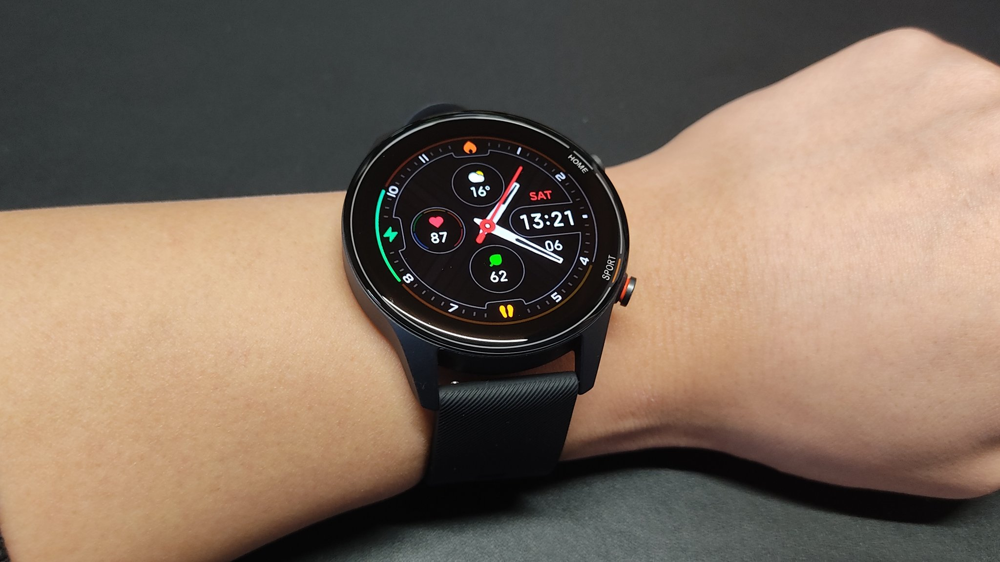

<h1>ついに Mi Watch が届いた！！</h1>

aliexpress で 2 月 17 日に注文し、2 月 24 日に発送され、届いたのは 3 月 6 日でした。 

<h2>何を求めて買ったか</h2>

購入の決め手は以下の 3 点です。

<ul>
<li>LINE やメールの通知を受け取れる</li>
<li>Amazon Alexa と連携できて、日本語に対応している</li>
</ul>

LINE やメールの通知をさっと確認出来て便利！めちゃくちゃ重宝してます。と Mi band4 を使っていても、これ以外の機能はほとんど使っていませんでした。 
Mi Watch では、Amazon Alexa と連携できます！しかも、ちゃんと日本語に対応してます！！ 
家のは 3 つスマートスピーカーがおいてあり、エアコン、照明、テレビ、空気清浄機を音声操作できるようにしてあります。なので、出先から簡単に家の家電を操作できるようになり大変便利です！！ 
なぜか子供の頃から丸いが好きで、扇風機、水晶玉とかを眺めていました。なので丸いものに惹かれます。

<h2>使ってみての感想</h2>

思ったより軽く、付け心地も良いです。文字盤には一部カスタマイズ可能なものもあり、背景画像を好きなものに設定できます。

<blockquote align="center" class="twitter-tweet" data-dnt="true">
mi watch 一部背景カスタマイズできる！！ <a href="https://t.co/BZF3fE1iyd">pic.twitter.com/BZF3fE1iyd</a>
— yukyu (a.k.a ugo) (@yukyu30) <a href="https://twitter.com/yukyu30/status/1368175661874024448?ref_src=twsrc%5Etfw">March 6, 2021</a></blockquote>

<h3>LINE やメールの通知を受け取れる</h3>

問題なく機能しています！通知をみたら自動的に削除される？のが不便に思う方もいるみたいですが、自分は自動的に削除されたほうが溜まらなくて好きです。

<h3>Amazon Alexa と連携できて、日本語に対応している</h3>

何回か試してわかったのですが、スマホで Mi Wear アプリを起動しているときのみこの機能は使えます。 
なので Mi Wear アプリを(バックグラウンドで)ずっと起動しておく必要があります。ここが少し不便に感じました。 
あと、起動していても時々「後でお試しください」とエラーが表示されます。

<h2>技適は？</h2>

グローバル版を購入しましたが、技適マークがパッケージに印刷されていました。

<h1>追記　 2021.3.21</h1>

満充電から充電切れまでは 14 日間でした。 
睡眠に関しては昼寝は検知されませんでした。

