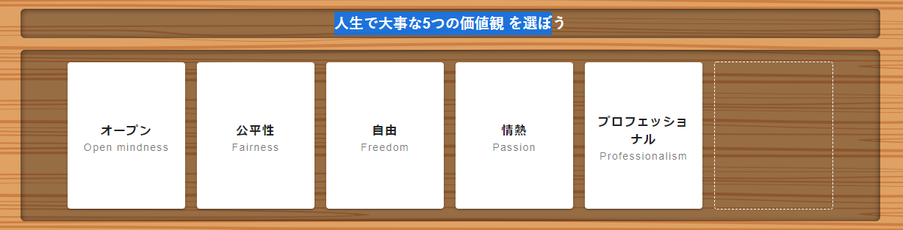
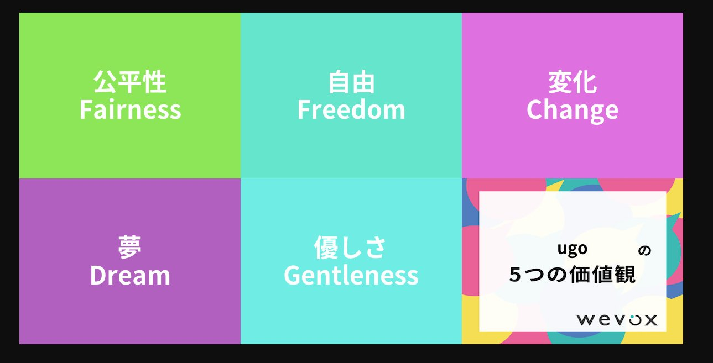

9 月 18 日にを行いました。

Discord で通話を行いながら行いました。開催は 3 回目になりました。その様子をお届けします。

<h1>とは</h1>

は月 1 回の頻度でゲームを行う会です。1 回目、2 回目では 
Among us、<a href="https://garticphone.com/ja">Gartic Phone</a>でました。 
今回は<a href="https://values-card.wevox.io/rooms/join">Wevox values card online</a>、<a href="https://codenames.game/">コードネーム</a>という二つのゲームを行いました。 
個人的に Wevox 　 values card online はあまりやったことのないゲームで新鮮でした。そこで Wevox 　 values card online をした様子を書いておきます。

<h1>Wevox values card online</h1>

価値観が書かれたカードを山札引いていき、お題にそった価値観のみを手札に残して行くゲームです。 
今回のお題は「人生で大事な 5 つの価値観」です。つまり、各プレイヤーは山札からカードを引き、自分が大事にしたい価値観を手札に残します。5 枚までしか持てないので、1 枚 
引くごとに一番大事ではない価値観を捨てることになります。順番に同じことを繰り返し、山札がなくなったら終了です。最後になぜその価値観なのかなどを話します。

<h2>実際に遊ぶ</h2>

どんな価値観を引いたのか、どれを捨てるのかを宣言しながら、進めていきました。 
それ捨てちゃうの！どれも大事だしなー。とわいわいがやがや言いながら進めていきました。 
最後に残った価値観がなぜ大事なのか発表して、みんながどんな価値観を大事にしてどんな風に考えてるのかわかりました。

<h2>ゲーム結果</h2>

最初の手札は以下のようになりました。 

様々な価値観のカードを引いていき、最終的にこのようになりました。 

<ul>
<li>

公平性 
オープンの先に公平性があると思ったので公平性を残しました。

</li>
<li>

自由 
いままで自由に育てられたと思ってます。自由があったから様々なモノに興味を持つようになって、いまの自分があると思ってるので自由は大事。

</li>
<li>

変化 
いままでは変化をあまり求めていませんでしたが、ここ最近は変化していきたいと思っているので変化をのこしました。

</li>
<li>

夢 
夢が自分の原動力になってる部分もあるので残しました。

</li>
<li>

優しさ 
友人から優しいとよく言われるので自分の個性な気がするので優しいを残しました。

</li>
</ul>
<h1>感想</h1>

ひととなりが知れるゲームでアイスブレイクや初対面の人とやっても楽しいとおもいました！！

