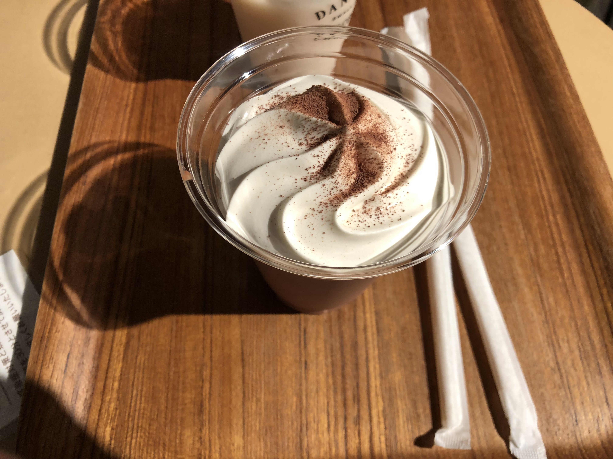

東京に行き、友人に会った記録。

<h1>大学の友人に会う</h1>
<h2>表参道</h2>

大学の時の友人に会うため、表参道で待ち合わせをした。アップルストアの前で友人の到着を待っていると、 
駅の階段を上がる友人が見えた。友人もすぐにこちらに気づき、話をしつつお店へ向かった。

<h1>ダンデライオン</h1>

表参道にあるダンデライオンというチョコレートのお店にいった。満席だったがすぐに席に案内された。 
レジに並びながらお土産用のお菓子を選んでいた。友人にドリンクをおごってもらったので、お土産用のクッキーを買った。 
フローズンチョコレートを飲んだ。 
 
上には生クリームがのっていた。口に入れると芳醇なチョコレートの味がした。美味しかった。

今度会ったときは抹茶スイーツのあるお店に行き、自分が奢る約束をした。

<h1>散策</h1>

サスペンダーが欲しくて古着屋さんに行ったが、特に収穫もなく渋谷方面に移動した。その後、渋谷パルコに行き、AnkerStore をみた。ふと、Anker 製品を買うタイミングは今じゃないなと思い何も買わなかった。遊べる時間は二時間くらいだったので、渋谷駅で友人を見送った。

<h2>別の友人たちとあう</h2>

実は大学の友人とは別の友人に会うことになっていたので、ハチ公前で友人を探して合流した。 
ハチ公前には人がいっぱいいて、合流するにも苦労した。 
予約してあるダンダダンに移動した。 
お茶と餃子を頼んだ。餃子は名物だけあって美味しかった。肉汁が口の中に広がっていくのが分かるほどだった。

緊張していたのか話をしたが覚えていない。

<h1>散歩</h1>

数人は帰るとのことで、渋谷駅に向かいつつ、街を眺めていた。唐突に写真撮影が始まり、友人が夜景を背景に決めポーズをしていた。なんかこのノリが高校生ぽくてエモかった。

<h1>HUB</h1>

残った友人で渋谷の HUB に行った。異世界のような店内で、冒険者ギルドに来てしまったのかと思った。 
マルゲリータとオレンジジュースを注文した。初めてだったので注文の仕方や商品の受け取りなどが分からず戸惑った。 
ここで今日初めてのオレンジジュースを飲んので最高に美味しかった。

各々飲み物を飲みながら、特技ってなにを特技にすればいいか。今日の感想、これからの事などの話した。 
電車の時間になったので、自分だけ途中で抜け、お店を後にした。

<h1>感想</h1>

1 日でスケジュールがパンパンに詰まっていたので充実した一日だった。友人にも会えたのがなによりもうれしかった。

今度東京に行くときは、ホテルを予約して二日間存分に楽しみたい。遊舎工房に行けなかったのが唯一の心残りなので、次回は絶対に行きたい。

