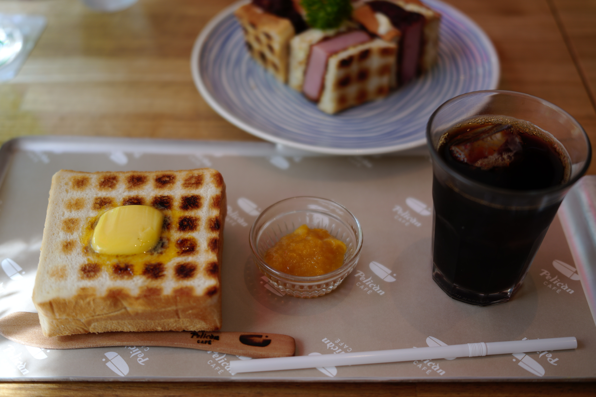
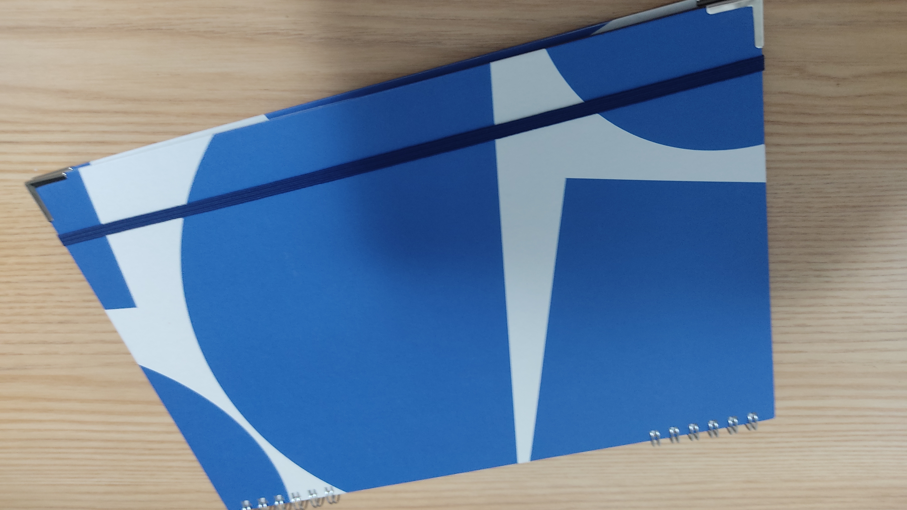
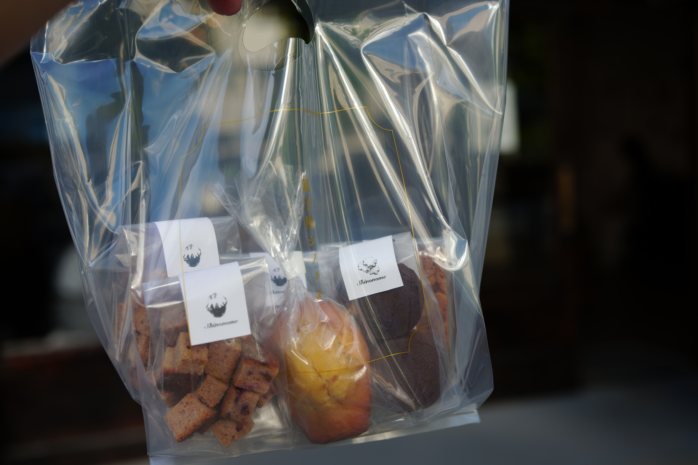
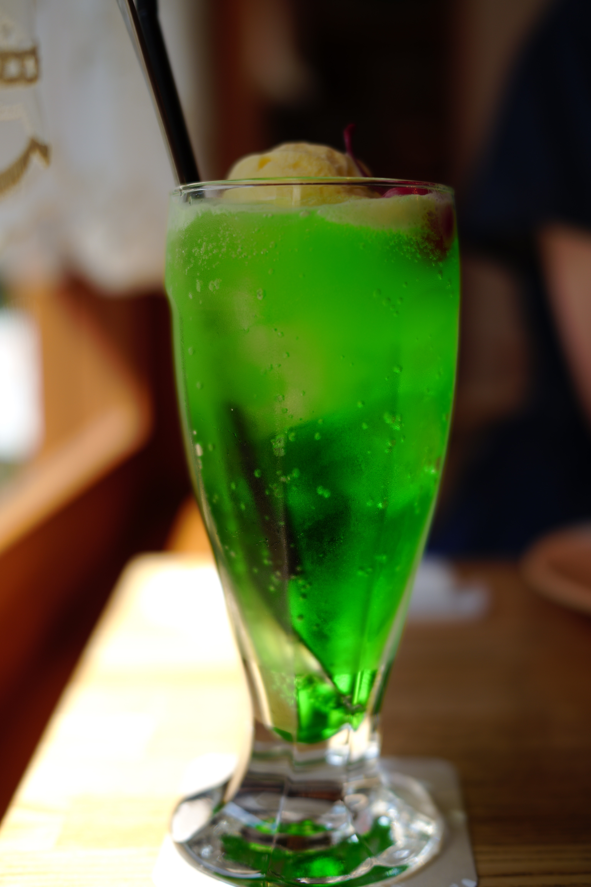

7月9日に友人と「蔵前さんぽ」を行いました。

<h1>散歩開始</h1>
<h2>お昼はペリカンカフェ</h2>

13 時に蔵前駅集合し、そのままペリカンカフェにいきました。ペリカンカフェは、パンのペリカンが運営しているカフェです。トーストやサンドのメニューが豊富でした。 
私は炭火焼きトーストと、ハムカツサンドをたべました。 

<h2>カキモリ</h2>

カキモリは私が愛してやまない文具店です。カキモリでは友人に様々なペンと紙を試してもらいました。

オリジナルノートが作れるので、2021 年のスケジュール帳の中身を変え、2023 年のスケジュール帳をつくりました。また、以前から欲しかった B5 サイズのノートも作りました！ 
 
興味を持った友人も、悩みながらノートを作っていました。ノートの紙は全て書き心地が試せるので自分の好みの一冊が作れます。

<h2>菓子屋シノノメ</h2>

友人が調べてくれたお店に行きました。カフェが併設された洋菓子屋さんです。アンティークな雰囲気の店内のショーケースやテーブルにクッキーやマドレーヌなどが並んでいまいた。クッキー、マドレーヌ、ラスクを買いました。 

<h2>ダンデライオンチョコレートファクトリー</h2>

ここは自分がよくいくカフェです。この日は暑かったので、フローズンチョコレートとチップクッキーを食べました。お持ち帰りをして、目の前の公園でベンチに座りながら食べるのも良いです。

<h1>終わりに</h1>

一人で蔵前にいくときには、自分の中で定番になっている「元楽」に行きますが、友人を誘うことでいつもと違うお店に行けて楽しかったです。 
菓子屋シノノメや、ペリカンカフェは行ったことのがないので蔵前が新鮮に感じました。 
誘って、一緒に行ってくれた友人に感謝です。 

<h3>関連記事</h3>

自分が一人で蔵前に行った時の記録は<a href="./2021-11-07-part1">こちら</a>です。

