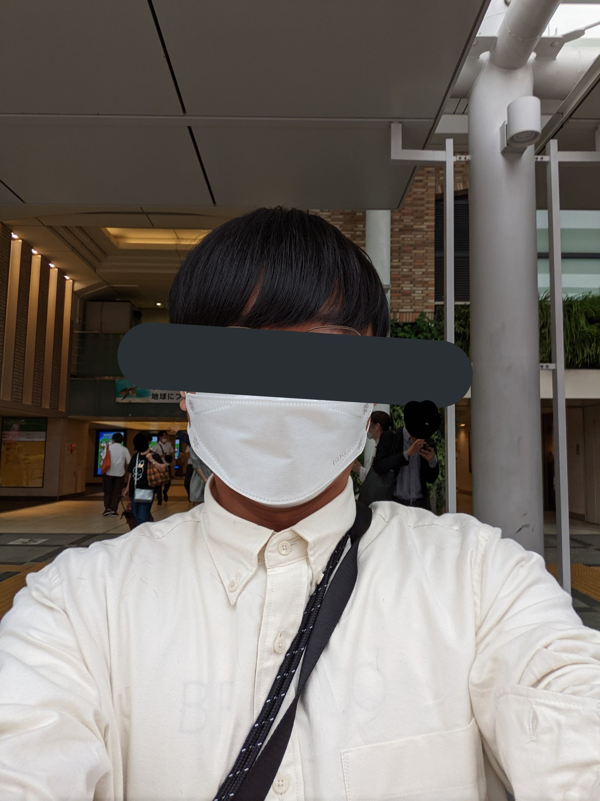

誕生日前日の29日に有給休暇を取りました。 
メインの目的は矯正縮毛をかけに美容院に行くためです。 
今まで髪型を変えることをせず、天パを受け入れてきました。 
しかし、このままでは髪型を変えるチャンスを逃しそうなので、誕生前日に矯正縮毛をかけました。 
そんな有給休暇の様子です。

<h2>ドトールで朝ごはん</h2>
<blockquote align="center" class="twitter-tweet" data-dnt="true">
ミラノサンドA <a href="https://t.co/8hiPbGf9c7">pic.twitter.com/8hiPbGf9c7</a>
— yukyu (a.k.a ugo) (@yukyu30) <a href="https://twitter.com/yukyu30/status/1575299891995475969?ref_src=twsrc%5Etfw">September 29, 2022</a></blockquote>

ミラノサンドAを食べました。美味しかったです。 
この前日に同期が「好きな言葉はミラノサンドB」と書いており、なんだか知りませんでしたが、ドトールの話だと理解できました。

<h2>吉祥寺に行った</h2>
<h3>ユニクロ</h3>

吉祥寺を散策してました。おしゃれなお店ばかりで、お店に入れませんでした。 
寒かったのとネタTしか家になかったので、ユニクロで長袖シャツを買いました。

<h3>井の頭公園</h3>

その後は、コンビニでおにぎり二つとお茶を買って、井の頭公園に行きました。 
自分が大学生の頃、友人と吉祥寺に来て遊んだ時の記憶を思い起こしながら、おにぎりを食べていました。

<blockquote align="center" class="twitter-tweet" data-dnt="true">
井の頭公園 <a href="https://t.co/v8s8jkjWcm">pic.twitter.com/v8s8jkjWcm</a>
— yukyu (a.k.a ugo) (@yukyu30) <a href="https://twitter.com/yukyu30/status/1575330752287322112?ref_src=twsrc%5Etfw">September 29, 2022</a></blockquote>

公園には人がいるものの、静かで穏やかな空間でした。

<h2>美容院のLIPPS</h2>

せっかくなので有名なLIPPSを予約しました。

<blockquote align="center" class="twitter-tweet" data-dnt="true">
いってきた。髪サラサラになった <a href="https://t.co/wL7F3QcBjh">pic.twitter.com/wL7F3QcBjh</a>
— yukyu (a.k.a ugo) (@yukyu30) <a href="https://twitter.com/yukyu30/status/1575383947755675649?ref_src=twsrc%5Etfw">September 29, 2022</a></blockquote>

お店に入って、受付を済ませたら、簡単な問診票的なものを書き、シャンプーをしました。 
席に着くと、短髪のお兄さんが、どんな髪型にしたいのかなどを簡単にヒアリングしてくれました。「矯正縮毛を活かした髪型にしてください」という雑な返しをしたら、サラサラさを活かして、マッシュはどうですか？と通信制限のかかったスマホで検索してくれたモデルさんの画像を見せてもらいました。即答で「それでお願います！」といったら、「本当にいいんですか」と聞き返されました。

髪を軽く切ったのち、薬剤をつける、洗い流す、アイロンする、また薬剤をつける、洗い流すという流れで縮毛矯正が進んでいきました。 
癖が消え、サラサラストレートになりました。

 
最後に、髪を乾かす時にはヘアオイルを使ってください。とのことだっだので薬局でヘアオイルを買いました。どれがいいのかわからなかったのでBOTANISTのヘアオイルを買いました。

鏡があったらチラッと自分を見てしまうくらいよかったです。

<h2>その後も吉祥寺を散策</h2>
<blockquote align="center" class="twitter-tweet" data-dnt="true">
そしてオヤツ <a href="https://t.co/yyF6L6wUFU">pic.twitter.com/yyF6L6wUFU</a>
— yukyu (a.k.a ugo) (@yukyu30) <a href="https://twitter.com/yukyu30/status/1575384027812413440?ref_src=twsrc%5Etfw">September 29, 2022</a></blockquote>

<blockquote align="center" class="twitter-tweet" data-dnt="true">
看板が異業種コラボになってるの珍しくて記念撮影 <a href="https://t.co/NRsWOqYtqT">pic.twitter.com/NRsWOqYtqT</a>
— yukyu (a.k.a ugo) (@yukyu30) <a href="https://twitter.com/yukyu30/status/1575384705767071746?ref_src=twsrc%5Etfw">September 29, 2022</a></blockquote>

BEAUTY &amp; YOUTHを友人にお薦めされました。友人の言う通り、自分が好きな雰囲気の服が多かったです。縮毛矯正でお金を使った直後だったので、買えませんでした。

<blockquote align="center" class="twitter-tweet" data-dnt="true">
オススメされたのでいってきた <a href="https://t.co/HTjHvgElj7">pic.twitter.com/HTjHvgElj7</a>
— yukyu (a.k.a ugo) (@yukyu30) <a href="https://twitter.com/yukyu30/status/1575399553775575040?ref_src=twsrc%5Etfw">September 29, 2022</a></blockquote>

そして、帰りました。

<h2>初めての有給休暇は充実していた</h2>

吉祥寺ではそんなに時間使わず、別の場所に行こうかなと考えていましたが、吉祥寺だけで一日遊べました。思った以上に充実した時間を過ごせました。

