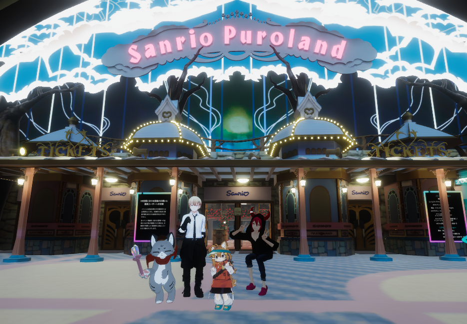
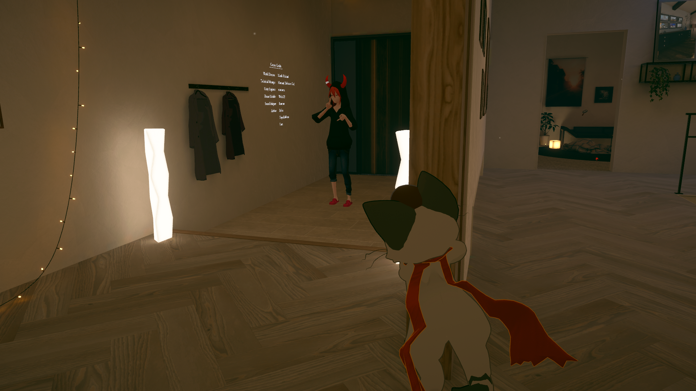
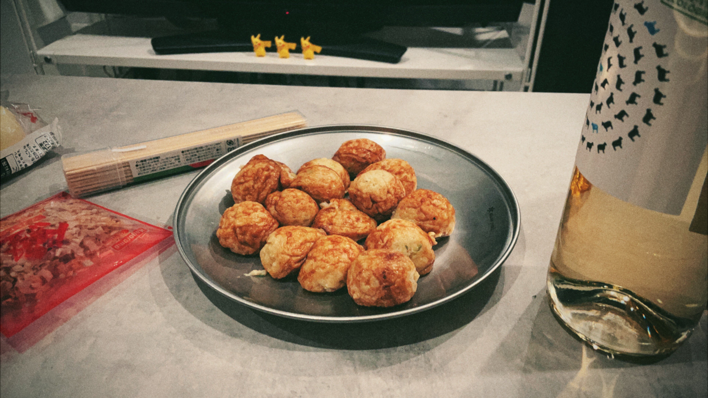

7,8,9の三連休は刺激を受ける日にしようと目論んで、家での作業はやらないことにしました。

<h2>７日　Chatで遊ぶ</h2>

同僚とChatでました。おすすめのワールドであるBoothHouseとイベントのNakayoku Connectを巡りました。

<h3>BoothHouse</h3>

<a href="https://booth.pm/topics/BOOTH_House">BoothHouse</a>を巡りました。 
さまざまなアイテムを触ったり、MVをビデオプレイヤーで再生して、一緒に鑑賞するなどをして遊びました。 
 

実際にかけるペンタブが置いてあり、すごかったです。

https://booth.pm/ja/items/3341823

<h3>Nakayoku Connect</h3>

バーチャルサンリオピューロランドの<a href="https://www.puroland.jp/nakayoku_connect/">NakayokuConnect</a>をみんなで見ました。 
やはり人とみるショーはいつも以上に楽しいですね。

<h2>８日：高円寺</h2>

同期と高円寺で遊びました。

<h3>初詣</h3>

高円寺の氷川神社に初詣に行きました。おみくじを引きましたが、末吉、中吉、小吉という誰もパッとしない結果でした。

<blockquote align="center" class="twitter-tweet" data-dnt="true">
末吉:自分から進んですることはやめることです。 <a href="https://t.co/4wzt29SMiG">pic.twitter.com/4wzt29SMiG</a>
— yukyu (a.k.a ugo) (@yukyu30) <a href="https://twitter.com/yukyu30/status/1612144421612683265?ref_src=twsrc%5Etfw">January 8, 2023</a></blockquote>

<h3>焼き鳥</h3>

やきとり大衆酒場 大将でお昼から、お酒と焼き鳥を堪能しました。

<h3>タコパをしたかった</h3>

友人宅でタコパをするために集まったのですが、お酒を飲んだことで、たこ焼きの準備がみんな面倒になり、業務スーパーで冷凍食品のオートミールたこ焼きを買って友人の家で食べました。 

追加の買い出しに行く時に、寄り道して数年ぶりにプリクラを撮りました。

<h2>9日：美少年展とすずめの戸締まり</h2>
<h3>美少年展</h3>
<blockquote align="center" class="twitter-tweet" data-dnt="true">
🌹展示会のお知らせ🌹 「美少年」展  🌹開催日時🌹 2023.1/7-1/16 11:00-20:00 ※最終日は17:00まで  🌹開催場所🌹 原宿 DesignFesta gallery EAST館301号室  来年も素敵な作家様をお招きして開催致します🌹今年も新しい試みがございます✨続<a href="https://twitter.com/hashtag/%E7%BE%8E%E5%B0%91%E5%B9%B4%E5%B1%95?src=hash&amp;ref_src=twsrc%5Etfw">#美少年展</a><a href="https://twitter.com/hashtag/%E7%BE%8E%E5%B0%91%E5%B9%B4%E5%B1%952023?src=hash&amp;ref_src=twsrc%5Etfw">#美少年展2023</a><a href="https://twitter.com/hashtag/SUZURI%E3%81%A7%E7%BE%8E%E5%B0%91%E5%B9%B4%E5%B1%95?src=hash&amp;ref_src=twsrc%5Etfw">#SUZURIで美少年展</a> <a href="https://t.co/KO6LEpVNs1">pic.twitter.com/KO6LEpVNs1</a>
— marienkafer (@__marienkafer__) <a href="https://twitter.com/__marienkafer__/status/1576165211463372803?ref_src=twsrc%5Etfw">October 1, 2022</a></blockquote>

美少年展っていい響きですよね。 
SUZURIでたまたま一目惚れしたアイテムが美少年展とのコラボグッズでした。これはいくしかない！と思って行きました。

<iframe height="162" src="https://suzuri.jp/kanekoshake/12370495/heavyweight-sweat/m/offwhite/embed" width="375"></iframe>

魅力的なグッズや展示があり、とても良かったです。もちろん買いました。

<blockquote align="center" class="twitter-tweet" data-dnt="true">
美少年展いってきましたー！！ 展示作品もめっちゃ良かった！！ イラストブックにピンバッジ、アクキーを買いました！！  あと、スリスリくんがめちゃくちゃ生息してた <a href="https://t.co/v9kkwr0DU2">pic.twitter.com/v9kkwr0DU2</a>
— yukyu (a.k.a ugo) (@yukyu30) <a href="https://twitter.com/yukyu30/status/1612323076305485825?ref_src=twsrc%5Etfw">January 9, 2023</a></blockquote>

本当に尊い空間でした 🙏

<h3>すすずめの戸締まり</h3>
<blockquote align="center" class="twitter-tweet" data-dnt="true">
楽しかったです <a href="https://t.co/qOdk5zWbm3">pic.twitter.com/qOdk5zWbm3</a>
— yukyu (a.k.a ugo) (@yukyu30) <a href="https://twitter.com/yukyu30/status/1612370105530478592?ref_src=twsrc%5Etfw">January 9, 2023</a></blockquote>

ネタバレしないように伝えると、良かったです。 
芹沢めっちゃ好きなんですが、エンドロールで神木隆之介さんが演じてると分かった時はめっちゃ驚きました。

<h2>終わりに</h2>

三連休はいつもとは違う休みになり、刺激的でした。今日はどうしようかな〜

