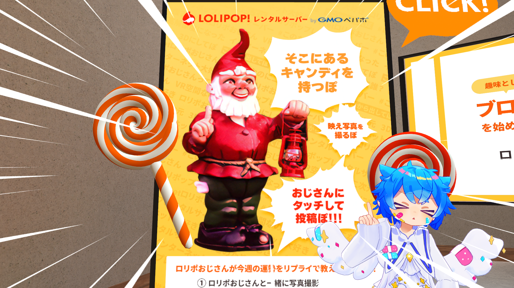

<h2>シリコンバレー</h2>

U-NEXTで<a href="https://video.unext.jp/title/SID0056451">シリコンバレー</a>という海外ドラマを見ていました。 
革新的な圧縮アルゴリズムを発明した主人公が、そのアルゴリズムを使って会社を立ち上げ、その会社での奮闘記を描いたドラマです。 
コメディ要素もあり、面白いのですが際どい描写があるので子供の前で見るのはお勧めしません。

<h2>内向型人間の時代</h2>

<a href="https://bookclub.kodansha.co.jp/product?item=0000187616">「内向型人間の時代」</a>という本を読んでいました。 
半分くらい読みました。内向型の人間の強みや、その強みをさらに活かす方法が書かれている本です。 
感想はあとで書けたら書きます

<a href="https://bookclub.kodansha.co.jp/product?item=0000187616">『内向型人間の時代　社会を変える静かな人の力』（スーザン・ケイン，古草　秀子）｜講談社BOOK倶楽部</a>

<h2>Vket</h2>

VRChatで行われているバーチャルマーケット（Vket）というイベントに行ってきました。 
ペパボの出展しているので、ペパボのブースに行ってきました！

https://twitter.com/yukyu30/status/1680577813332606977

 

<h2>おわり</h2>

読書や、ドラマ、エンタメを楽しめた三連休でした。

