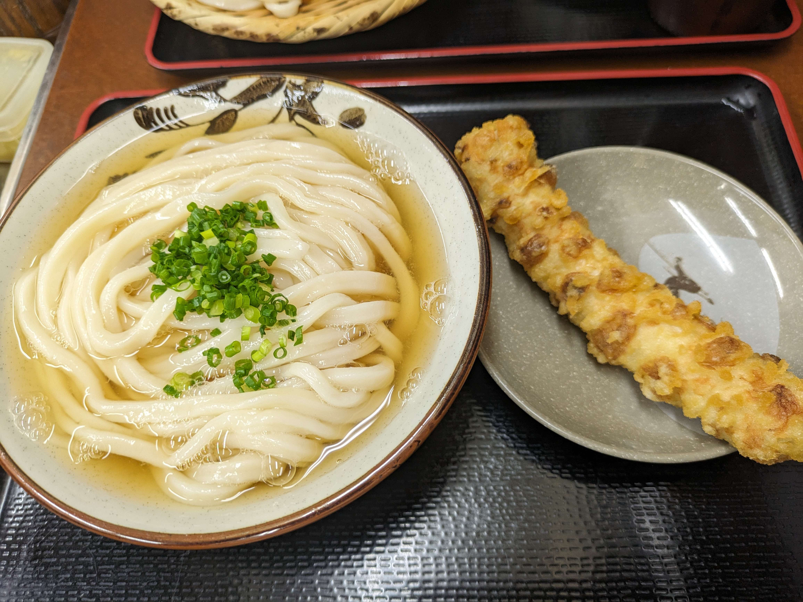
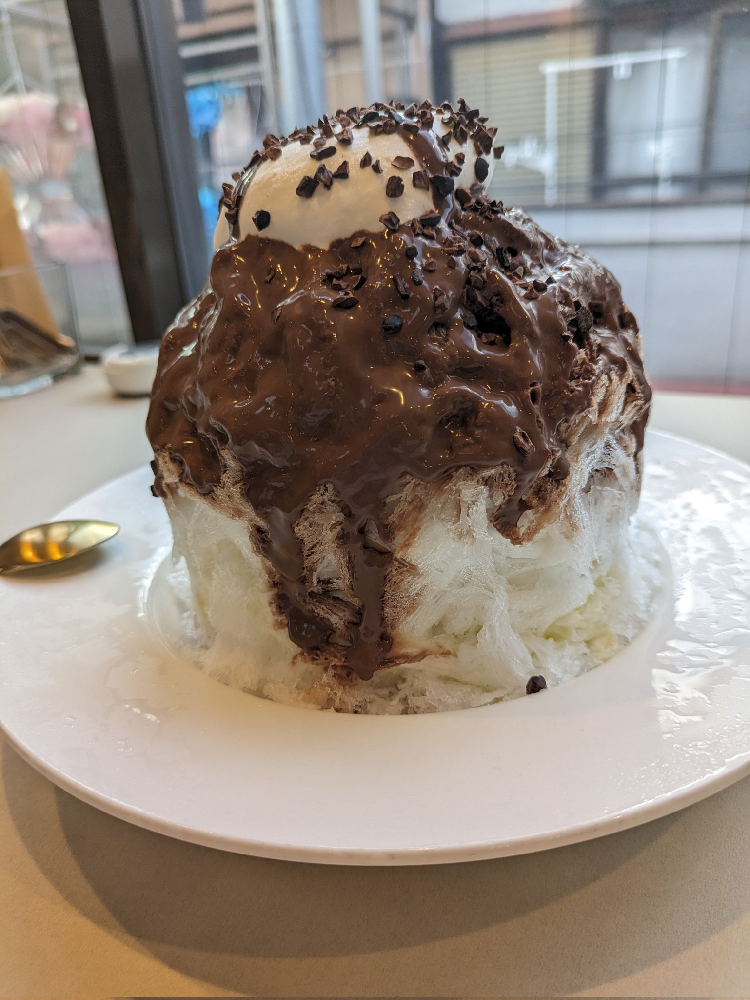
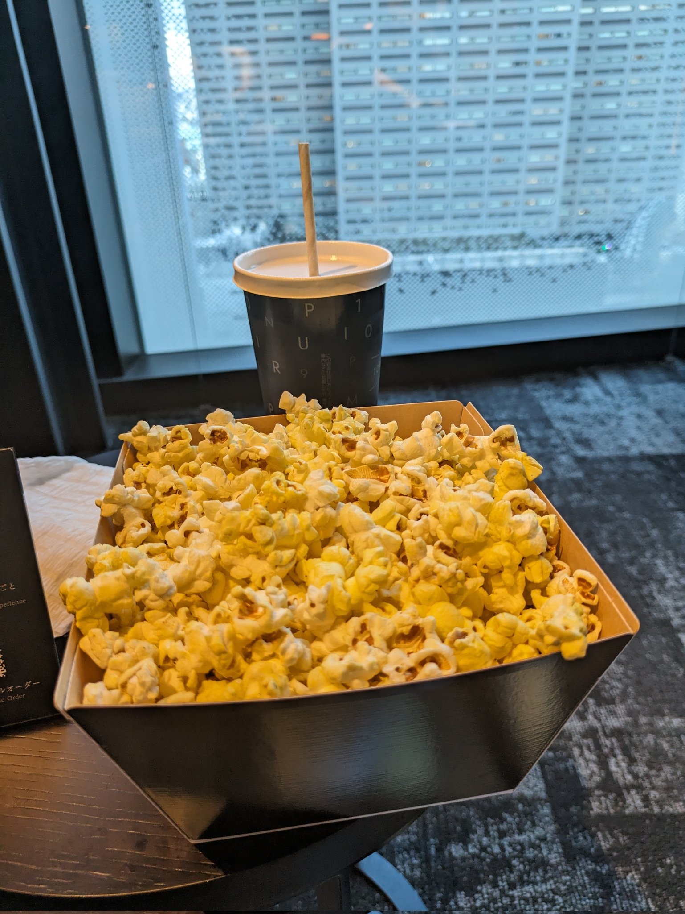

映画はネタバレしないように書いています。

<h2>うどん</h2>

お昼ご飯にうどんを食べた。つゆの色が薄かったが、しっかり出汁が効いていて美味しかった。 

<h2>かき氷</h2>

おやつにチョコレートソースがかかっているミルクかき氷を食べた。上の乗っているカカオニブの食感もよくて満足度が高かった。 

<h2>109シネマズプレミアム良かった</h2>

<a href="https://109cinemas.net/premiumshinjuku/">109シネマズプレミアム</a>で『ザ・スーパーマリオブラザーズ・ムービー』を観てきました。 
109シネマズプレミアムは、鑑賞料金が4,000円するのですが、1時間前から専用ラウンジでポップコーン、ドリンクを自由に食べれます。 
雰囲気の良い音楽も流れていて、1時間があっという間でした。 
 
シアターの席は間に仕切り、サイドテーブルがゆったりとした座席でした。リクライニング機能も有り、快適に映画を観ることができました。

映画の料金、ドリンク、ポップコーン、プレミアムシートということを考えると4,000円は高くないなと思いました。今後も使っていきます

<h3>ザ・スーパーマリオブラザーズ・ムービー</h3>

よかったです。音楽が良かったのでサントラ欲しいです。所々、マリオシリーズならではの要素もあったり、マリオのゲームをしたことがある人は楽しめると思います。

<h2>鳥貴族</h2>

新宿で鳥貴族チャレンジをしました。前回は色々あって、カフェに行きました。 
前に3組くらい並んでいましたが、2人席に空いていたのですぐ入れました。 
鳥貴族が均一価格だということを初めて知りました。釜飯が美味しかったです。

