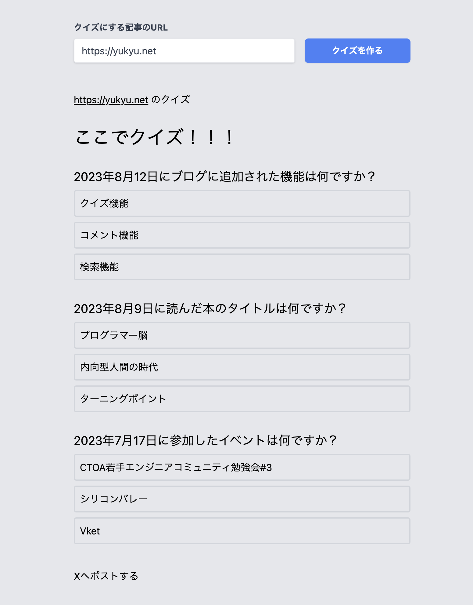

<h2>QuizBiteをリリースしました</h2>

QuizBiteはURLを入力するとクイズが生成されるサービスです。 
このブログにあるクイズ機能をサービス化したものです。

🔻 QuizBite 🔻   
https://quizbite.yukyu.net/ 

<h2>使い方</h2>

https://quizbite.yukyu.net/ にアクセスして、URLを入力してクイズを作るを押して、待つだけです。

https://quizbite.yukyu.net/?url=https://quizbite.yukyu.net/about 
という形式でアクセスすると、URLが入力された状態になるので、そのままシェアしたらクイズを楽しめます

<h2>最終的な構成</h2>
<h3>クイズ生成APIサーバー</h3>
<ul>
<li>Python</li>
<li>FastAPI</li>
<li>LangChain</li>
<li>Supabase</li>
</ul>

PythonでFastAPIを使用しています。 
肝心のクイズ生成部分ではGPT-4とLangChainを使っていますが、今の段階ではLangChainでなくても実装はできそうです。

将来的にはURLとプロンプトをPOSTして、クイズの数や難易度を調整できるようにしたいので、LangChainを使っています。

生成されたクイズを保存するためにSupabaseを使用しています。サクッと導入できて便利でした。 
無料で使える分を超えた時はその時に考えます。

<h3>Webサイト</h3>
<ul>
<li>Next.js</li>
<li>Vercel</li>
</ul>

APIにリクエストを送るだけなので無難にNext.jsを使っています。

<h2>直したいところ</h2>
<h3>クイズの生成に失敗しがち</h3>

LLMをつかっているので、出力がコードで期待されていない形式だと例外でエラーになります。結構多くて困ってます

<h3>クイズの生成に時間がかかる</h3>

クイズの生成に時間がかかる。どうにかしたい

<h3>長い文章だとクイズが生成されない</h3>

GPT-4は8k tokenまでなので、それ以上の文章だとクイズが生成されないです。 
GPT-4-32kに期待したいです。公開はやくー

<h2>楽しい</h2>

自分が欲しいものを作れてよかったです。 
三連休でずっと作っていましたが、楽しかったです。

