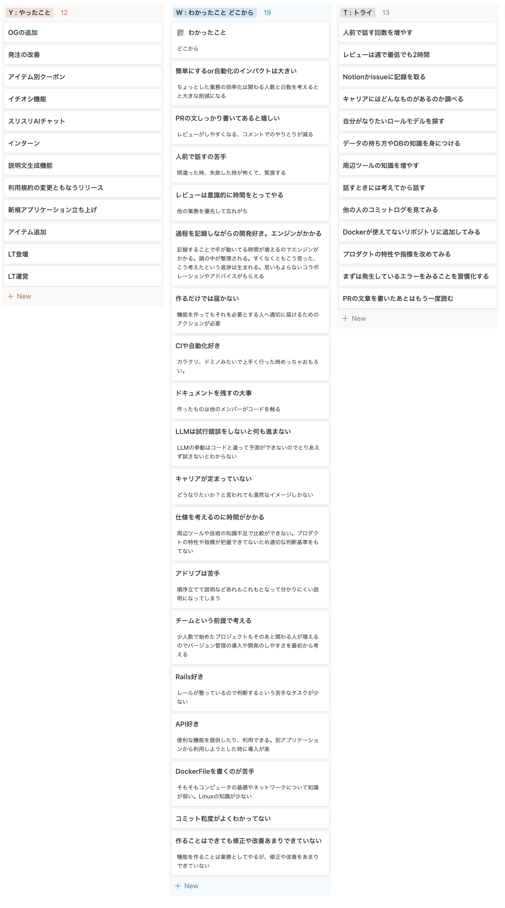

SUZURIに配属されて一年たったので、振り返りをYWDT形式で書いていきます。

<h2>YWDTとは</h2>

YWTにD(どこから)を加えてアレンジした自分の独自のフォーマットが「YWDT」です。Yがやったこと、Wがわかったこと、Dがどこから、Tがトライ(次にやること)です。

<h2>D</h2>

「やったこと、わかったこと間にあるはずの理由」=「どこからわかったのか」がDになります。

以前にMIMIGURIの方から、理由を聞く時にWhy(なぜ？)よりもWhere(どこから?)を聞く方が答えが出やすいという話を聞きました。実践すると確かに答えが出やすいと感じたので自分の振り返りにも取り入れてみました。

<h2>振り返り</h2>

前提として、自分は以下のような属性です。

<ul>
<li>2022年4月からエンジニアとして働き始めた</li>
<li>SUZURIのエンジニア</li>
<li>フロントエンド、バックエンド両方やるがバックエンドが多かった</li>
<li>React, Railsを使っています。</li>
<li>入社前は個人でWebアプリケーション開発をしていた</li>
</ul>

振り返りした中でのいくつか抜粋して書きます

<h3>Y (やったこと)</h3>
<ul>
<li>スリスリAIチャット
<ul>
<li>開発合宿でできた機能です。自分を含めエンジニア2人、ディレクター1人で開発した機能で、2日間で技術選定、プロトタイプの実装を行いました</li>
<li>その後、改良を加えた上でプロダクトに取り込まれました</li>
<li>0からアプリケーションの立ち上げを行うことができたので、とても良い経験になりました</li>
</ul>
</li>
<li>LT運営
<ul>
<li>業務とは関係ないのですが、LTの運営を行い2,3ヶ月に1回くらいの頻度でLTを開催しています</li>
<li>会場を確保、参加者の募集、当日の運営などを行なっています</li>
<li>社外の人と関わり、さまざまな知見を聞くことができ、自分のモチベーションにもつながっています</li>
</ul>
</li>
<li>アイテム別クーポン
<ul>
<li>対象アイテムが限られたクーポンの実装をしました</li>
<li>対象アイテムだけを値引きするロジックよりも、返金処理を考える方が難しかったです</li>
<li>返金処理の方針を話した時に、レビューで良い反応をもらって自分の自信にもつながった施策でした</li>
</ul>
</li>
<li>インターン
<ul>
<li>インターンのサポーターとして、面接やインターンの時のサポートを行いました</li>
<li>面接は話すのが苦手で緊張していました。</li>
<li>サポーターとして質問に答える時、自分の考えを伝える難しさに直面しました</li>
</ul>
</li>
</ul>
<h3>WD (わかったこと、どこから)</h3>
<ul>
<li>仕様を考えるのに時間がかかる
<ul>
<li>こういうことを実現したいに対して、知識不足で判断するのに時間がかかりました</li>
<li>他のエンジニアに相談して、こういう手法があるけどどう？SUZURIではここでこういうの使ってるけどどう？のようにいくつか候補を教えてもらうことが多かったです。</li>
</ul>
</li>
<li>コミットの粒度がわからない
<ul>
<li>細かくコミットしてしまい、変更の意図が伝わりにくいのでもうすこしコミットの粒度を大きくする方が良さそう</li>
</ul>
</li>
<li>作るだけでは届かない
<ul>
<li>新しい機能を作っても、ユーザーに認知して使ってもらえるとは限らない</li>
<li>ユーザーを抱えるプロダクト開発をして初めてこの観点を持った、そもそもユーザーがほとんどいない個人開発の時には考えてもいなかった</li>
</ul>
</li>
<li>簡単にするor自動化のインパクトは大きい
<ul>
<li>開発や運営に関わる人の人数を考えると、少しの効率化でも日々の積み重ねでとんでもないインパクトになる</li>
</ul>
</li>
<li>つくることはできても、修正や改善ができていない
<ul>
<li>機能開発をすることは多いが、出ているエラーを直すなどの修正や改善が他の人と比べた時自分はできていない</li>
</ul>
</li>
</ul>
<h3>T (トライ)</h3>
<ul>
<li>他人のコミットログを見てみる
<ul>
<li>コミットの粒度がわからないので、他人のコミットログを見てみる</li>
</ul>
</li>
<li>データ構造、DBの知識を身につける</li>
<li>周辺ツールの知識を身につける</li>
<li>Dockerが使えてないリポジトリに追加してみる</li>
<li>エラーをみることを習慣にする</li>
</ul>
<h2>終わりに</h2>

1年経ったという実感はなく、まだ一年かという感覚です。 
1年間でいちばんの出来ことはChatGPTです。そこから生成AIを使った機能をプロダクトに追加するなど新しいことにも取り組めて楽しかったです。 
それ以外にもインターンやLT運営など、開発業務以外のことにも取り組めて良かったです。

