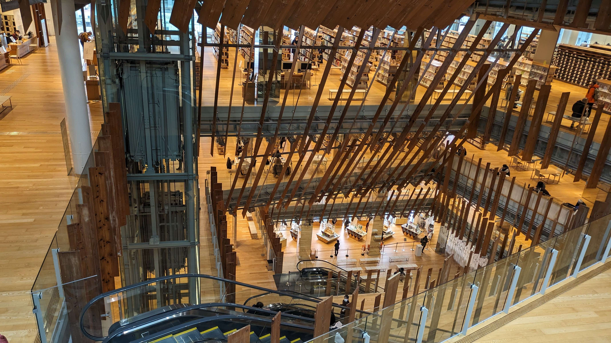
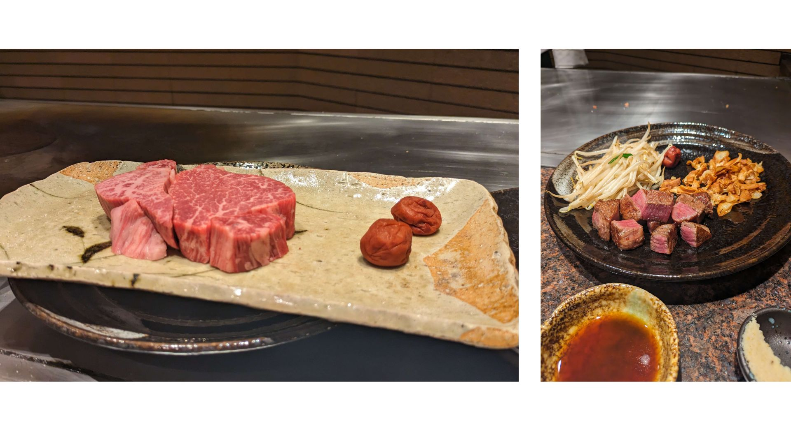
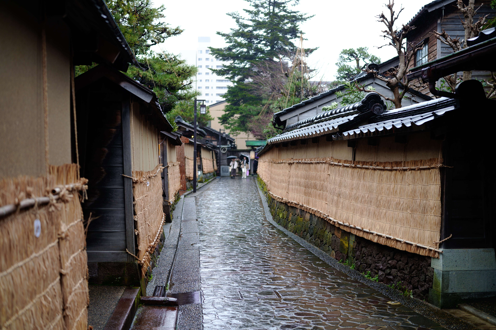
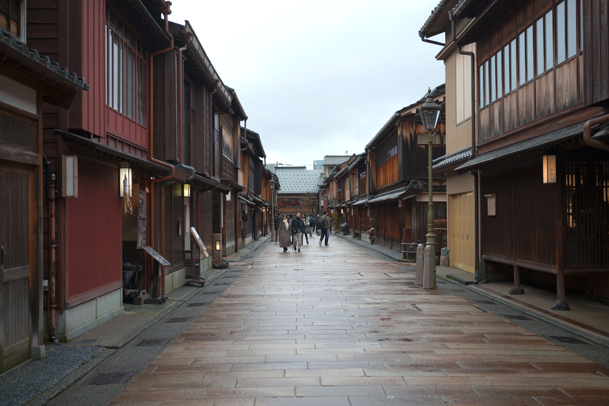
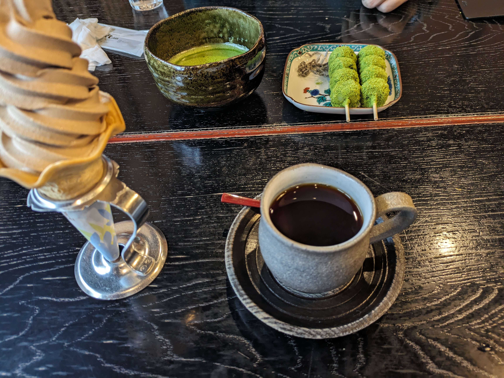
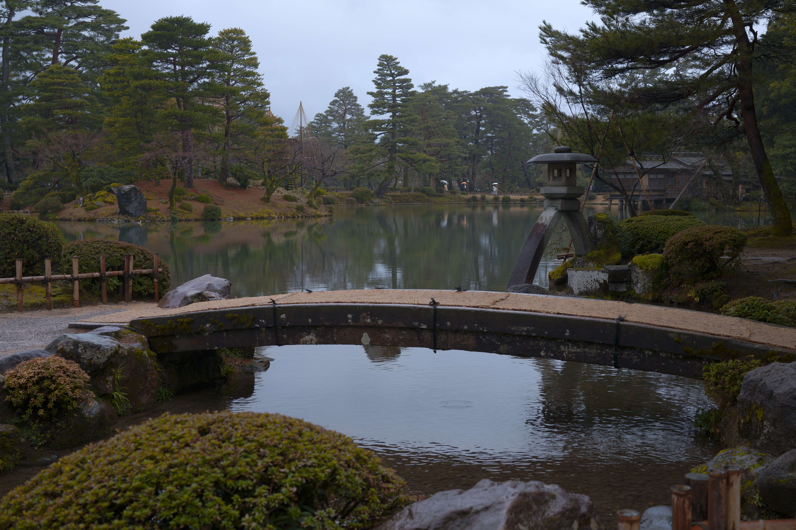
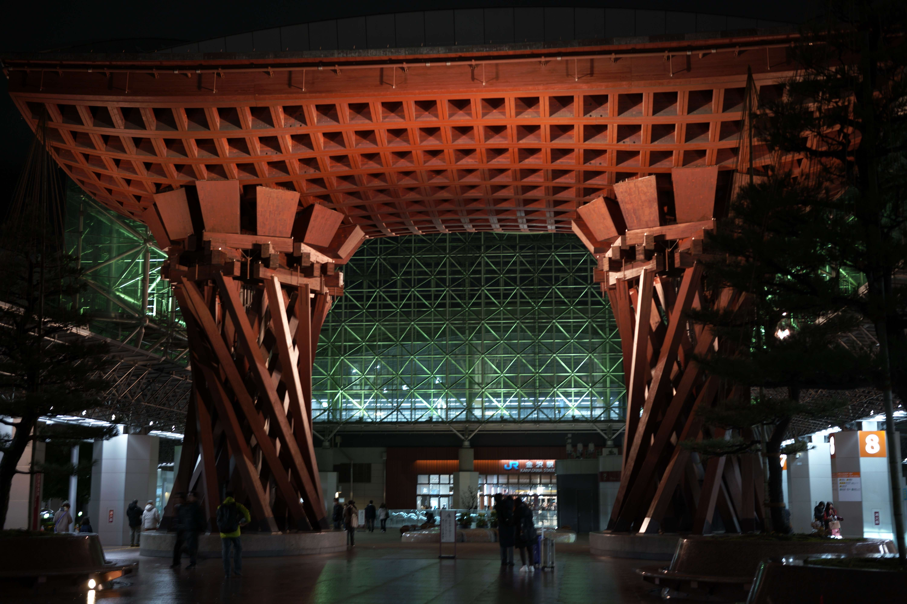

BuriKigi に参加するため富山に行きました。翌日は富山・金沢で観光をしました。

<h2>富山市ガラス美術館</h2>

富山に泊まっていたので、午前中は<a href="https://toyama-glass-art-museum.jp/">富山市ガラス美術館</a>に行きました。 
 
図書館が併設されているおしゃれな建物の中にありました。

展示物の SNS シェアは NG だったので、写真はありませんが、ガラスの作品がたくさんありました。 
ガラスでしょと思って舐めてましたが、想像を超えるデカさの作品がいくつもありました。ガラスの色使いがとても綺麗でした。

<h2>金沢散策</h2>

午後からは金沢に移動して、観光をしました。 
お昼には六角堂せせらぎ通り店でステーキを食べました。 
目の前で焼いてくれるので、ずっと見てしまいました。もちろん美味しかったです。 
 
長町武家屋敷跡界隈を歩きました。気になったお店にふらっと立ち寄り、ショッピングを楽しみました！ 

そのあとはバス移動で、ひがし茶屋街に行きました。 
お茶屋さんがたくさんあり、どのお店に入るか迷いました。 
ほうじ茶アイスとコーヒーを飲みました。 
 

天気が回復してきたので、兼六園に行きました。 
徽軫灯籠（ことじとうろう）を見て、そのあとは兼六園の中を散策しました。 
想像以上の広さと、道の入り組み度合いにびっくりしました。 
日本最古の噴水もみました！ 
 
近江町市場で散策して夕飯を食べようと思ったのですが、17:00 で閉まっていました。 
しかし、一部の居酒屋はやっていたので、金沢おでんと刺身を食べました。

<h2>帰り</h2>

金沢駅に戻り、新幹線で帰りました。シンカンセンスゴクカタイアイスも食べました！ 

<blockquote align="center" class="twitter-tweet" data-dnt="true">
これが噂のアイスかー <a href="https://t.co/pTmcjw90vy">pic.twitter.com/pTmcjw90vy</a>
— yukyu (a.k.a ugo) (@yukyu30) <a href="https://twitter.com/yukyu30/status/1749023796991054327?ref_src=twsrc%5Etfw">January 21, 2024</a></blockquote>

<h2>おわりに</h2>

一日歩き回って、食べて買って楽しかったです！ 
金沢 21 世紀美術館にも行きたかったのですが、地震の影響で休館していました 😢

