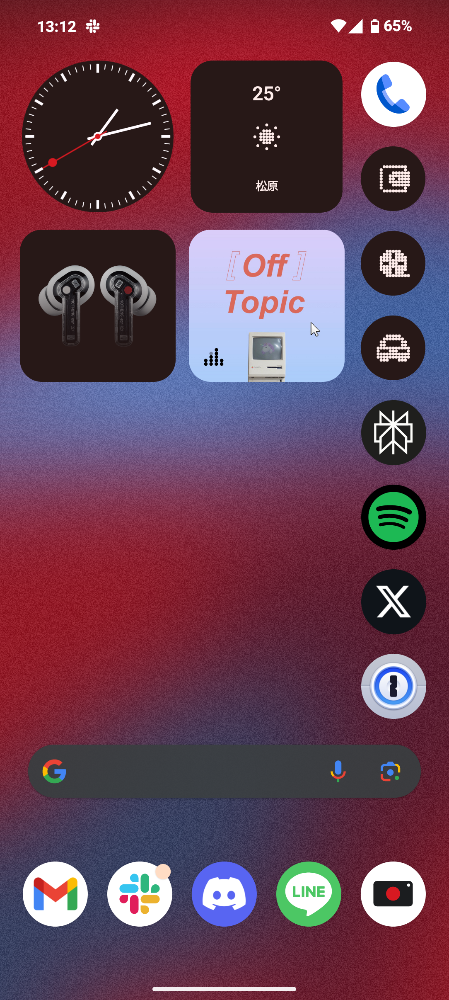

4月21日にカメラのシャッター音が解決した旨を追記

Nothing phone (2a)を買った。 
以前の Nothing phone は Felica 非対応のため、買っていなかった。 
今回から Felica 対応と聞き、速攻予約した。 
そして、3 月 30 日に届いた。

<h2>モバイル Suica、PASMO 😊</h2>

Felica に対応したことで、モバイル Suica や PASMO が使えるようになった。 
実際に駅に行って試したところ、使えたので安心した。

<h2>Pixel であった不満が消えた 😊</h2>

Pixel 7a で圏外になったら、そのまま圏外のままになってしまう現象が頻発していた。通勤で電車に乗って圏外になるとその後ずっと圏外になる。 
通信を再起動し直したら治るが不便だった。

今の所その現象は起きていないのでとても満足している。

<h2>ホーム画面のカスタマイズがめっちゃ良い 😊</h2>

公式のウィジェットがおしゃれなのはもちろんだが、アプリをまとめたフォルダで中身を隠せることができる。 
生活感のある銀行のアプリや決済アプリはフォルダにまとめて、お財布のアイコンに変更して隠すことにした(電話アプリの下)。 
Pixelで一番下に強制的に表示される検索バーが非表示にできる。その上でウィジェットの検索バーを別の位置に置いた。

<h2>カメラのシャッター音がでかい 😞　（OSのアップデートにて解決)</h2>

カメラで写真を撮ったら、めちゃくちゃでかいシャッター音が鳴る。おしゃれな飲食店、美術館などで写真を撮ればたちまち注目の的になるくらいの音のデカさだった。 
今後のソフトウェアアップデートで改善に期待している。

4月12日追記：

OSのアップデートにてシャッター音が小さくなりました 
参考 https://smhn.info/202404-nothing-shutter-volume

<h2>eSIM 非対応 😞</h2>

デュアル SIM 対応だが、eSIM 非対応だった。自分は Nuro モバイル(データ通信のみ)を物理 SIM、povo(データ通信と電話)を eSIM で使っていた。 
eSIM 非対応なので povo が使えなくなってしまった。電話番号がないと SMS による二要素認証が突破できないので当分は 2 台持ちで運用する予定だ。

<h3>eSIM ってそこまで便利ではないのかも</h3>

機種変更での eSIM 再発行には、再発行手続きして、発行が完了されるまで待って、プロファイルダウンロードして...と時間がかかる。 
物理 SIM なら SIM を入れ替えて、APN 設定を終わらせたらそれで終わり。自分みたいに 1 年でスマホを買い替えるような場合、eSIM ってむしろ手間なのではと思い始めてきた。

<h2>おわりに</h2>

Nuro モバイルにデータ通信と電話をまとめて、povo は最近できたデータ通信だけのプランに変更しようと思う。 
一番の不満はシャッター音くらいで、あとは満足している。

