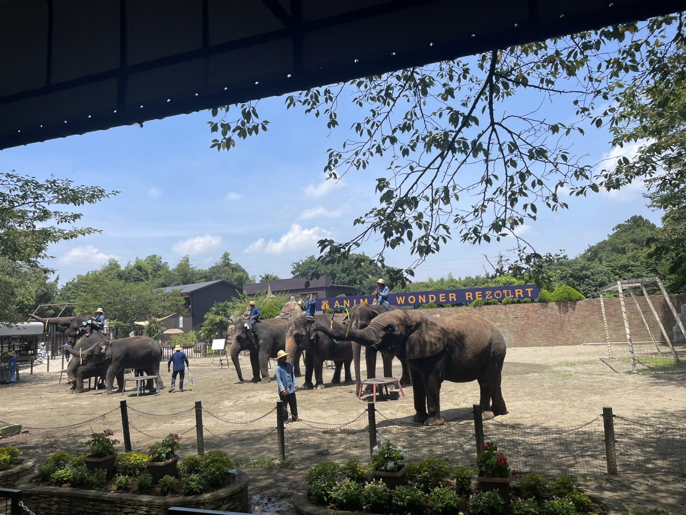
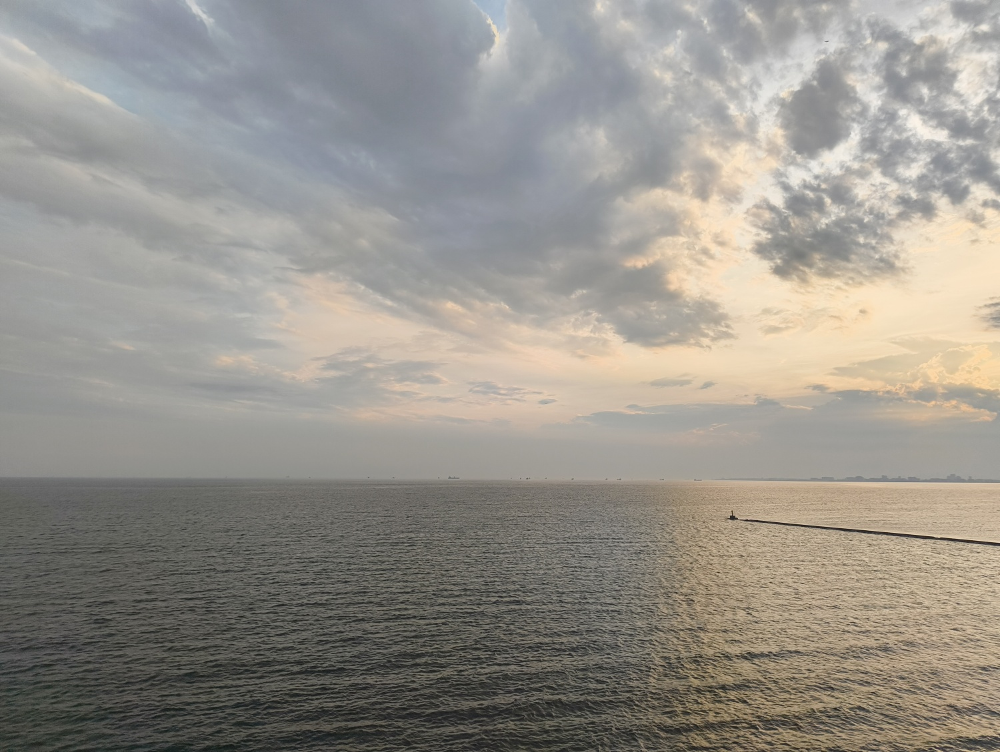

会社の同僚と千葉旅行に行った。

<h2>海ほたる</h2>

レンタカーを利用したため高速道路で移動をしていた。 
途中で海ほたるに寄った。海を眺めたり、軽食を食べたりした。

まわりに広がる海を見て、広大さを感じた。

<blockquote align="center" class="twitter-tweet" data-dnt="true">
海ほたるきました <a href="https://t.co/QGKkL4PWOd">pic.twitter.com/QGKkL4PWOd</a>
— yukyu (a.k.a ugo) (@yukyu30) <a href="https://twitter.com/yukyu30/status/1814834145006399497?ref_src=twsrc%5Etfw">July 21, 2024</a></blockquote>

<h2>市原ゾウの国 / サユリワールド</h2>

市原ゾウの国に行った。 
ゾウさんのショーを見て、動物たちに餌をあげながら、園内を見て回った。

ドムドムハンバーガーを食べた。小さい頃に行ったことがあるらしいが、記憶はないので実質初めてだった。美味しかった。

<blockquote align="center" class="twitter-tweet" data-dnt="true">
ぞうの国でドムドムハンバーガーをたべた！！ <a href="https://t.co/F75RyHb4A8">pic.twitter.com/F75RyHb4A8</a>
— yukyu (a.k.a ugo) (@yukyu30) <a href="https://twitter.com/yukyu30/status/1814876767473311843?ref_src=twsrc%5Etfw">July 21, 2024</a></blockquote>

サユリワールドという動物とふれあることがメインの動物園？にも行った。 
園内に放たれている動物もいるし、ケージに入って触れ合える動物もいた。

キリンやカピバラにおやつをあげた。ワオキツネザルのいる場所にバナナを持って行ったら同僚がめっちゃ狙われていたのを見て怖かったので眺めるだけにした。

<h2>かりんの湯</h2>

宿泊予定のコテージの隣にある温泉に行った。

汗をかいていたので温泉に行ってスッキリした。他のみんなより早く上がったのでロビーに座りながらコーヒーを飲みながらぼーっとしていた。

<h2>The Farm HABITA</h2>

以前、<a href="./2023-10-07">The Farmに来た時はグランピングでテントに泊まった</a>が、今回はHABITAというコテージに泊まった。 
近くにある「スーパーうい」で食材を買ってBBQをした。

<blockquote align="center" class="twitter-tweet" data-dnt="true">
BBQをした〜！ <a href="https://t.co/8OBmcuR5R0">pic.twitter.com/8OBmcuR5R0</a>
— yukyu (a.k.a ugo) (@yukyu30) <a href="https://twitter.com/yukyu30/status/1815002468553744738?ref_src=twsrc%5Etfw">July 21, 2024</a></blockquote>

ほとんどはとても美味しくできたが、最後の焼きそばだけは、火力も足りずイマイチになってしまったが、それも含めて思い出になった。

BBQを終えたら、コテージでコーヒーを入れ、お菓子を食べながら雑談した。 
喋り倒したところで、<a href="https://picoparkgame.com/">PICO PARK</a>というゲームをした。 
面白くて大盛り上がりした。

朝食はビュッフェで、カレー、味噌汁、パン、サラダなどなどを食べた。 
チキンのトマト煮込みがめちゃくちゃに美味かった。

<h2>マザー牧場</h2>

コテージで雑談してる時にバンジージャンプしたいとなり、マザー牧場に行った。 
自分は怖いのが苦手なので見学をした。他の全員がバンジージャンプをするのを眺めていたらいけそうな気がしてきた。

ジップラインは全員で体験した。思ったよりも勢いもあり、到着時の衝撃があった。 
爽快感があり、とても楽しかった。

<h2>湯楽の里</h2>

帰りながらまた温泉に行った。海辺にある湯楽の里というスパに行った。 
露天風呂から海を眺めることができて絶景だった。

自分たちにが1日目に行った海ほたるを見ることができて、なんともしみじみした気持ちになった。 

<h2>ハプニング</h2>
<ol>
<li>帰り始めてすぐにお腹が痛くなって、PAによる</li>
<li>前日消費しきれなかった炭酸水を飲んで車酔い</li>
<li>お腹が痛くなった時に酔ったPAにカメラを忘れてしまい、とりに戻る(申し訳なかったが後ろの予定を調整もらいことなきを得た)</li>
</ol>
<h2>おわりに</h2>

普段は旅行でも電車などで移動するので、車がある今回はいつもと違う旅行になった。 
BBQは持ち込みプランにしたり、前日に行きたいところを見つけ翌日に行ったりと自由度が高く、面白かった！

動物園もあまり行かないが久々に行って、動物のおやつをあげてベロで手をなめられるという体験ができてよかった。 
ハプニングが起きたが、それでも臨機応変に対応してくれた同僚に感謝をしたい。

