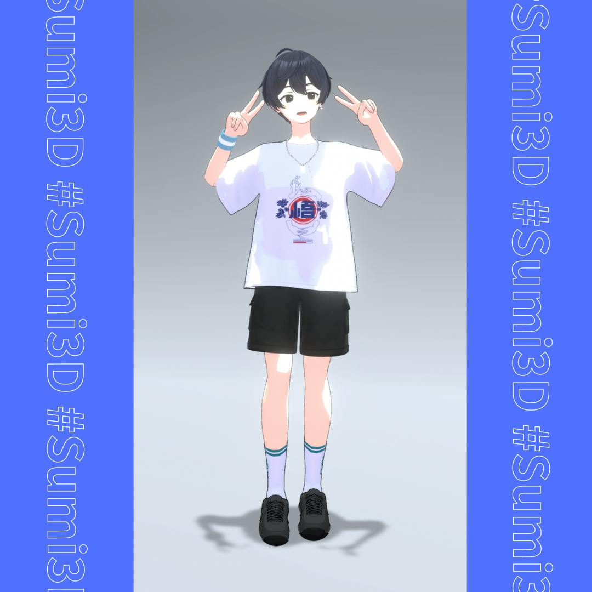

リアルクローズ集会と墨澄集会に行ってきた。

<strong>ブログはだ・である調で書くことにしている。そのため、テンションが低めに感じ取れるがとても楽しかったので気にしないでほしい。</strong>

<h2>リアルクローズ集会</h2>

リアルクローズ集会とは、リアルクローズ(現実的な服<a href="#fn1" id="fnref1">[1]</a>)のファッションが好きな方が集まる定期開催のイベントである。 
今回のテーマは「Graphics」ということで、SUZURIの3DグッズのTシャツを着て行った。

<blockquote align="center" class="twitter-tweet" data-dnt="true">
【告知】第29回リアルクローズ集会  　開催日時　7/26（金）21:30~23:30 　Friends＋　※PC Only 　テーマ「Graphics」 　※ドレスコードではないです！  なんとSUZURIさんがリアクロ集会に遊びに来ま～す🎊✨！！色んなことが聞けるかも👀！？是非交流してね～～～！！！  　<a href="https://twitter.com/hashtag/%E3%83%AA%E3%82%A2%E3%82%AF%E3%83%AD%E9%9B%86%E4%BC%9A?src=hash&amp;ref_src=twsrc%5Etfw">#リアクロ集会</a> 　<a href="https://twitter.com/hashtag/ReaClo?src=hash&amp;ref_src=twsrc%5Etfw">#ReaClo</a>… <a href="https://t.co/fKsSlnJ8Ig">pic.twitter.com/fKsSlnJ8Ig</a>
— JONER（ジョネ） (@JONER_121) <a href="https://twitter.com/JONER_121/status/1814496769352651106?ref_src=twsrc%5Etfw">July 20, 2024</a></blockquote>

大盛況で第2インスタンスでも立てての開催だった。 
墨澄を男性っぽく改変して、墨澄くんと言い張って参加した。

<blockquote align="center" class="twitter-tweet" data-dnt="true">
<a href="https://twitter.com/hashtag/%E3%83%AA%E3%82%A2%E3%82%AF%E3%83%AD%E9%9B%86%E4%BC%9A?src=hash&amp;ref_src=twsrc%5Etfw">#リアクロ集会</a> に参加してきました！いろんなファッションをみたり、ゆるくおしゃべりして楽しかったです～ <a href="https://t.co/QUEvbcYRR8">pic.twitter.com/QUEvbcYRR8</a>
— yukyu (a.k.a ugo) (@yukyu30) <a href="https://twitter.com/yukyu30/status/1816851518211109352?ref_src=twsrc%5Etfw">July 26, 2024</a></blockquote>

同じように男性になるよう改変している方に出会って嬉しかった。控えるくらいめっちゃ好きな改変だったのだが、平穏を保ったふりをしていた。とても好きな改変だった。

<blockquote align="center" class="twitter-tweet" data-dnt="true">
男性化改変はいいぞ。  これはSUZURIからDL出来る無料アバターの墨澄(スミスミ)ちゃん……<a href="https://t.co/98TLvwoC0n">https://t.co/98TLvwoC0n</a> の男の子改変。 胸のシェイプキーでFlatがあるのが嬉しいね。<a href="https://twitter.com/hashtag/SUMI3D?src=hash&amp;ref_src=twsrc%5Etfw">#SUMI3D</a> <a href="https://t.co/GW7FiBroOH">pic.twitter.com/GW7FiBroOH</a>
— らいず (@_mumumu) <a href="https://twitter.com/_mumumu/status/1816799382609809792?ref_src=twsrc%5Etfw">July 26, 2024</a></blockquote>

また、シティポップに描いた友人のイラストをTシャツにしていてきてるグループがいてめちゃくちゃに良かった。

<blockquote align="center" class="twitter-tweet" data-dnt="true">
昨夜はこちらの方々が面白すぎて2時間くらい笑ってました🤣 私もシティポップしたい🏙️<a href="https://twitter.com/hashtag/%E3%83%AA%E3%82%A2%E3%82%AF%E3%83%AD%E9%9B%86%E4%BC%9A?src=hash&amp;ref_src=twsrc%5Etfw">#リアクロ集会</a> <a href="https://t.co/Bc2ABoLqpa">pic.twitter.com/Bc2ABoLqpa</a>
— K Kinosh (@k_kinosh) <a href="https://twitter.com/k_kinosh/status/1817033247840489874?ref_src=twsrc%5Etfw">July 27, 2024</a></blockquote>

1会場に人数が収まらなかったので2会場で実施された。最後は各会場で集合写真を撮って解散した。

<blockquote align="center" class="twitter-tweet" data-dnt="true">
第29回リアクロ集会ありがとうございました～🥳！！<a href="https://twitter.com/hashtag/%E3%83%AA%E3%82%A2%E3%82%AF%E3%83%AD%E9%9B%86%E4%BC%9A?src=hash&amp;ref_src=twsrc%5Etfw">#リアクロ集会</a><a href="https://twitter.com/hashtag/ReaClo?src=hash&amp;ref_src=twsrc%5Etfw">#ReaClo</a> <a href="https://t.co/UtE3VZA46e">pic.twitter.com/UtE3VZA46e</a>
— JONER（ジョネ） (@JONER_121) <a href="https://twitter.com/JONER_121/status/1817034543142175040?ref_src=twsrc%5Etfw">July 27, 2024</a></blockquote>

<h2>墨澄集会</h2>

墨澄集会とは、その名の通り、墨澄が好きな方が集まるイベントである。

<blockquote align="center" class="twitter-tweet" data-dnt="true">
――――――――――――<a href="https://twitter.com/hashtag/kaihen?src=hash&amp;ref_src=twsrc%5Etfw">#kaihen</a> イベント開催‼️ ――――――――――――<a href="https://twitter.com/hashtag/SUZURI?src=hash&amp;ref_src=twsrc%5Etfw">#SUZURI</a> より好評配信中の 「墨澄」ちゃん集会を、 kaihen チームが 主催しちゃいます🧡  日時：2024/7/28(日)21:00～23:00 kaihen Group+インスタンス 会場ワールドは <a href="https://twitter.com/hashtag/%E3%82%B8%E3%82%A7%E3%82%A4%E3%83%97%E3%83%A9?src=hash&amp;ref_src=twsrc%5Etfw">#ジェイプラ</a> です  あなたの墨澄ちゃんを見せに来て下さい✨<a href="https://twitter.com/hashtag/Sumi3D?src=hash&amp;ref_src=twsrc%5Etfw">#Sumi3D</a> <a href="https://twitter.com/hashtag/VRChat?src=hash&amp;ref_src=twsrc%5Etfw">#VRChat</a> <a href="https://t.co/Fc1khK17ga">pic.twitter.com/Fc1khK17ga</a>
— kaihen | VRChat改変投稿サービス (@kaihen_jp) <a href="https://twitter.com/kaihen_jp/status/1815953520295829792?ref_src=twsrc%5Etfw">July 24, 2024</a></blockquote>

様々な墨澄が集まり、「え！それもスミちゃんなんですか」と驚きの連続だった。

<blockquote align="center" class="twitter-tweet" data-dnt="true">
墨澄集会 の写真 カメラ上手くないの許してください🙏<a href="https://twitter.com/hashtag/Sumi3D?src=hash&amp;ref_src=twsrc%5Etfw">#Sumi3D</a> <a href="https://twitter.com/hashtag/%E3%82%B8%E3%82%A7%E3%82%A4%E3%83%97%E3%83%A9?src=hash&amp;ref_src=twsrc%5Etfw">#ジェイプラ</a> <a href="https://twitter.com/hashtag/kaihen?src=hash&amp;ref_src=twsrc%5Etfw">#kaihen</a> <a href="https://twitter.com/hashtag/SUZURI?src=hash&amp;ref_src=twsrc%5Etfw">#SUZURI</a> <a href="https://t.co/98o2CfFvud">pic.twitter.com/98o2CfFvud</a>
— yukyu (a.k.a ugo) (@yukyu30) <a href="https://twitter.com/yukyu30/status/1817572584843849946?ref_src=twsrc%5Etfw">July 28, 2024</a></blockquote>

リアクロ集会などのポストをみくれたのか、「yukyuさんに会いたかったんです〜！」と言われたので、嬉しかった。 
墨澄くんを3人くらいでまじまじと見られてドキドキしたが、改変を褒められたので良かった。

こちらも集合写真を撮った。

<blockquote align="center" class="twitter-tweet" data-dnt="true">
イベントありがとうございました～！<a href="https://twitter.com/hashtag/Sumi3D?src=hash&amp;ref_src=twsrc%5Etfw">#Sumi3D</a> <a href="https://twitter.com/hashtag/kaihen?src=hash&amp;ref_src=twsrc%5Etfw">#kaihen</a> <a href="https://t.co/wrpPuZd98v">https://t.co/wrpPuZd98v</a> <a href="https://t.co/SOiQZxnnMT">pic.twitter.com/SOiQZxnnMT</a>
— kaihen | VRChat改変投稿サービス (@kaihen_jp) <a href="https://twitter.com/kaihen_jp/status/1817570046820126926?ref_src=twsrc%5Etfw">July 28, 2024</a></blockquote>

<h2>おわりに</h2>

改めて個性豊かなファッションや墨澄を見ることで自分の創作意欲がさらに高まった。 
また、直接お話し、要望や褒め言葉を聞くことができ楽しかった。

<h2>今回の着用アイテム</h2>

<a href="https://kaihen.jp/post_detail/1722095332952x983570316771983400">kaihenにも投稿した</a>が改めて今回のコーディネートで使ったアイテムを紹介していく。 

<h3>SUZURI</h3>

<iframe allowfullscreen="" data-iframely-url="//cdn.iframe.ly/api/iframe?app=1&amp;url=https%3A%2F%2Fsuzuri.jp%2FKoiWasLie%2Fdigital_products%2F44852&amp;key=878c5bef402f0b2911bf6d4ce6261abd" style="top: 0; left: 0; width: 100%; height: 100%; position: absolute; border: 0;" title="【VRCHAT想定3Dモデル】HalfDeadPierces【アクセサリ】 by こいわずらい。 ( KoiWasLie ) ∞ SUZURI"></iframe>

<iframe allowfullscreen="" data-iframely-url="//cdn.iframe.ly/api/iframe?app=1&amp;url=https%3A%2F%2Fsuzuri.jp%2FStore_elesato%2Fdigital_products%2F46076&amp;key=878c5bef402f0b2911bf6d4ce6261abd" style="top: 0; left: 0; width: 100%; height: 100%; position: absolute; border: 0;" title="【VRChat】4連ネックレス by えれさとのお店 ( Store_elesato ) ∞ SUZURI"></iframe>

<iframe allowfullscreen="" data-iframely-url="//cdn.iframe.ly/api/iframe?app=1&amp;url=https%3A%2F%2Fsuzuri.jp%2Fvikingshrimp%2Fdigital_products%2F54137&amp;key=878c5bef402f0b2911bf6d4ce6261abd" style="top: 0; left: 0; width: 100%; height: 100%; position: absolute; border: 0;" title="悟 by SHRIMPのおみせ ( vikingshrimp ) ∞ SUZURI"></iframe>

<iframe allowfullscreen="" data-iframely-url="//cdn.iframe.ly/api/iframe?app=1&amp;url=https%3A%2F%2Fsuzuri.jp%2Fnearlyequal%2Fdigital_products%2F58204&amp;key=878c5bef402f0b2911bf6d4ce6261abd" style="top: 0; left: 0; width: 100%; height: 100%; position: absolute; border: 0;" title="【墨澄専用】NICO2 ロゴソックス by NEARLY EQUAL ( nearlyequal ) ∞ SUZURI"></iframe>

<iframe allowfullscreen="" data-iframely-url="//cdn.iframe.ly/api/iframe?app=1&amp;url=https%3A%2F%2Fsuzuri.jp%2Fyukyu30%2Fdigital_products%2F58211&amp;key=878c5bef402f0b2911bf6d4ce6261abd" style="top: 0; left: 0; width: 100%; height: 100%; position: absolute; border: 0;" title="墨澄対応 黒スニーカーテクスチャ by 悠久 ( yukyu30 ) ∞ SUZURI"></iframe>

<h3>BOOTH</h3>
<ul>
<li><a href="https://pochiya.booth.pm/items/3416602">【PB対応】ぽちショート</a></li>
<li><a href="https://hero2poi.booth.pm/items/4841044">Urban Street Set / 衣装 [VRC] (杏里 - Anri)</a></li>
</ul>

<section class="footnotes">
<ol class="footnotes-list">
<li class="footnote-item" id="fn1">
https://www.fastretailing.com/jp/glossary/1845.html <a class="footnote-backref" href="#fnref1">↩︎</a>

</li>
</ol>
</section>
