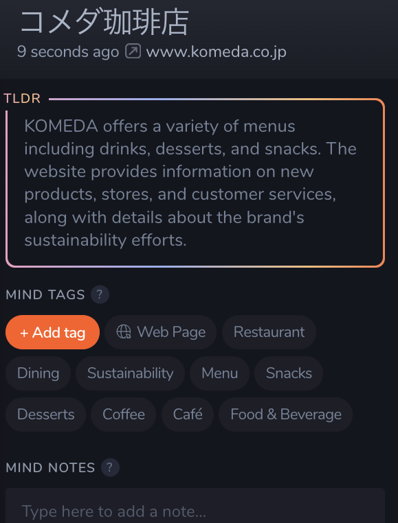
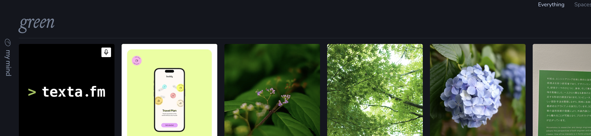
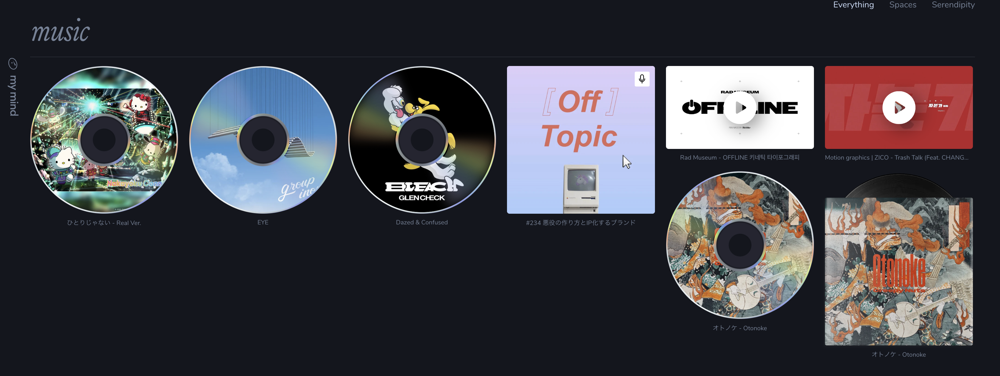

Readwiseを使っていたが、mymindというブックマークツールを見つけて、乗り換えた。

mymindの良さを伝えたい。

<h2>mymind</h2>

<a data-iframely-url="//cdn.iframe.ly/api/iframe?card=small&amp;url=https%3A%2F%2Fmymind.com%2F&amp;key=878c5bef402f0b2911bf6d4ce6261abd" href="https://mymind.com/">mymind is the extension for your mind.</a>

<a href="https://mymind.com/">mymind</a>はWebコンテンツをブックマークできるアプリ。

ブックマークにはNotionとReadwise Readerなどを使っていたが、 
ReadwiseとNotionはタグをつけるなどのメンテナンスができず、情報に辿り着くには検索する必要があった。 
しかし、Notionの検索性がイマイチで、時間がかかる上に、そもそも欲しい情報に辿り着けないことが多い。Readwise Readerは検索性はよいが、それでも検索結果が返ってくるのに4秒くらいかかった。その空いたNo Resultと表示されるので該当する記事がないのか、検索中なのかわからない。

mymindはこれらを解決してくれた。

おすすめポイントとしては以下の4点になる。

<ul>
<li>ブックマークの整理はしなくていい</li>
<li>画像に写っているオブジェクトや色で検索できる</li>
<li>検索が爆速</li>
<li>遊びごごろのあるデザイン</li>
</ul>

それぞれをもう少し詳しくまとめていく。

<h3>ブックマークの整理をしなくていい</h3>
<blockquote>

Remember everything. Organize nothing.

</blockquote>

と書いてあるが、まさにこの言葉の通り。 
ブックマークしたら、要約とタグ付けが自動で行われる。 
たとえば、コメダ珈琲店の公式サイトをブックマークすると、以下のような要約とタグが自動的に追加される。 
 
Ruby on Railsの記事も適切にRails、Rubyといったタグがついた。 
画像を保存したら、画像内の文字、色、オブジェクトといった情報も保存される。

個人的にはReadwise と  Eagleのいいとこ取りをしたツールだと思う。

<h3>画像に写っているオブジェクトや色で検索できる</h3>

前述したように、画像の色や写っているオブジェクト、文字も記録される。 
なので、greenと検索したら、緑を含む画像が検索できる。 
 
shoesと検索したら、靴の画像を検索できる。 
 
画像のテキスト検索は試していないのでどんな精度かはわからない。

<h3>検索が爆速</h3>

さまざまな検索ができるのに、検索結果がでるのがとても早い。 
ローディングやスケルトンが表示される時間もない。一文字入力するたびに検索結果が更新される。ブックマークしたものにはタグが自動でつくのでも目的のものを見つけやすい。整理しなくても検索で辿り着ける。

<h3>遊び心のあるデザイン</h3>

ミュージックをブックマークしたら、CDのようなサムネイルになり、本をブックマークしたら、本のようなサムネイルになる。 

<h2>気になる点</h2>
<h3>タグも要約も英語</h3>

タグも英語も基本英語で作成されるので、英語でないと検索できない。

英語を読む力や語彙が増すからいいかと思っている。

<h3>noteにはタグや要約がつかない</h3>

エディタ機能があり、ノートを作成して保存できる。しかし、これにはタグや要約がつかない。

なので、ノートやメモを取るときはNotionでとり、公開したNotionのページをmymindへ保存するということをしている。

<h2>mymindとフィードアプリの組み合わせ</h2>
<ul>
<li>Inoreader でフィードを購読</li>
<li>気になる記事をInoreaderのシェア機能でmymindに保存</li>
</ul>

フィードアプリのシェア機能はアプリに保存した記事をシェアする機能の場合がある。 
Inoreaderモバイルアプリのシェアは、元の記事がシェアされる。mymindのブラウザ拡張が使えないモバイルアプリではこの方法が楽だった。

<h2>終わりに</h2>

mymindはとてもおすすめのツールなのでみんな使って見てほしい。

