
サントリー白州工場の工場見学に申し込んで、友人が当選したので11/1, 2で山梨旅行に行ってきた。

<h2>1日目</h2>
<h3>小淵沢駅から白州工場へ</h3>

新宿から2,3時間ほどでサントリーの白州工場の最寄り駅の小淵沢駅まで着いた。 
そこからは無料のシャトルバスが出ているので乗って、工場まで20分程度乗った。 
乗務員さんの皮肉の効いたトークで和やかな雰囲気だった。

到着を受付を済ませて、ツアーの時間までウィスキー博物館を見ていた。 
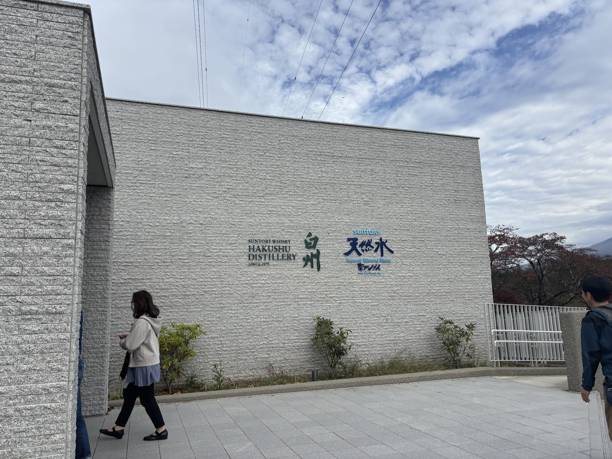

蒸留器の容量が課税基準になると、人々が節税を図るために蒸留回数を増やすといった技術革新を目指し、また一方では密造のため製造過程の簡略化し、ウィスキーの基盤を作り上げたという話が面白かった。 
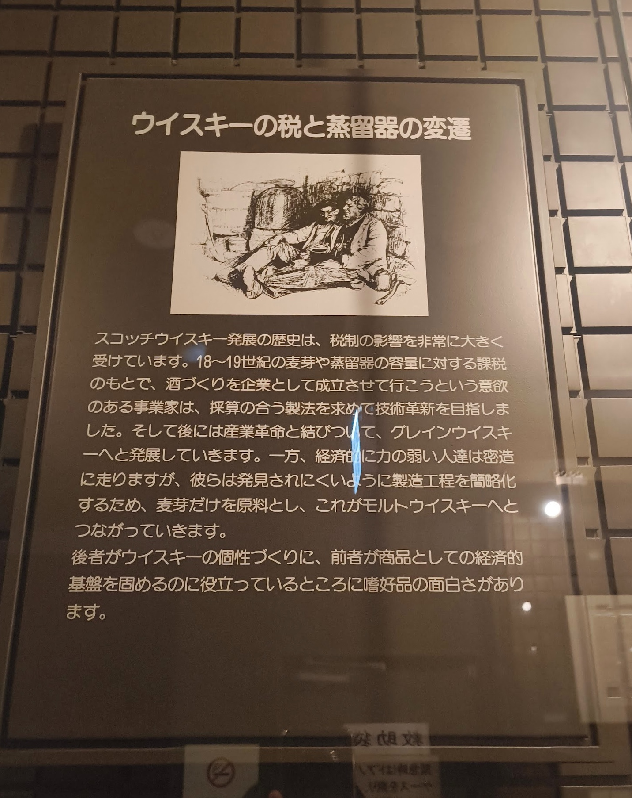 
工場見学では、製造工程を実際にみることができた。 
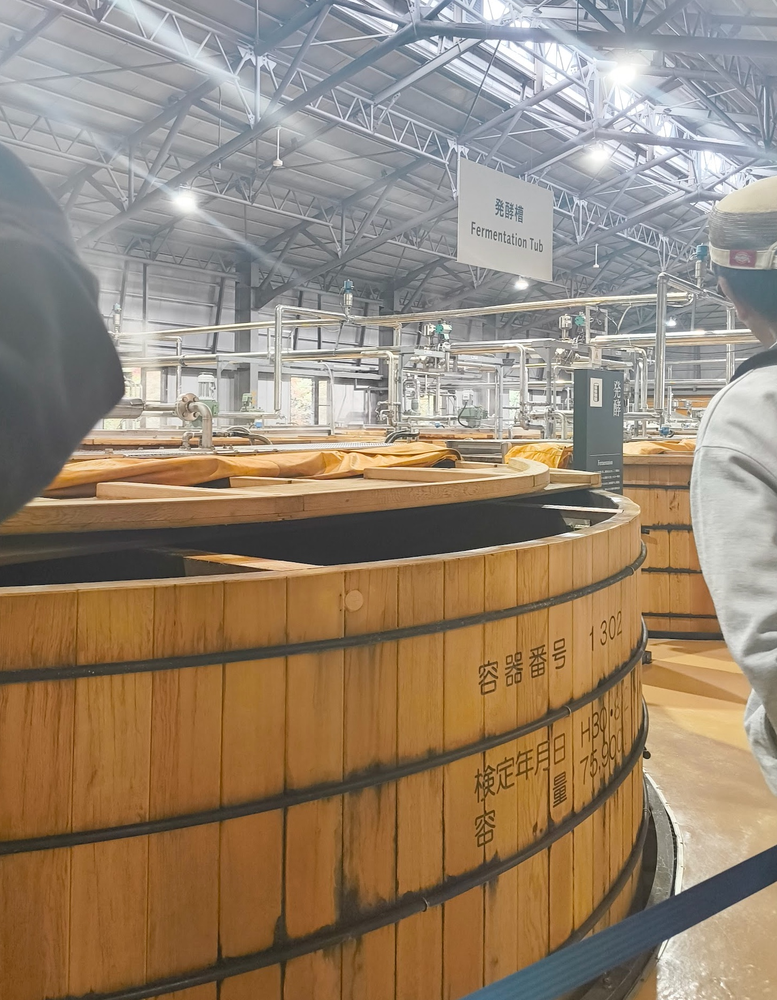 
工場見学の後は、テイスティングをした。 
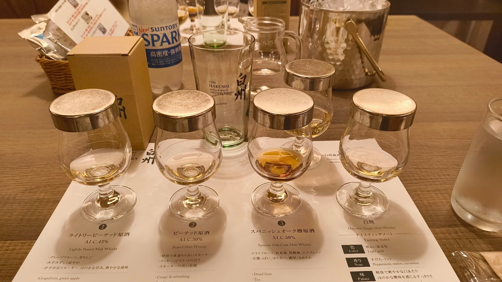 
色をみて、匂いを嗅ぎ、常温の水を注いで飲むというティスティング方法を学んだ。原酒は面白いくらいに違いがあった。原酒を組み合わせて作られた白州はバランスがよく美味しかった。 
最後はハイボールを作って飲んだ。美味しかった。 
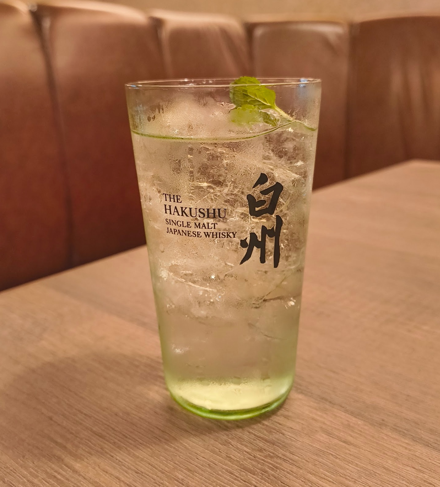

ランチは、白州テラスでピザや鶏もも肉のコンフィなどを食べた。予約がなくても空き次第入れるようだった。 
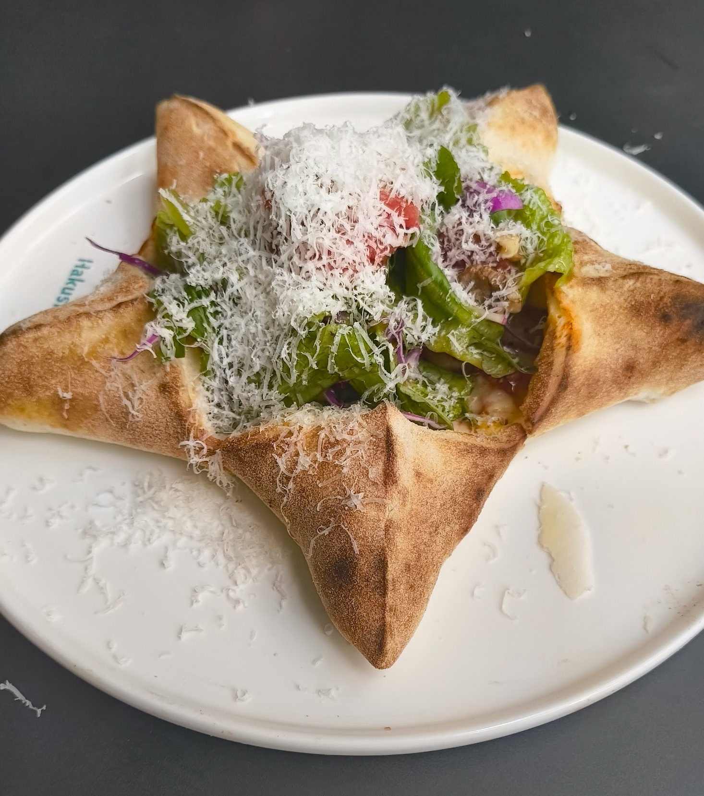

<h3>甲府城跡</h3>

時間があったので、甲府城跡を見ることにした。一番上で周りの山々を一望できた。富士山も見えた。 
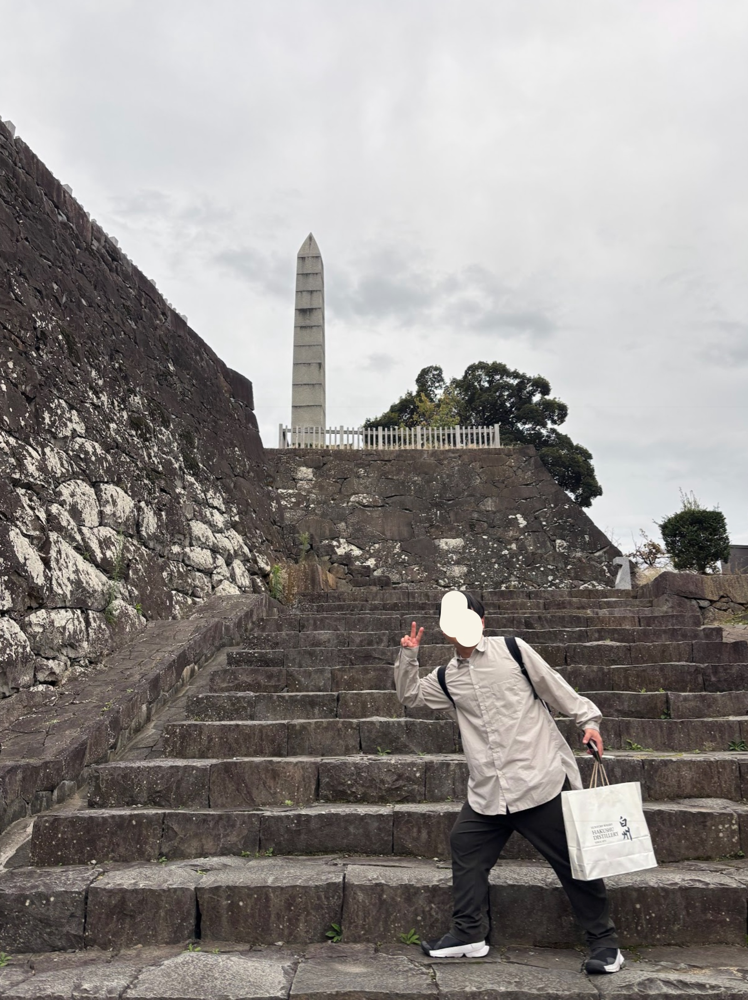

<h3>シャトレーゼホテル 石和</h3>

石和温泉郷近くのシャトレーゼホテル石和にチェックインした。

チェックイン時にウェルカムスイーツとしてケーキを食べた！ 
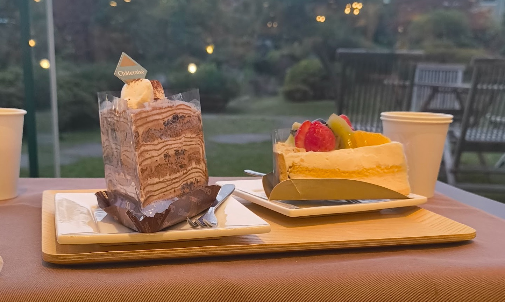

ホテルの温泉に入ったが、早めの時間帯だったのか人がおらず、貸切状態だった♨️

晩御飯は会席料理だった。ビュッフェでないタイプが久々なので楽しかったし、普段自分なら選ばないような料理を食べれてよかった。

部屋は露天風呂付きにした(というか、この部屋しか残っていなかった）ので、部屋でもお風呂に入った。

友人にダンダダンを布教するため、2話まで見て寝た。

<h2>2日目</h2>
<h3>シャトレーゼホテル 石和</h3>

朝ごはんは、ビュッフェだった。 
白米の上に、とろろを乗せて醤油をかけたご飯が一番美味しかった。

部屋の露天風呂に最後にもう一回入って、チェックアウトした。

ホテルではアイスが食べ放題だったので宿泊中に5つくらい食べた。 
甘いもの好きには、シャトレーゼホテルをオススメしたい。

<h3>昇仙峡</h3>

昇仙峡という渓谷？に行ってきた。中腹までバスで行って、自然を眺めながら登った。 
 
石門と呼ばれる有名なスポットや、仙娥滝（せんがたき）を見た。 
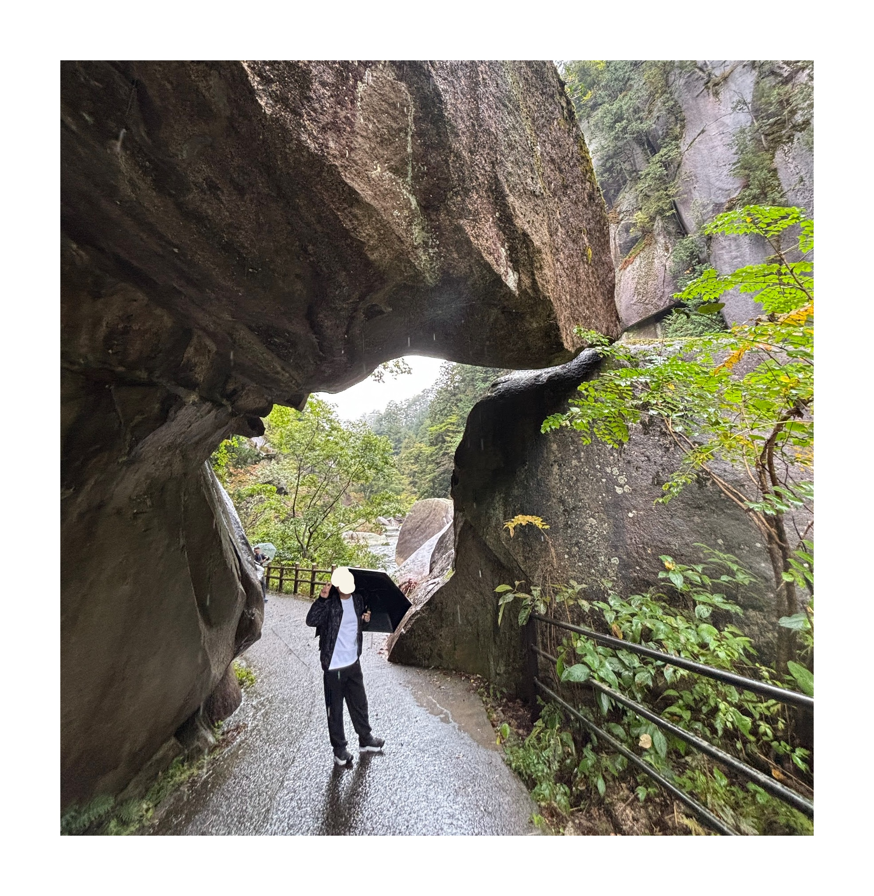 
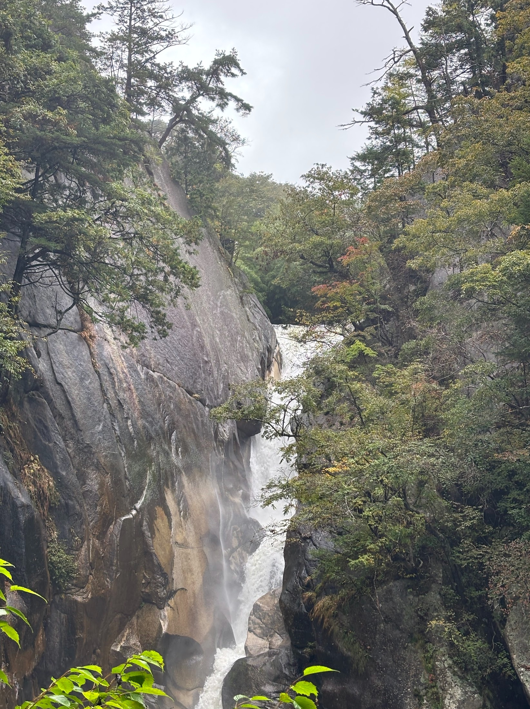 
滝上にあるお店でお昼にした。ほうとうを食べた。予想以上に味噌汁に近い味だった。具材がゴロゴロ入っていてボリュームがあった。 
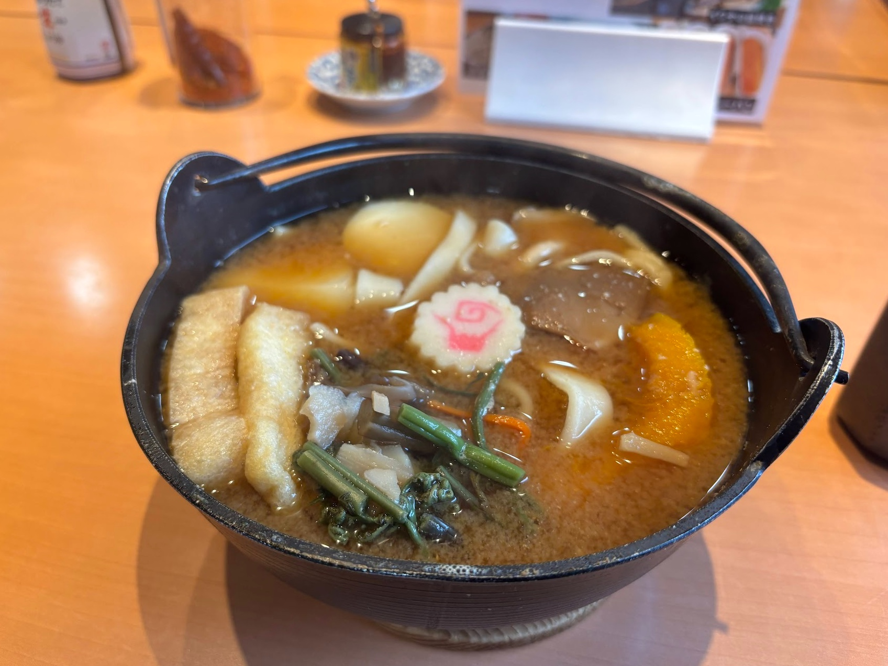

<h3>ジュエリーミュージアム・近代人物館</h3>

甲府駅にもどり、ジュエリーミュージアムと、近代人物館を見て回った。

宝石の原石がならんでいた。化学式は同じでも宝石としては別の名前が付いていることが面白かった。 
近代人物館では、中央線を甲府に繋げるための必要な笹子トンネルの歴史を学んだ。トンネルには、「天に変わって工事する」を意味する 
「代天工」という3文字が刻まれていことを知った。この3文字だけで当時のトンネル開通かどれほど大変で偉大なことだったのかわかった。

<h2>終わり</h2>

今回の旅行では文化や歴史に触れ、いつものアクティビティメインの旅行とは、違った面白さがあった。

空き時間で入った博物館や展示が面白く、全て面白かった。

昇仙峡は11月末までが紅葉の見頃らしいのでぜひ。 
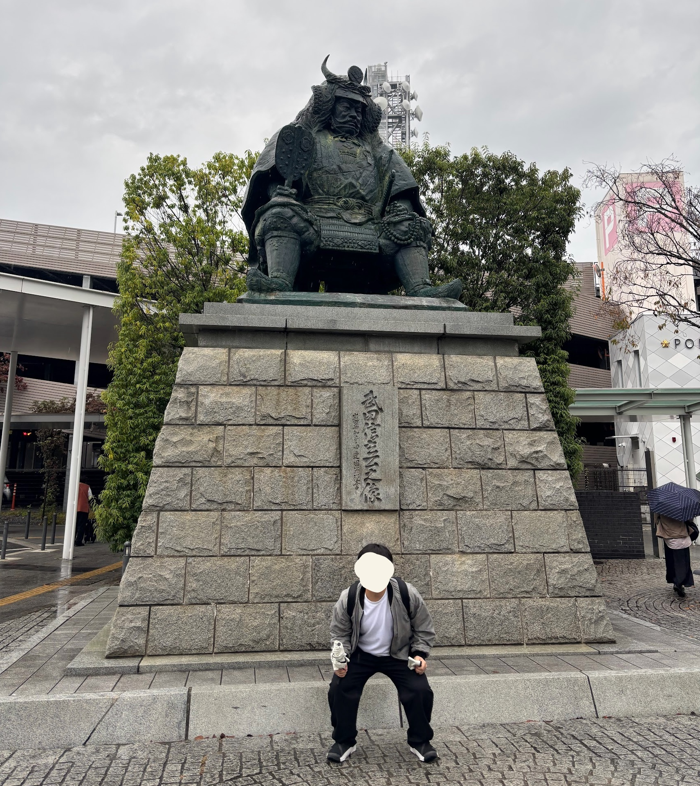

