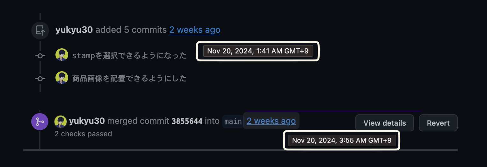

SUZURI Advent Calendar 2024の2日目です！！！

<a data-iframely-url="//cdn.iframe.ly/api/iframe?url=https%3A%2F%2Fadventar.org%2Fcalendars%2F10879&amp;key=878c5bef402f0b2911bf6d4ce6261abd" href="https://adventar.org/calendars/10879/embed">SUZURI Advent Calendar 2024 - Adventar</a>

1日はマキヤマミルテさんの<a href="https://sizu.me/mmakiyama/posts/c97rrzhnmdk6">未知のことを知るということ</a>でした。ご懐妊おめでとうございます🎉

<h2>SUZURIに特化したエディタのようなもの作った</h2>

SUZURIのための便利ツールをまとめたサイト「S Tool」をひっそりと公開しています。そこに「PR画像生成」ツールを追加しました。

特徴としては<strong>SUZURIのグッズの画像をダウンロードしなくても、インポートできる</strong>点です。 
以下のポストの動画を見ていただければわかると思います。

<blockquote align="center" class="twitter-tweet" data-dnt="true">
<a href="https://twitter.com/hashtag/SUZURI%E3%81%AE%E3%83%96%E3%83%A9%E3%83%83%E3%82%AF%E3%83%95%E3%83%A9%E3%82%A4%E3%83%87%E3%83%BC?src=hash&amp;ref_src=twsrc%5Etfw">#SUZURIのブラックフライデー</a>  用のPR画像を作れるアプリケーションを作りました 👉 <a href="https://t.co/EiZGl88JYM">https://t.co/EiZGl88JYM</a>   ブラックフラデーセールは11/29 12時〜 ぜひ作成してみてください！！！！ ※非公式のツールです <a href="https://t.co/LMkO864RuB">pic.twitter.com/LMkO864RuB</a>
— yukyu (a.k.a ugo) (@yukyu30) <a href="https://twitter.com/yukyu30/status/1859264148657578337?ref_src=twsrc%5Etfw">November 20, 2024</a></blockquote>

<a href="https://suzuri.jp/developer/documentation/v1">SUZURI API</a>を使ってデータの取得を実現しています。

<h2>盛り上がりが忘れられなかった</h2>

ブラックフライデーセールの準備をしている時に、SUZURIニンゲンで飲みに行き、そこで「ブラックフライデーのクリエイティブが最高。スタンプもいい」という話で盛り上がりました。

いいなと思っているものをさらに多くの人に届けたいと思い、帰宅後、そのまま開発を始めました。 


<h2>実装のほとんどはCursorのComposerでやった</h2>

基本的にはCursorのComposer機能をつかい、AIによるコーディングで実装しました。そのため、2時間で作れました。 
自分は「グッズの画像を回転できるハンドルをつけて」などと言っていただけです。

コードは<a href="https://github.com/yukyu30/suzuri-auth-nextjs">GitHubのyukyu30/suzuri-auth-nextjs</a>で公開しています。

<h2>使ってくださった方の声</h2>
<blockquote align="center" class="twitter-tweet" data-conversation="none" data-dnt="true">
こちらの広告画像は<a href="https://twitter.com/yukyu30?ref_src=twsrc%5Etfw">@yukyu30</a> さんのアプリを使わせていただきました！お手軽に広告画像が作成出来ます✨感謝です☺️
— ari design (@ari_design_3) <a href="https://twitter.com/ari_design_3/status/1862499871955329275?ref_src=twsrc%5Etfw">November 29, 2024</a></blockquote>

<blockquote align="center" class="twitter-tweet" data-dnt="true">
<a href="https://twitter.com/hashtag/SUZURI%E3%81%AE%E3%83%96%E3%83%A9%E3%83%83%E3%82%AF%E3%83%95%E3%83%A9%E3%82%A4%E3%83%87%E3%83%BC?src=hash&amp;ref_src=twsrc%5Etfw">#SUZURIのブラックフライデー</a> セール開催中！ なんだかんだいくつあってもいい定番Tシャツやパーカー、タンブラー他が800円OFFとなっております✨<a href="https://t.co/hI6sWJig41">https://t.co/hI6sWJig41</a>  告知画像制作協力＞<a href="https://t.co/QrvDZFn3bs">https://t.co/QrvDZFn3bs</a> by <a href="https://twitter.com/yukyu30?ref_src=twsrc%5Etfw">@yukyu30</a> <a href="https://t.co/mBSKX6cSry">pic.twitter.com/mBSKX6cSry</a>
— 天野竜@ファーム22のオレンジの木になりたい🍊🍊🍊 (@R_Amano) <a href="https://twitter.com/R_Amano/status/1862447036198740445?ref_src=twsrc%5Etfw">November 29, 2024</a></blockquote>

<blockquote align="center" class="twitter-tweet" data-dnt="true">
徒労サーモンを  SUZURIのブラックフライデー イチオシアイテムに掲載いただきました🥳<a href="https://twitter.com/hashtag/SUZURI%E3%81%AE%E3%83%96%E3%83%A9%E3%83%83%E3%82%AF%E3%83%95%E3%83%A9%E3%82%A4%E3%83%87%E3%83%BC?src=hash&amp;ref_src=twsrc%5Etfw">#SUZURIのブラックフライデー</a> 11/29 (金) 12:00 ～ 12/8(日) 23:59 よろしくお願いします。<a href="https://twitter.com/hashtag/suzuri?src=hash&amp;ref_src=twsrc%5Etfw">#suzuri</a> <a href="https://twitter.com/hashtag/%E3%81%8A%E5%AF%BF%E5%8F%B8?src=hash&amp;ref_src=twsrc%5Etfw">#お寿司</a>  画像はyukyuさん作のアプリを 使用させてもらいました（非公式・PC推奨）… <a href="https://t.co/j70dU4U6SE">https://t.co/j70dU4U6SE</a> <a href="https://t.co/UriGn6P6GE">pic.twitter.com/UriGn6P6GE</a>
— kocoon（コクーン） (@kocoon7) <a href="https://twitter.com/kocoon7/status/1861757098755076525?ref_src=twsrc%5Etfw">November 27, 2024</a></blockquote>

<blockquote align="center" class="twitter-tweet" data-dnt="true">
<a href="https://twitter.com/hashtag/SUZURI%E3%81%AE%E3%83%96%E3%83%A9%E3%83%83%E3%82%AF%E3%83%95%E3%83%A9%E3%82%A4%E3%83%87%E3%83%BC?src=hash&amp;ref_src=twsrc%5Etfw">#SUZURIのブラックフライデー</a> 便利なツールを作成されている方を見つけたので、お借りして宣伝画像を作ってみました！ 最近 <a href="https://twitter.com/hashtag/SUZURI?src=hash&amp;ref_src=twsrc%5Etfw">#SUZURI</a> のお知らせができてなかったので久々に宣伝です！良ければ覗いて見てください！<a href="https://t.co/nQt05awyvN">https://t.co/nQt05awyvN</a> <a href="https://t.co/FNHwG9thAf">pic.twitter.com/FNHwG9thAf</a>
— Mike-Ash (@mikenikke) <a href="https://twitter.com/mikenikke/status/1861876008326180969?ref_src=twsrc%5Etfw">November 27, 2024</a></blockquote>

<h2>まえにも実はつくっていた</h2>

実は同様なアプリケーションを2020年7月1日に公開していました。当時は決まった位置に画像を配置するだけのアプリケーションでしたが、今回は好きな場所に好きなサイズで置けるようになりました。

詳しい話は<a href="https://zenn.dev/yu_9/articles/5fa3a6c9332afd">趣味で開発したWebアプリケーションの私的まとめ ～その1～</a>に書いてありますので、割愛します。

<h2>レイヤー機能が欲しい</h2>

レイヤー機能を開発中です。複雑な処理になりAIでもうまく実装できないので自分でコーディングをする必要がありそうでした。ブラックフライデー終わるまでに間に合うか？

以上、SUZURI Advent Calendar 2024 2日目でした！！！ 
<a href="https://suzuri.jp/yukyu30">SUZURIのブラックフライデーでぜひ買ってください。 
</a>

