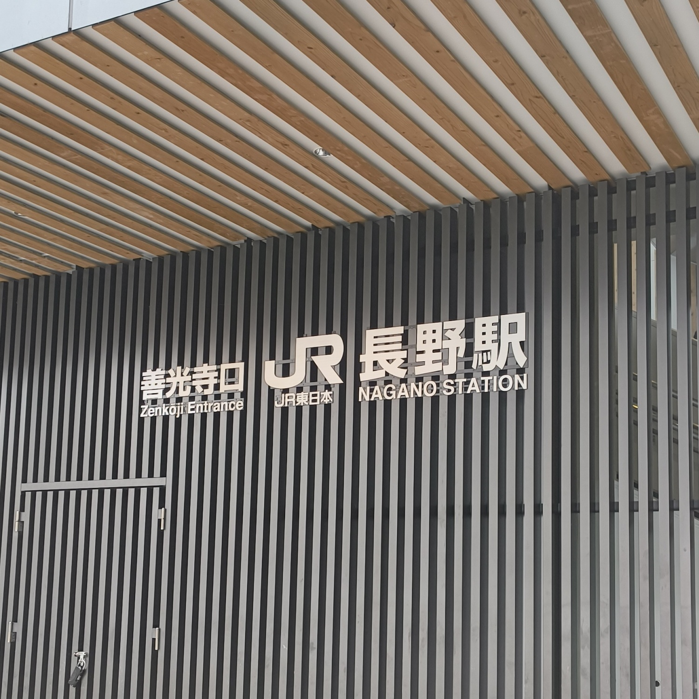
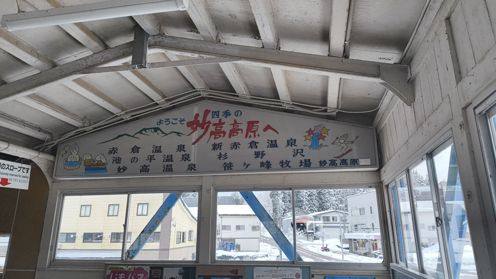
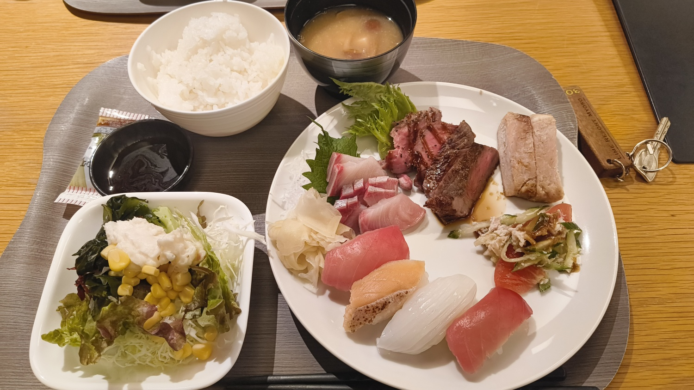
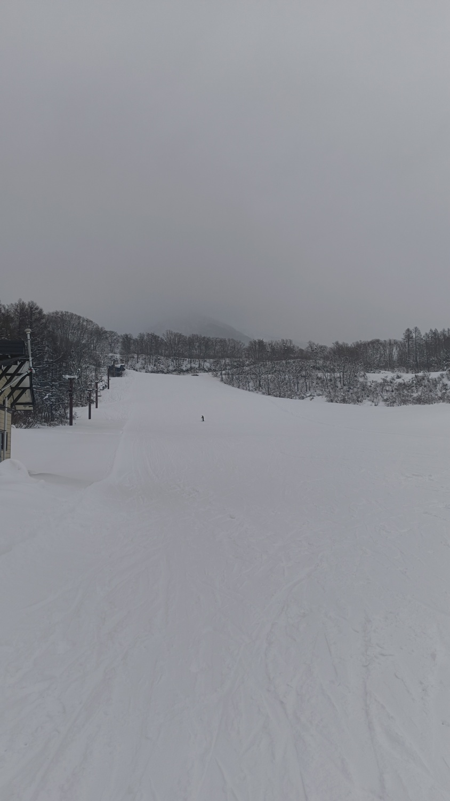
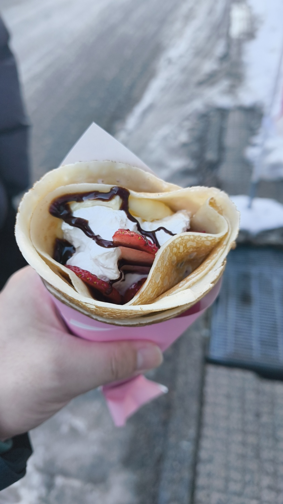

14日から2泊3日で新潟旅行に行った。

<h2>1日目</h2>

東京駅から長野まで、新幹線で移動した。 

新潟行くには、軽装すぎたため、スポーツ用品店、ユニクロ、ドンキなどで、防寒具を買い集めた。 
一緒に行った友人には、申し訳なかった。

防寒具を買い集めた後は、カフェで休憩をとり、妙高高原へ向かった。

駅からホテルの送迎車で、宿泊先である 
<a href="https://limeresorts.com/myoko/">LIME RESORT MYOKO</a>に移動した。

ホテルは綺麗で、部屋も広くとても良かった。 
https://limeresorts.com/myoko/rooms にある3人部屋に泊まった。

温泉に入り、ご飯を食べて、休んで温泉に入りなどとして1日目が終わった。 

<h2>2日目</h2>

スキーに行った。

小学校の時に、スキーに行ったのが最後なので、10数年ぶりのスキーだった。 
初めは怖かったが、１回滑ったら楽しくなった。

オープンしたばかりなので、人が少なく滑りやすかった。

滑り終わった後は、周辺を歩きながらお店を見て回った。まだ、オープンして数日なので営業しているお店は少なかった。チョコカスタードいちご生クリームクレープを食べた。 

ホテルでの温泉が1日目よりも気持ちよかった。

<h2>3日目</h2>

遅めのチェックアウトができるということだったので、11時にチェックアウトし、帰ることにした。 
途中で軽井沢駅でおり、アウトレットを見て回った。 
良さげなadidasの服を見つけてたら、友人にも似合ってると言われた買ってしまった。

個人的には、ロゴが胸元にある服は、自慢しているようで苦手で避けてきたのでちょっぴり冒険した買い物だった。

<h2>おわりに</h2>

久々にスキーをして、楽しかった。地面から伝わる感覚を意識することはないので、新鮮だった。リフトに乗りがら、真っ白の山や木をみて、とてもほのぼのした気持ちになった。

温泉にも9回ぐらい入った。一人用のサイズのお風呂も大浴場にあって、満足度が高かった。 
ホテルのブッフェも、味噌汁になめこが入っていて、ディっピンドッツのアイスも食べ放題だった。品揃えが自分の好みで良かった。そしてどれも美味しかった。

