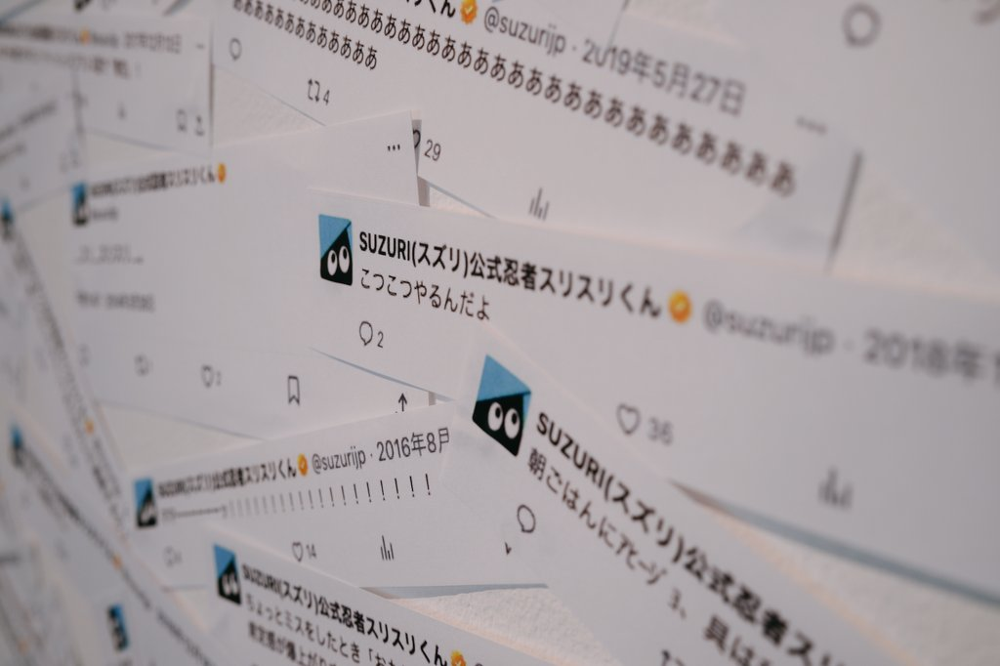

<h2>2024年を振り返る</h2>

ありがたいことに交友関係が広がり、どこかに出かけることが多かった1年だった。

ブログの構成は<a href="https://feneshi.co/2024_of_the_year/">n01e0さんの 2024年を振り返る</a>を参考にしています。

<h2>各月の振り返り</h2>
<h3>1月</h3>

BuriKaigiに参加し、2日目は富山・金沢の観光をした。

<ul>
<li><a href="https://old.yukyu.net/posts/2024-01-24">BuriKaigi2024に参加した</a></li>
<li><a href="https://old.yukyu.net/posts/2024-01-25">富山・金沢旅行</a></li>
</ul>
<h3>2月</h3>

「もじ イメージ Graphic 展」、サンリオバーチャルフェスなどを楽しんだ。

Blenderで缶バッチをつくるなどの創作活動をしていた。

麻布台ヒルズで千疋屋のパフェを初めて食べた。

<ul>
<li><a href="https://old.yukyu.net/posts/2024-02-12">ミッドタウンと麻布台ヒルズ</a></li>
</ul>
<h3>3月</h3>

TENTの青木さんの考え方が良いなと思って、YouTubeの動画や、TENTのTEMPOに行ったりした。

<ul>
<li><a href="https://old.yukyu.net/posts/2024-03-24">あおき量産というYouTubeチャンネルにハマっている</a></li>
<li><a href="https://old.yukyu.net/posts/2024-03-31-tent-tempo-setagaya-park">TENTのTEMPO/世田谷公園</a></li>
</ul>
<h3>4月</h3>

SUZURI POP UPでスタッフとして参加した。SUZURIのデジコンで、3Dグッズ作成機能の第一弾を公開した。

TEDxUTokyoでSUZURIのワークショップの企画と運営をした。

コメダのアプリのランクが上がり、ジョーレンさんになった。

インターステラをとうとう見た。

<ul>
<li><a href="https://old.yukyu.net/posts/2024-04-30">近況報告</a></li>
<li><a href="https://old.yukyu.net/posts/2024-05-12">入社前から考えていた機能を実装した</a></li>
</ul>
<h3>5月</h3>

Featured Projects2024に参加した。コクヨのオフィスの中庭的なところ好き。

オッペンハイマーを見に行った。

人生初の叙々苑。美味かったが緊張した。

CTOA若手エンジニアの勉強会 #5を久々に開催した。6回目の開催の準備は何もしていないので、もしやりたい人いたら一緒にやりましょう。

<ul>
<li><a href="https://old.yukyu.net/posts/2024-05-27">Featured Projects 2024に行ってきた</a></li>
</ul>
<h3>6月</h3>

新卒エンジニア研修の担当で、さまざまなことをしていた。

会社の同僚とスパ ラクーアに行っり、蔵前を案内したりした。新宿御苑を散歩したりした。

映像を作るぞと意気込んでいたが、その後あまり作れず。

じゃがりこドリームのパッケージのじゃがりこが販売になって、コンビニに行くたびに後方彼氏ヅラでお菓子コーナーを眺めてた。

数分間のエールを見た。

<ul>
<li><a href="https://old.yukyu.net/posts/2024-06-03">スパ ラクーアに行った</a></li>
<li><a href="https://old.yukyu.net/posts/2024-06-30">蔵前に行ってきた</a></li>
</ul>
<h3>7月</h3>

3Dグッズ作成機能の第2弾をリリース。VRで活躍するクリエイターさんや知っているワールド、イベント、メディアにSUZURIの文字があった。とても嬉しかった。 
リアクロ集会に参加、ここで知り合った方々と、オフ会したのは11月の話。

同僚と千葉旅行にいった。朝ごはん食べすぎて、気持ち悪くな、休憩でよったスパーキングエリアにスマホを忘れて、迷惑をかけまくった。

大学生に頃のバイト先の飲み会に行った。

<ul>
<li><a href="https://old.yukyu.net/posts/2024-07-17">3Dグッズをリリースしました</a></li>
<li><a href="https://old.yukyu.net/posts/2024-07-29">「リアルクローズ集会」と「墨澄集会」に行ってきた #Sumi3D</a></li>
</ul>
<h3>8月</h3>

新サービスAliveStudioの開発に参画した。

入院中の親の容体が悪化して、電話がなり、夏季休暇は実家にいた。いまは回復したのでご安心を。 
未来のかけらという展示を見に行った。

<h3>9月</h3>

ラストマイルをみた。 
軽井沢旅行にいって、BBQした。

<ul>
<li><a href="https://yukyu.net/posts/2024-09-03">軽井沢旅行に行ってきた</a></li>
</ul>
<h3>10月</h3>

AliveStudioのリリースが終わって、SUZURIに戻った。開発中、普段座らない場所に座って、いろんな人と繋がりが増えた。

テレンス・コンラン展や蔵前に行った。

サンリオのハロウィンナイトに行き、夜通し音楽を聴いていた。水曜日のカンパネラさんとても良かった。

NetflixのThe Boyfriendを見た。

<ul>
<li><a href="https://yukyu.net/posts/2024-10-07">誕生日を迎えた &amp; Alive Studioのリリース</a></li>
<li><a href="https://yukyu.net/posts/2024-10-13">蔵前散策</a></li>
<li><a href="https://yukyu.net/posts/2024-10-14-terence-conran">「テレンス・コンラン　モダン・ブリテンをデザインする」に行ってきた</a></li>
</ul>
<h3>11月</h3>

サントリー白州工場に行き、その後、石和温泉のシャトレーゼホテルでアイスを食べた。ウィスキーが好きになった月。

同僚とカフェ巡りをして、一日カフェを巡った。

リアクロ集会で仲良くなった方々とオフ会した。実際に会って話すのは緊張していたが、空気感はVRChatと同じったのですぐに緊張は解けて、たのしかった。

嘘つきな6人の大学生を見た。

<ul>
<li><a href="https://yukyu.net/posts/2024-11-03">山梨の甲府に行ってきた</a></li>
<li><a href="https://yukyu.net/posts/2024-11-18">カフェ巡り</a></li>
<li><a href="https://yukyu.net/posts/2024-11-25">週末は映画をみた</a></li>
<li></li>
</ul>
<h3>12月</h3>

新潟にスキー旅行に行った。久々のスキーだが無事滑れて楽しかった。

プロジェクターを買った。

社員旅行で舞浜にいった。謎解きやBBQをして楽しかった。

<ul>
<li><a href="https://yukyu.net/posts/2024-12-23">新潟でスキーをした</a></li>
</ul>
<h2>おでかけ</h2>

驚いたことに数えたら、 
富山・金沢旅行、千葉旅行、軽井沢旅行、甲府旅行、新潟旅行、社員旅行と6回も旅行に行っていた。

展示や映画を見に行き、技術的なもの以外をたくさん得ることができる一年だった。

<h2>趣味</h2>

個人開発も2日程度で終わるものならやりきれるが、長期間のものは続かなかった。社員旅行中に」「うごの偉いところは、何かを作り続けてところ」という言葉を同期からもらって今年で一番嬉しかった。 
小さく別のものを作るとういのは、引き続きやっていきたい。

動画投稿をし続けて、もうすぐ目標の登録者数に到達するらしい友人の話を聞いた時悔しいなと思った。自分が、継続して続けて、何かをやり遂げるということができないのを意識したからだと思う。

個人開発以外では、 
AEで映像を作りたい思って、モーションの練習をしていたが、続かなかった。 
Blenderでの3DCGも続かなかった。 
これといって明確に作りたいものがないからだと思う。そこをちゃんとしっかり決めて来年はリベンジしたい。

<h2>仕事</h2>

3月からはリーダーとして選任していただき、今までよりも、見る領域が増えた。ただ、他の事業部のエンジニアから、「ugoさんってリーダーにならないんですか」って聞かれたので、あまりリーダーらしいことを表向きではやれてないなと感じた。

AliveStudioの開発のための、SUZURIから2ヶ月離れていた。その中で、いままで話したことがない方々との繋がりができたのと、コードを書くだけではなくデザイナーと、サービスロゴについて話し合ったりできた。濃厚で、充実した2ヶ月間だった。

3Dグッズ作成機能も、入社前からのアイデアで、それが実現できたのが嬉しかった。 
それに加え、SUZURIでアバター「墨澄」を作成し、リリースできたのが嬉しかった。 
チームメンバーが誰一人かけていたら機能もアバターも公開できなかったと思う。チームメンバーに感謝しても仕切れない。VRChatとGMOペパボのパートナーシップも締結されたので来年からはもっとたくさん楽しいことをして、多くの人となかよくしたい！

<h2>おわりに</h2>

振り返りのために自分のポストを見ていたが、これが刺さった。 

あたりまえのことを、こつこつやっていきたい。

