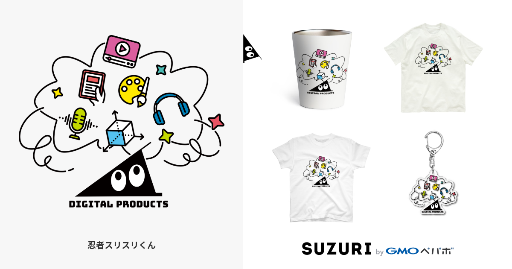
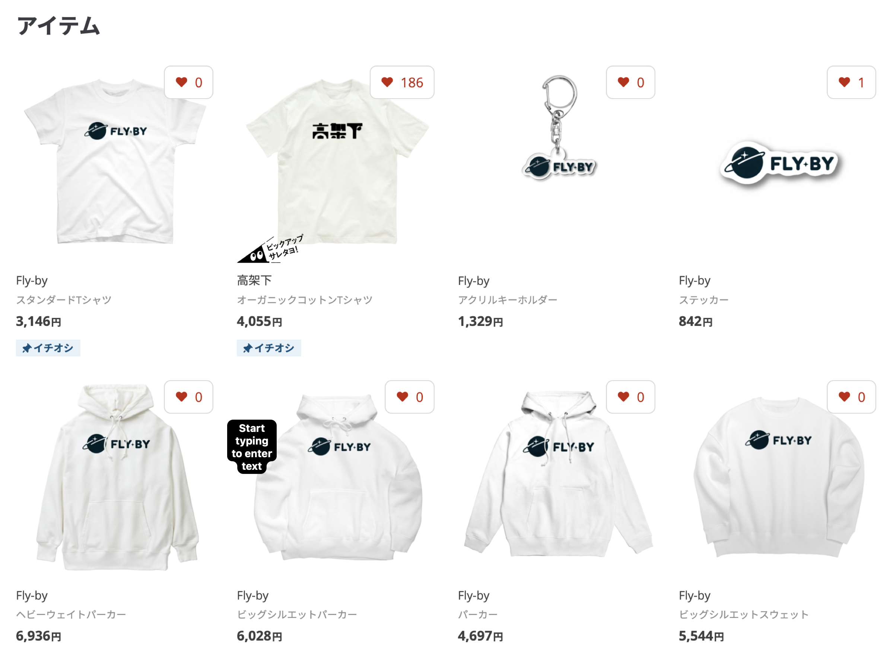
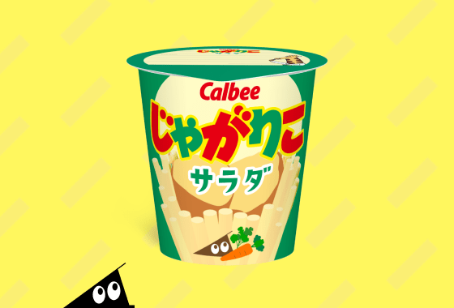
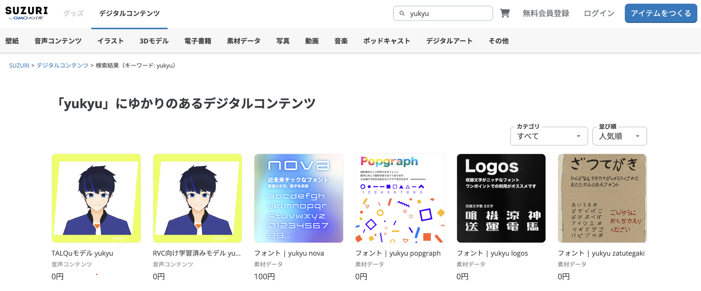
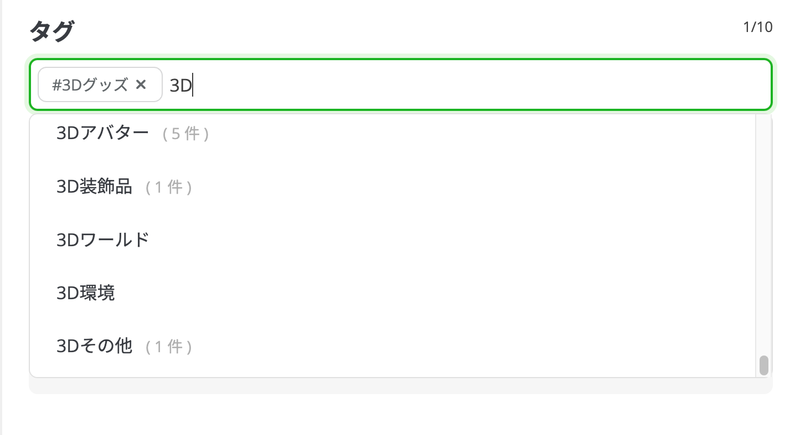
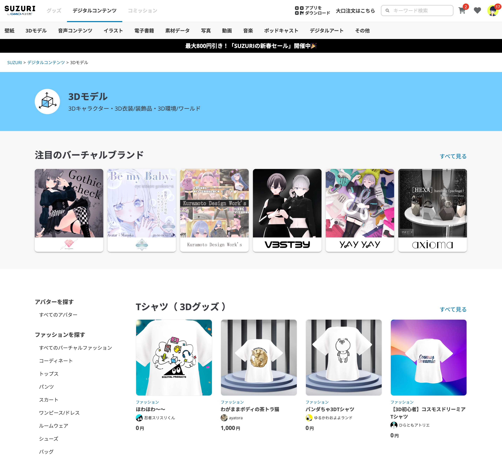
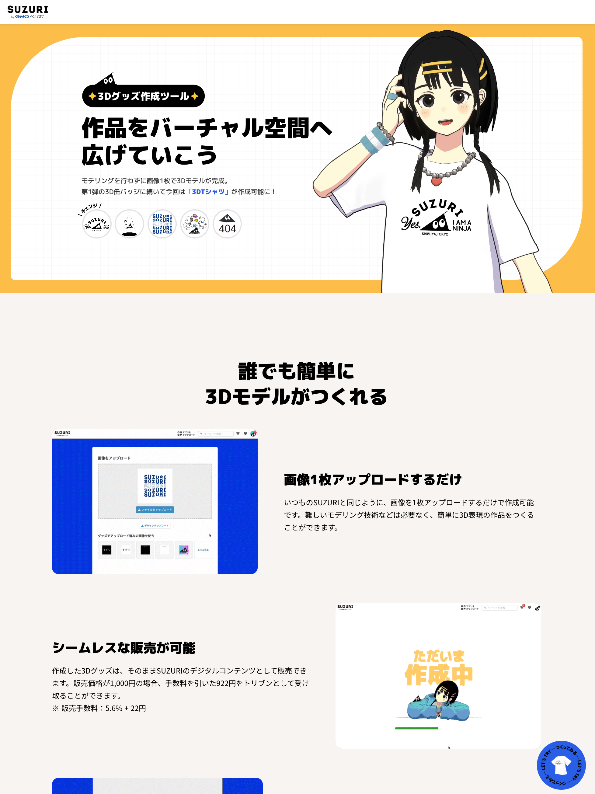
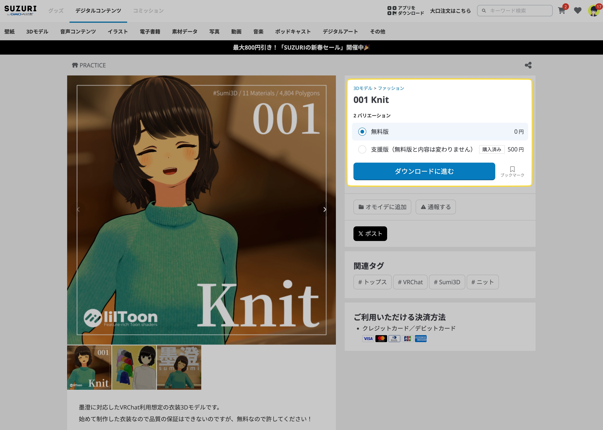

2022/08/17から2024/12/31までGMOペパボ株式会社SUZURI事業部で働いていました。 
2025年からはSUZURI事業部を離れ、メタバース推進室へ異動しています。 
同時にエンジニアリングリードにもなりました。

そんな一つの節目であるこのタイミングで、今までの総括をしようと思います。 
<a href="https://yukyu.net/posts/2023-12-22">新卒Webエンジニアとしての2年を振り返る</a>をベースに、3年目に追加する形となります。

<h2>新卒入社当時</h2>
<ul>
<li>Rails でアプリケーションは作ったことはある</li>
<li>React などフロントエンドは知っているが、馴染みはない</li>
</ul>
<h2>研修</h2>

フロントエンドから k8s まで幅広く行いました。 
特に印象に残っているのがフロントエンド研修です。 
自分たちのグループは忍者スリスリくんワクワクおえかきランドという Web アプリケーションを作りました。 
その後、SUZURI で正式に<a href="https://suzuri.jp/surisuri_land">忍者スリスリくんワクワクおえかきランド</a>としてリリースされました。 
リリースのためブラッシュアップをしたエンジニア、デザイナーさんありがとうございました！

<ul>
<li><a href="https://tech.pepabo.com/2022/07/21/12th-datacenter-tour/">新卒研修でデータセンターを見学しました</a></li>
<li><a href="https://tech.pepabo.com/2022/07/14/12th-training-frontend/">新卒研修で最高の Web サービスを作りました</a></li>
</ul>
<h2>SUZURI事業部 プロダクトチーム 2022/08/17 - 2023/07/31</h2>

SUZURI 事業部 プロダクトチーム配属後は、以下のようなことをしてきました。

<ol>
<li>文言修正や、いくつかのページでの多言語対応といったGood First Issue</li>
<li>社内向けの機能開発、サブアプリケーションの開発</li>
<li>アイテムのサイズ追加</li>
<li>クーポンやショップのカスタマイズ機能</li>
<li>生成AIを活用した機能開発</li>
<li>「じゃがりこ」パッケージコンテスト</li>
</ol>

ステップアップする形で、影響範囲が広く、より密な連携が必要な施策を担当するようになりました。その後は、生成AIを活用した機能開発、やSUZURIを活用したコンテストといった、前例がなく0から考える施策も行いました。

<ul>
<li><a href="https://yukyu.net/posts/2022-09-08">OJTが始まってから3週間</a></li>
<li><a href="https://yukyu.net/posts/2022-10-29">エンジニアとして配属されてから二ヶ月が経った</a></li>
<li><a href="https://yukyu.net/posts/2023-09-03">SUZURIへの配属から1年経った</a></li>
</ul>
<h3>発注機能での改良</h3>

最初に担当した大きな施策が発注機能の改良でした。

発注機能における人的ミスを最小化できるようにするような改良を行いました。 
発注に関する機能であるためほとんど表には出ませんが、毎日利用される機能なのでいまでも動いています。

SUZURI で買った商品がどのようなフローで発注され、生産されているか全体像を知ることができました。

<h3>デザイン OG 追加</h3>

デザインページ(例: https://suzuri.jp/surisurikun/designs/13021630 )の OG<a href="#fn1" id="fnref1">[1]</a>を追加しました。

デザインの色に合わせて、背景のグレーを淡色、濃色に変える処理も実装しました。

<h3>スマホケースの iPhone14 のサイズ追加</h3>

自分が配属されて少し経ってから iPhone14 が発売されました。 
そこで既存のスマホケース各種に iPhone14 サイズを追加を担当しました。

<blockquote align="center" class="twitter-tweet" data-dnt="true">
みなみなサマ大変お待たせ申しマシた！！  すべてのスマホケースがiPhone 14シリーズに対応しマシた📲✨   🆕追加機種 ・iPhone 14 ・iPhone 14 Plus ・iPhone 14 Pro ・iPhone 14 Pro MAX  ▼人気のスマホケースを見に行く🚀<a href="https://t.co/tbcQkff6ef">https://t.co/tbcQkff6ef</a> <a href="https://t.co/QH6BIt8md3">pic.twitter.com/QH6BIt8md3</a>
— SUZURI公式忍者 忍者スリスリくん (@suzurijp) <a href="https://twitter.com/suzurijp/status/1594568491092172800?ref_src=twsrc%5Etfw">November 21, 2022</a></blockquote>

SUZURI には全く新しいアイテムを追加する「アイテム追加」と既存のアイテムにサイズを追加する「サイズ追加」があります。 
アイテム追加はアップロードされた画像をアイテムに合成する実装が必要となります。

今回はサイズ追加だったので、画像合成の処理を書くことはせず、合成領域の位置調整などを行いました。 
実際のグッズとの合成画像の差異が少なくなるよう調整をシビアにやっていくため、根気が必要な施策でした。

普段の開発とは違う言葉や概念が出てくるのでその都度理解していくのが難しかったです。

<h3>アイテム別クーポン機能</h3>

利用できるアイテムを限定したクーポン機能を開発しました。

アイテムを限定することで、利用時に対象アイテムがあるかどうかを判断する処理を入れ、 
返金時においては対象アイテムだけでの値引き額の按分を行うなどの実装も行いました。 
返金の要件を理解することが大変でした。

最終的に按分の処理は綺麗に実装できたので成長を感じた施策でした。

<h3>イチオシ機能</h3>

自分のショップにてイチオシのグッズを先頭に持ってきて固定できるイチオシ機能の開発を行いました。

今までの開発はサーバーサイドの開発で Rails がメインで、既存のコードがあり、変更を加えることが多かったです。 
イチオシ機能では GraphQL と React、Rails を使った開発を行いました。

GraphQL はこの時初めてしっかりと触りましたが、mutation? query?と頭の中が整理ができていませんでした。当時は REST API を利用する機会が多く、GraphQL 自体を概念として理解することが難しかったのだと思います。 
この時は苦手意識がありましたが、現在は書籍を読んだり、GraphQL に関わる実装したことで苦手意識は無くなりました。

<ul>
<li><a href="https://suzuri.jp/media/journal_ichioshi/">マイショップでアイテムを「イチオシ」できるようになりました</a></li>
</ul>
<h3>生成 AI を使った商品文生成機能</h3>

OpenAI API を利用して、商品文を生成する機能を開発しました。

SUZURI で OpenAI API を使うのが初めてであったため、プロンプトの追加や生成などを行うような API Client を作成しました。 
趣味で<a href="https://zenn.dev/yu_9/articles/737aca68c7fcd8">ChatGPT を利用した Discord Bot を開発</a>していたこともあり、API の仕様を理解して中で施策を始めることができました。

SNS でも面白い商品文がシェアされていて、ユーザーの反応が直に見れる CtoC サービスの良さを実感することができる施策でした。

同期ディレクターのhermanとは、この施策から、「じゃがりこ」パッケージデザインコンテスト、デジタルコンテンツ、メタバース推進室と同じ仕事をするようになりました。

<ul>
<li><a href="https://zenn.dev/yu_9/articles/737aca68c7fcd8">Rust で ChatGPT を利用した Discord Bot 作った</a></li>
</ul>
<h3>スリスリ AI チャット</h3>

2 日間の<a href="https://hr.pepabo.com/report/2023/04/06/8730">開発合宿</a>で作成したアプリケーションをブラッシュアップして<a href="https://chat.suzuri.jp/">スリスリ AI チャット</a>としてリリースしました。 
SUZURI 公式忍者のスリスリくんとチャットができ、さらに商品検索が行える機能です。

どのように実装されているかなどはテックブログの<a href="https://tech.pepabo.com/2023/09/15/introducing-surisuri-ai-chat/">AI チャットで商品検索 | GPT-3 と LangChain 活用</a>に書かれています。

LangChain とよばれるライブラリと Python を使い実装しました。LangChain に関する日本語の記事は少なく、アップデートも頻繁にあるためドキュメントを読んで実装を進めていきました。 
普段の業務では使わない言語とライブラリを使うので、ドキュメントや Issue を読んだりと普段より多くの情報を漁りながら開発を進めました。

OJT をしてくれたエンジニアの先輩と、hermanで進めた施策でした。思い出深い施策です。

<ul>
<li><a href="https://hr.pepabo.com/report/2023/04/06/8730">テーマは"AI で「人類のアウトプットを増やす」" 過去最多！？の 84 名が参加！「お産合宿 2023」</a></li>
<li><a href="https://suzuri.jp/media/journal-surisuri-ai-chat-beta/">AI（ChatGPT）を搭載したスリスリくんと会話が楽しめる「スリスリ AI チャット（β）」を公開しました！</a></li>
<li><a href="https://tech.pepabo.com/2023/09/15/introducing-surisuri-ai-chat/">AI チャットで商品検索 | GPT-3 と LangChain 活用</a></li>
</ul>
<h3>「じゃがりこ」パッケージコンテスト</h3>

じゃがりこパッケージコンテストのアプリケーションの開発を行いました。 

「じゃがりこ」のパッケージの画像合成機能を中心に、画像をアップロードからコンテスト応募までの全機能の開発を行いました。

画像合成の処理を実装するのは初めてでしたが、画像合成に関するドキュメントが整っていたので、ドキュメントとコードを読み解きながら実装を進めることができました。

画像合成サーバーへのじゃがりこ追加や、コンテストとしての要件を満たす機能をもつアプリケーションの開発は、小さなSUZURIを構築する規模の開発であるため、SUZURI のエンジニアメンバーに相談や質問をしながら、開発を行いました。

また、社内外で多くの方とやり取りを行うため、仕事の進め方やコミュニケーションなど技術以外の部分でも多くのことを学ぶことができました。

コンテストは、予想を上回る応募数となりました。受賞作品の一部はパッケージになり、オフィスの下のコンビニでも購入できました。

<ul>
<li><a href="https://suzuri.jp/lp/jagarico-dream">あたいも有名になりたーい!"じゃがりこ"ドリーム 〜あなたのアイデアが"じゃがりこ"に!? "じゃがりこ"パッケージデザインコンテスト〜</a></li>
<li><a href="https://creatorzine.jp/article/detail/4749">"じゃがりこ"と SUZURI のパッケージデザインコンテストが好調 背景から見えたクリエイターコラボのヒント</a></li>
</ul>
<h2>SUZURI事業部 デジタルコンテンツチーム 2023/08/01 - 2024/02/29</h2>

じゃがりこパッケージデザインコンテストが無事始まり、一区切りついたタイミングで、デジタルコンテンツチームに配属になりました。

主にやってきたことは、以下のような内容です。

<ul>
<li>デジタルコンテンツ検索機能</li>
<li>デジコンOG</li>
<li>デジタルコンテンツへのタグ付け機能</li>
<li>サブカテゴリ追加・バーチャルファッション関連のページ追加</li>
<li>3Dグッズ作成機能</li>
<li>バリエーション販売機能</li>
</ul>

検索やタグなどグッズにはあるがデジコンにはない機能開発をすすめ、その後、バーチャルファッション特化したサブカテゴリ、ページ追加、3Dグッズ作成機能などの開発をしました。自分自身、デジタルコンテンツを販売しているので、こういう場合も考慮しておかないとかも、こういう機能があると良いかもと提案することが増えました。

3Dグッズ作成機能をリリースしたのち、一時的にSUZURIを離れ、配信支援サービス Alive Studioの立ち上げに参加しました。自分自身、自身のアバターでYouTubeの配信をたまにやっていたため、配信の準備、ハードルというものは理解しており、すっと開発に参加できました。

その後は、SUZURIのバリエーション販売機能を開発しました。デジタルコンテンツチームのエンジニアが一人増えたため、バックエンド、フロントエンドと行った感じで役割分担をして進めていきました。

<h3>デジタルコンテンツ検索機能</h3>

デジタルコンテンツを検索する機能を開発しました。 

デジタルコンテンツでは<a href="https://github.com/ankane/searchkick">Searchkick</a>を導入して、検索を行えるようにしました。 
そのため、Index 作成・更新処理の実装、Index するデータの定義、検索 API の実装、検索ページの追加など 0 から実装を行いました。

自分が欲しいものへアクセスできる体験はとても良いので、検索に関する知識をつけていきたいと思いました。

<h3>デジコン OG</h3>

デジタルコンテンツのの OG<a href="#fn1" id="fnref1:1">[1:1]</a>を追加しました。

<blockquote align="center" class="twitter-tweet" data-dnt="true">
SUZURIでデジタルコンテンツを 販売中のクリエイターさんにお知らせ📣  アイテムURLをペタっとSNSに貼り付けて投稿すると、「いい感じ」のアイテム画像が表示されるようになりマシた🎉  ご自身のSNSでアイテムを、ﾋﾞｬｽﾋﾞｬｽ紹介してクレよな👀  「いい感じ」の画像👇<a href="https://t.co/DV3C0khaBh">https://t.co/DV3C0khaBh</a>
— SUZURI公式忍者 忍者スリスリくん (@suzurijp) <a href="https://twitter.com/suzurijp/status/1730829151421034673?ref_src=twsrc%5Etfw">December 2, 2023</a></blockquote>

施策としてはやる予定がなかったのですが、OG を追加したかったので試しに実装したものを見せたところ、ブラッシュアップして、リリースされることになりました。 
当時のX での変更を鑑みて、サムネイルと商品の説明を入れるといったスタイルになりました。

<h3>デジタルコンテンツへのタグづけ機能</h3>

デジタルコンテンツへのタグをつける機能を実装しました。 
文字を入力したら既存のタグから、サジェストする機能や、タグでのデジタルコンテンツ検索などをも実装しました。 
タグに紐づいたデジコンの個数カウントを行わなくて済むように、実装しました。

<h3>バーチャルファッション関連のページ追加</h3>

バーチャルファッションへの取り組みを進めてくなかで、バーチャルファッションに特化したページの作成を行いました。これに伴い、サブカテゴリの追加も行いました。

この施策を行う前から、サブカテゴリの追加したいねという話があったため、「もし、サブカテゴリを追加するなら」という話を事前にエンジニアでしていたため、方針がある程度決まっており、短期間でリリースすることができました。

自分は別の施策で動いていたため、他のエンジニアに依頼し、自分は進行管理やレビューで関わっていました。

<h3>3Dグッズ作成機能</h3>

画像をアップロードでTシャツが販売できるというSUZURIの良さを、バーチャルファッションでも実現するための機能です。正式公開版のリリースにあわせて、<a href="https://suzuri.jp/surisurikun/digital_products/53046">墨澄というアバターもSUZURIで配布</a>しました。 
画像から3DモデルのTシャツを販売できます。 
2回に分けてリリースを行いました。

<ul>
<li>先行公開版は、缶バッジのみで、販売は出来上がった3Dデータを手動でSUZURIアップロード</li>
<li>正式公開版は、缶バッジ、Tシャツの2種類で、3Dモデルは自動的にデジタルコンテンツで販売開始 
 
</li>
</ul>

3Dモデルを扱うWebページについて考えたり、3Dモデル合成サーバーの実装などを行いました。詳しい話は、BuriKaigi2025で話します。

<ul>
<li><a href="https://suzuri.jp/lp/3d-badge">オリジナル3Dグッズをつくろう</a></li>
<li><a href="https://lp.suzuri.jp/3d-t-shirt">3Dグッズ作成ツール &amp; オリジナルアバター『墨澄』をリリース </a></li>
<li><a href="https://yukyu.net/posts/2024-05-12">入社前から考えていた機能を実装した</a></li>
<li><a href="https://yukyu.net/posts/2024-07-17">3Dグッズをリリースしました</a></li>
</ul>
<h3>バリエーション販売</h3>

データマイグレーションを伴う、大きな開発でしたが、無停止で完了できました。 
データマイグレーションのおおよそは、自分以外のエンジニアが進めていました。自分が苦手なことであるためとても助かりました。 
自分はフロントエンドやGraphQLの開発が多かったです。決済する値段も変えるといった処理もあり、会計に関わってくるため慎重な実装とリリースで進めていきました。

無料版と支援版の使い分けができるようになって嬉しいです！

 
画像のショップは自分は関係ありません。

<h2>事業部を超えてやったきたこと</h2>
<h3>新卒エンジニア研修の企画</h3>

新卒のエンジニアの企画をしました。 
カリキュラムの構築、講師のアサイン、スケジュール調整などを行いました。 
振り返ると構築や調整が遅くなり、アサインから実施までタイトなスケジュールになったので、反省点ばかりです。社内イベントのお産合宿(開発合宿)も研修のカリキュラムとして組み込み、1年先輩のエンジニアと参加してもらったことで、1年後にどんなエンジニアになっているかをイメージしてもらうことができたのが良かったです。

<h3>Alive Studioの立ち上げ</h3>

一時的にSUZURIを離れ、AliveStudioへの立ち上げに参加しました。

技術スタックやメンバーがガラッと変わりました。ロゴのデザインについてデザイナーとも話し合ってたりと、新規サービスならではの楽しいことが多かったです。

これを機に、さまざまな人との関わりが増えたことが一番大きな変化でした。

<a href="https://yukyu.net/posts/2024-10-07">誕生日を迎えた &amp; Alive Studioのリリース</a>

<h3>P-1グランプリ</h3>

社内プレゼン大会 P-1グランプリにhermanとメタバース戦略室というチーム名を名乗って出ました。この時、特に異動は決まっていませんでした。

どんなプレゼンをしたはお伝えできませんが、審査員特別賞をいただきました。

<h2>おわりに</h2>

おわりにを長く書くと、お別れみたいになるのでそんなに書きません！

SUZURIは3DグッズやバーチャルファッションなどVR SNSとの相性が良いため、今後も何らかの形で関わるのだろうなと思っています。その時にはこれからもよろしくお願いします！！

<h2>他の記事</h2>
<ul>
<li><a href="https://tech.pepabo.com/2022/07/21/12th-datacenter-tour/">新卒研修でデータセンターを見学しました</a></li>
<li><a href="https://tech.pepabo.com/2022/07/14/12th-training-frontend/">新卒研修で最高の Web サービスを作りました</a></li>
<li><a href="https://yukyu.net/posts/2022-09-08">OJTが始まってから3週間</a></li>
<li><a href="https://yukyu.net/posts/2022-10-29">エンジニアとして配属されてから二ヶ月が経った</a></li>
<li><a href="https://yukyu.net/posts/2023-09-03">SUZURIへの配属から1年経った</a></li>
<li><a href="https://yukyu.net/posts/2023-12-22">新卒Webエンジニアとしての2年を振り返る</a></li>
<li><a href="https://hr.pepabo.com/interview/2023/12/15/9386">“ゼロから任される” SUZURIの新卒2年目コンビに話を聞いてみました</a></li>
<li><a href="https://yukyu.net/posts/2024-10-07">誕生日を迎えた &amp; Alive Studioのリリース</a></li>
<li><a href="https://yukyu.net/posts/2024-05-12">入社前から考えていた機能を実装した</a></li>
<li><a href="https://yukyu.net/posts/2024-07-17">3Dグッズをリリースしました</a></li>
<li><a href="https://tech.pepabo.com/2024/09/03/2024-engineer-training/">2024年度新卒エンジニア研修を実施しました! - Pepabo Tech Portal</a></li>
</ul>

<section class="footnotes">
<ol class="footnotes-list">
<li class="footnote-item" id="fn1">
URL を Twitter や LINE などでシェアしたときに表示される画像のこと <a class="footnote-backref" href="#fnref1">↩︎</a> <a class="footnote-backref" href="#fnref1:1">↩︎</a>

</li>
</ol>
</section>
