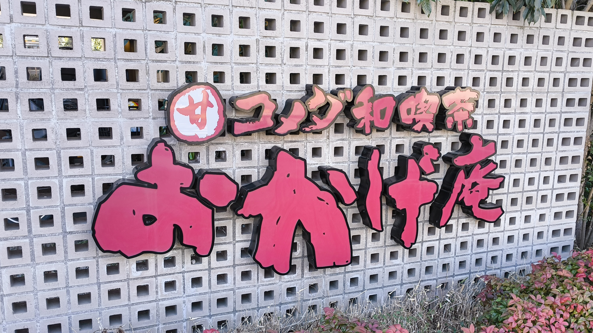
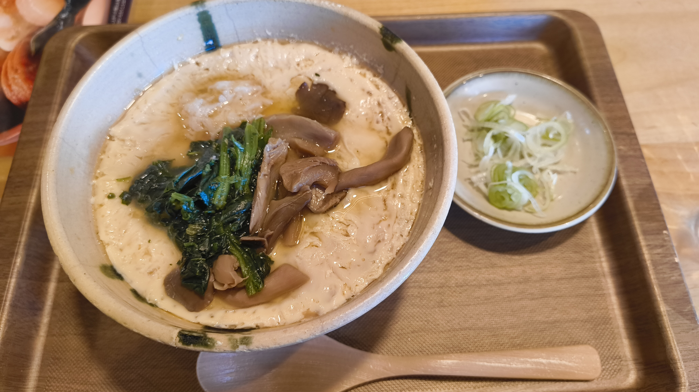
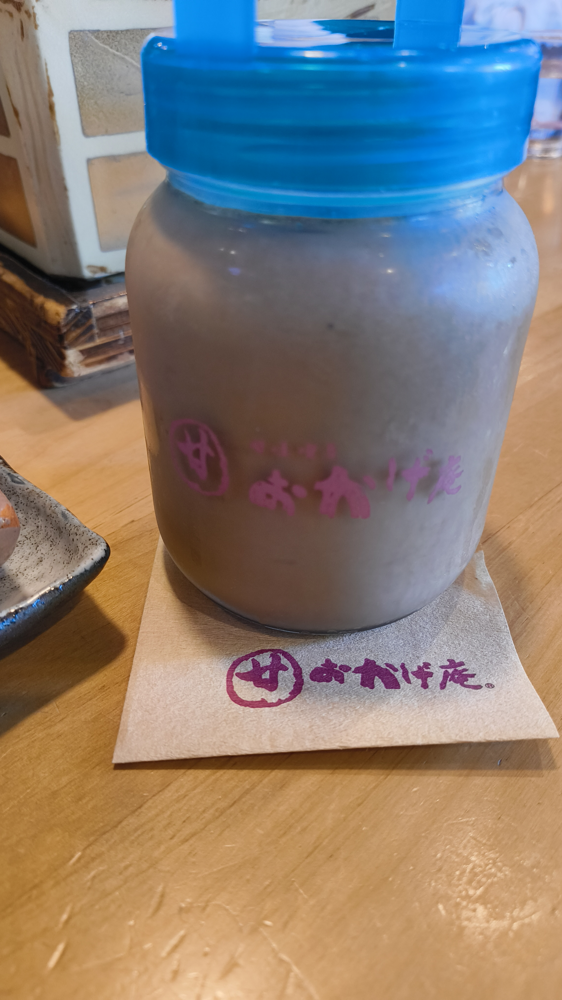
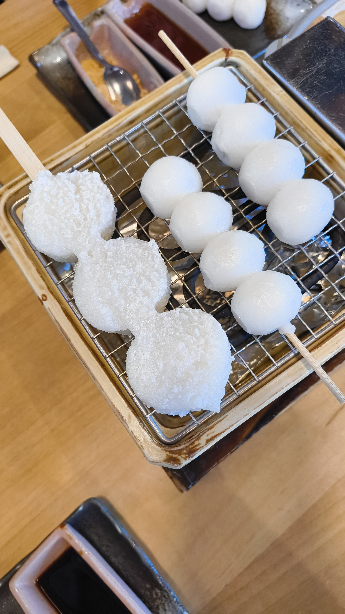
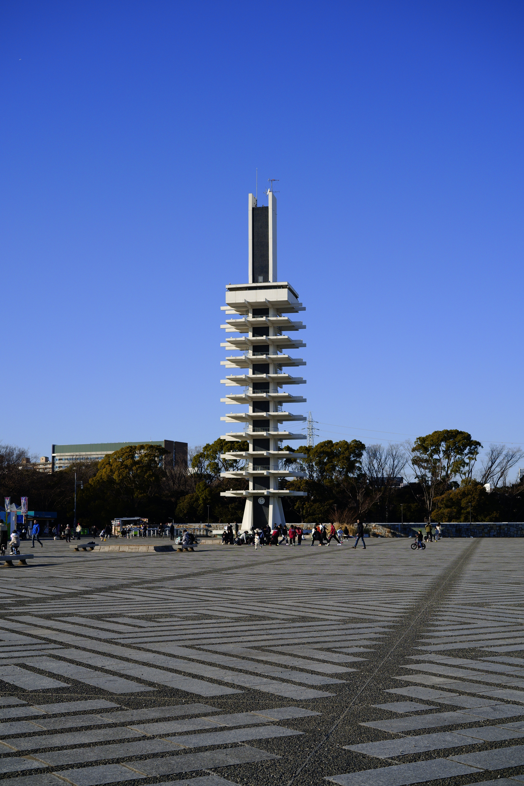
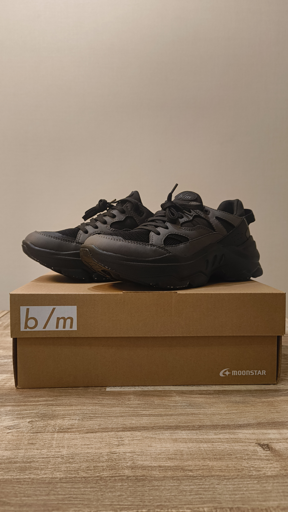
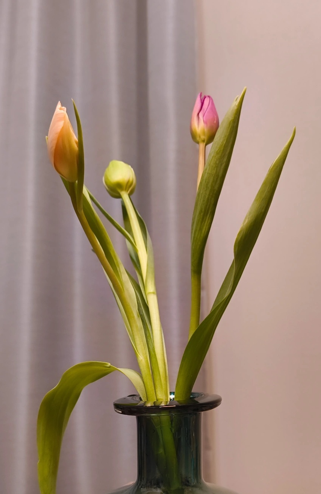
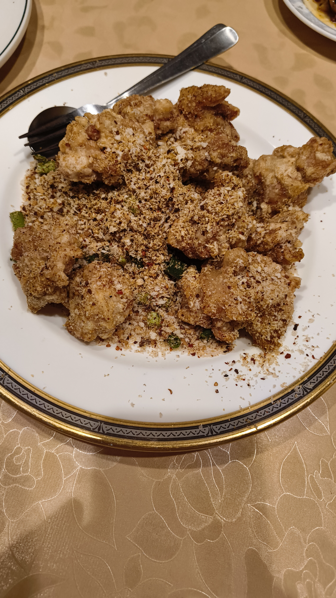

駒沢公園近くのおかげ庵に行き、そのあとは自由が丘で散策をした。

<h2>おかげ庵 最高。</h2>

とおかげ庵現地集合した。

 
初めてのおかげ庵だったので、すべてが食事、甘味、飲み物のセットで、お雑炊、団子、ほうじ茶シェークを頼んだ。 
お雑炊は出汁がきいていて、優しい味だった。 

ほうじ茶シェークは、お茶なのでさっぱりとしていたが、しっかりどろっとしていて、シェークだった。 
!

団子は自分で焼くので、作るのも楽しかった。 
焼きながらどうやって食べようか考えるのが楽しかった。 

<h2>駒沢オリンピック公園</h2>

公園を散歩した。凧あげや自転車の練習などをしている家族が多かった。結構高く凧を挙げている人がいてすごかった。それを眺めていた。 
 

<h2>自由が丘のMOONSTARのショップへ</h2>

MOONSTAR Jiyugaoka Maple St.というMOONSTARのショップが自由が丘にある。

<a data-iframely-url="//cdn.iframe.ly/api/iframe?url=https%3A%2F%2Fmaps.app.goo.gl%2FmhLPxUFNqV1jDdZd6&amp;key=878c5bef402f0b2911bf6d4ce6261abd" href="https://www.google.com/maps/place/MOONSTAR+Jiyugaoka+Maple+St./@35.6628828,139.5680078,12z/data=!3m1!5s0x6018f51e0c1ff1ff:0x56088879bb1ee828!4m7!3m6!1s0x6018f594b97f24c3:0xf897077f8e2e47b9!8m2!3d35.6082972!4d139.6661179!15sChrjg6Djg7zjg7Pjgrnjgr_jg7wgR29vZ2xlTSIDiAEBWh0iG-ODoOODvOODsyDjgrnjgr_jg7wgZ29vZ2xlbZIBCnNob2Vfc3RvcmXgAQA!16s%2Fg%2F11w7_jnxcm?entry=tts&amp;g_ep=EgoyMDI1MDExNS4wIPu8ASoASAFQAw%3D%3D">MOONSTAR Jiyugaoka Maple St. · Japan, 〒152-0035 Tokyo, Meguro City, Jiyugaoka, 2 Chome−15−22 １F</a>

MOONSTARのb/m(ビーエム)というシリーズの、チャグとノマドマグという靴が気になっていた。

<a data-iframely-url="//cdn.iframe.ly/api/iframe?url=https%3A%2F%2Fwww.moonstar.co.jp%2Fstore%2Fproducts%2Fdetail%2F42700013&amp;key=878c5bef402f0b2911bf6d4ce6261abd" href="https://www.moonstar.co.jp/store/products/detail/42700013">B/M01チャグ グレイ/ブラック | 【公式】MOONSTAR ONLINE STORE</a>

<a data-iframely-url="//cdn.iframe.ly/api/iframe?url=https%3A%2F%2Fwww.moonstar.co.jp%2Fstore%2Fproducts%2Fdetail%2F42700108&amp;key=878c5bef402f0b2911bf6d4ce6261abd" href="https://www.moonstar.co.jp/store/products/detail/42700108">B/Mノマドマグ サンド | 【公式】MOONSTAR ONLINE STORE</a>

実物を見てから、買いたかったためお店に行った。 
ノマドマグのほうはお店に在庫がなかったため、チャグのほうを試履きして、買った。 
しっかり足の長さを図って、お店の人とフィッティングをしながら決めた。すごい丁寧で、リアルならではの良さを感じた。 
カラーリングも白系、黒系で悩んで黒にした。 

<h2>インテリア、雑貨をみた</h2>

友人と一緒に、IDÉEやTODAY'S SPECIALといったお店を巡った。特にTODAY'S SPECIALはよさそうな日用品が多くあり、とても心惹かれるものが多かった。 
急須が欲しくなった。

<h2>チューリップをかった</h2>

お花屋でお花を買いたいが1人だと勇気がないので、この機会に行くことにした。 
最初はわかりやすい花ということで、チューリップにした。 
3本買ってそれぞれ異なる色のチューリップにした。 

<h2>蜀味苑</h2>

カフェで紅茶を飲んだのち、夕ご飯に中華屋さんに行った。 
四川料理がメインのお店で、しっかりと唐辛子や山椒がきいている本格的な中華だった。 
どれもおいしいうえに一品1200円くらいだったのでとてもよかった。! 
鶏唐揚げのニンニク風味和え？みたいな名前の料理がとてもおいしかった。 

ほかにも、餃子、小籠包、ホイコーロー、エビチリ、チャーハンなどを食べたがどれもおいしかった。 
また行きたい。

<h2>終わりに</h2>

いままで行ったことないお店や体験ができた一日だった。花のお世話ができるようなら観葉植物なども買って家に置きたい。

