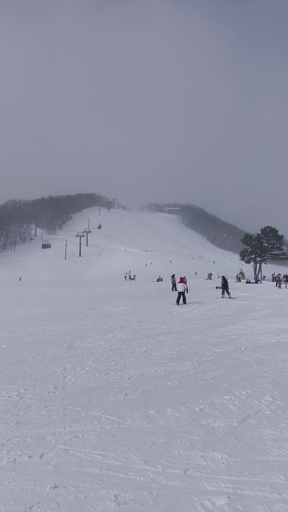
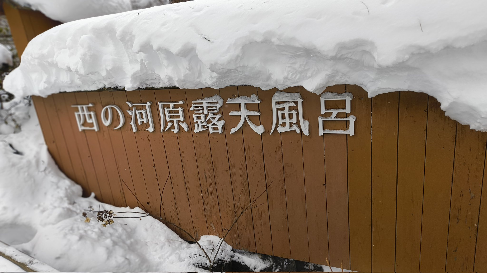
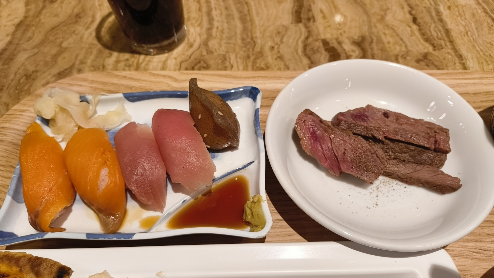
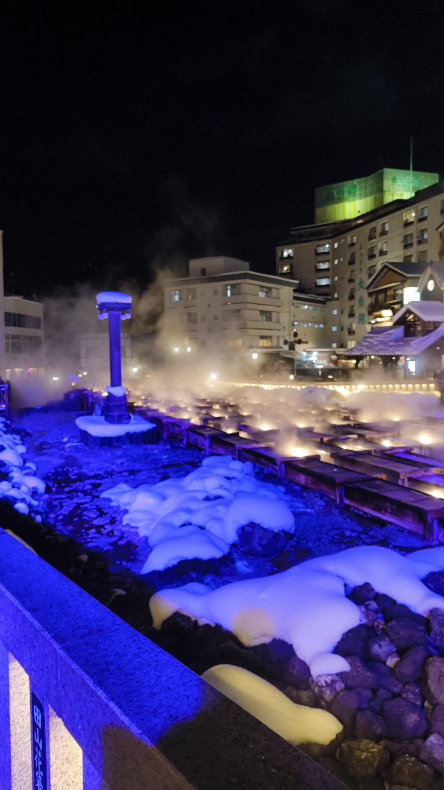
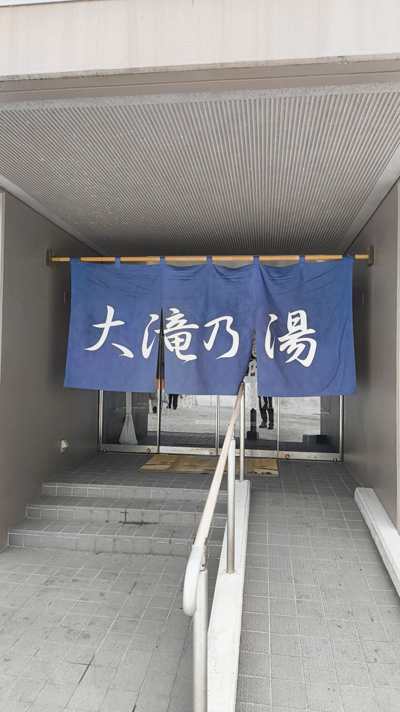

同僚と草津旅行に行ってきた。

<h2>スキー</h2>

1日目は夜にチェックインしたので、2日目にスキーをした。 
前に妙高高原で滑った時は、スキー場がオープンしたてだったので、コースがそんなになかった。今回はたくさんコースがあり、いろんなコースを楽しめた。 
最後の最後で一番良い感じに滑れたのでよかった。 

<h2>西の河原露天風呂</h2>

スキーの後は、西の河原露天風呂に行った。 
とても広い露天風呂が1つ温泉だった。場所によって温度が違うので一つの温泉でも楽しめた。 

入った後に飲んだ、飲むヨーグルトがとてもおいしかった。

<h2>御座之湯</h2>

ホテルで夕食を食べた。こんにゃく寿司という群馬に住んでいた自分もはじめての寿司を食べた。 
 
そのあとは、ホテルから出ているバスで湯畑に行き、散策をした。 
 
湯畑にある御座之湯に行った。 
ふたつの源泉を楽しめるようになっていた。湯煙とあかりが相まって、とても良い雰囲気だった。

<h2>大滝乃湯</h2>

3日目、ホテルをチェックアウトした後に大滝乃湯に行った。 

熱さが異なる4つのお風呂を低い順から1分づつ入る「合わせ湯」に入った。 
4つめのお風呂は熱く5秒で出た。 
休憩室もあって、穏やかな時間が流れていた。

<h2>巡り終わった</h2>
<blockquote align="center" class="twitter-tweet" data-dnt="true">
温泉巡りした！ <a href="https://t.co/7apYMU0m8H">pic.twitter.com/7apYMU0m8H</a>
— yukyu (a.k.a ugo) (@yukyu30) <a href="https://twitter.com/yukyu30/status/1889501881678123024?ref_src=twsrc%5Etfw">February 12, 2025</a></blockquote>

個人的には御座之湯が一番好きだった。

