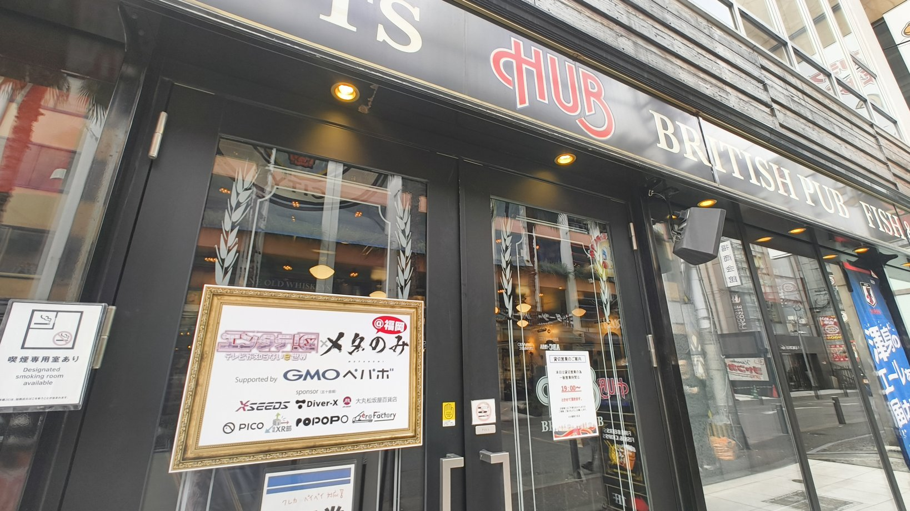

<h2>はじめに</h2>

GMOペパボメタバース推進室として、2025年3月30日の「エンタテ！区× メタのみ@福岡 supported by GMOペパボ」と2025年4月5日の「出張版！VRCくりえいてぃ部」という2つのVR関連イベントに企業出展しました。この記事では、この二週間で参加したイベントの様子と感想を書いていきます。

<h2>「エンタテ！区× メタのみ@福岡」</h2>

2025年3月30日、福岡で開催された「<a href="https://t.livepocket.jp/e/metanomi_fukuoka">エンタテ！区× メタのみ@福岡 supported by GMOペパボ</a>」に出展しました。 
 
私たちのブースでは、ペパボのメタバース関連の取り組みを紹介しました：

<ul>
<li>NAGiSAでのスーパーカジュアル面談</li>
<li>VRChatを活用した新卒説明会</li>
<li>SUZURIでの墨澄(アバター)と3Dグッズ作成機能</li>
</ul>

このイベントで最も印象的だったのは、これまでVRChatでしか会ったことのなかったフレンドと実際に対面できたことです。「はじめまして」なのに「知っている」という不思議な感覚がありました。VRChat上で会う時よりもリアルでの出会いの方が、さらに熱量や勢いを感じました。 
会場には、VRChatを始めたばかりの方からVR体験を目的に来場された方まで、幅広く様々な方が楽しんでいました。他の出展企業の方々と交流できたことも大変貴重な経験でした。

<blockquote align="center" class="twitter-tweet" data-dnt="true">
本日、「エンタテ！区× <a href="https://twitter.com/hashtag/%E3%83%A1%E3%82%BF%E3%81%AE%E3%81%BF?src=hash&amp;ref_src=twsrc%5Etfw">#メタのみ</a>@福岡 supported by GMOペパボ」にご参加いただきありがとうございました🍺  こちら最後の集合写真になります📸  スポンサー、出張キャスト、ご来場のみなさまのおかげで会場、終始大盛り上がりでした！  また九州での開催を企画させてください〜‼️‼️‼️ <a href="https://t.co/tWtgVORCJL">pic.twitter.com/tWtgVORCJL</a>
— 🍺メタのみ公式🍺 (@metanomi_) <a href="https://twitter.com/metanomi_/status/1906294769548181512?ref_src=twsrc%5Etfw">March 30, 2025</a></blockquote>

<h2>出張版！VRCくりえいてぃ部</h2>

続いて4月5日、東京の大田区産業プラザPiOで開催された「<a href="https://www.vrcreative.net/">出張版！VRCくりえいてぃ部</a>」に企業出展しました。このイベントは、VRSNS上で活動するクリエイターや企業がオフラインの会場で作品を発表・展示するもので、120以上のサークルと企業が参加する大規模なものでした。

GMOペパボは<a href="https://pepabo.com/news/information/202412231500/">VRChatとのパートナーシップを締結しています</a>。そのため、 
私たちのブースでは、以下のコンテンツを提供しました：

<ul>
<li>VRChatの公式グッズのサンプル展示</li>
<li>現在クローズドベータ中のiOS版のVRChatの試遊</li>
</ul>

そこもとさんの書き下ろしのRealとVRChatをポータルで行き来する「どこでもポータルVRCat」は可愛いと好評でした。

<blockquote align="center" class="twitter-tweet" data-dnt="true">
ペパボさんのブースにて、VRChat公式グッズが受注販売されております👀 私そこもともVRCatちゃんのイラストでご協力させていただきました！🐈📦  ゆる〜いVRCatちゃんをよろしくお願いします！<a href="https://twitter.com/hashtag/VRC%E3%81%8F%E3%82%8A%E3%81%88%E3%81%84%E3%81%A6%E3%81%83%E9%83%A8?src=hash&amp;ref_src=twsrc%5Etfw">#VRCくりえいてぃ部</a> <a href="https://twitter.com/hashtag/VRChat?src=hash&amp;ref_src=twsrc%5Etfw">#VRChat</a> <a href="https://t.co/MDcKbKbnO1">https://t.co/MDcKbKbnO1</a> <a href="https://t.co/owY2ZELQ2W">pic.twitter.com/owY2ZELQ2W</a>
— M / そこもと (@M_vrc_world) <a href="https://twitter.com/M_vrc_world/status/1908363733900177841?ref_src=twsrc%5Etfw">April 5, 2025</a></blockquote>

VeryPoorパーカー、Trusted Userジェットキャップはとても引きが強く、通り過ぎる時におもしろいなーと言っていただけて嬉しかったです！！

<blockquote align="center" class="twitter-tweet" data-dnt="true">
【終売まで残り5時間弱⏰】 大盛況で終わった <a href="https://twitter.com/hashtag/VRC%E3%81%8F%E3%82%8A%E3%81%88%E3%81%84%E3%81%A6%E3%81%83%E9%83%A8?src=hash&amp;ref_src=twsrc%5Etfw">#VRCくりえいてぃ部</a> にて受注販売したSUZURIのVRChat公式グッズは本日のみの限定品なのでお買い忘れなく💨  ご来場者の方でVery Poorを主張したい気分になられた方、Trusted Userのみなさまはぜひこの機会にご購入ください👍<a href="https://twitter.com/hashtag/VRC%E3%81%8F%E3%82%8A%E3%81%88%E3%81%84%E3%81%A6%E3%81%83%E9%83%A8?src=hash&amp;ref_src=twsrc%5Etfw">#VRCくりえいてぃ部</a> <a href="https://twitter.com/hashtag/VRChat?src=hash&amp;ref_src=twsrc%5Etfw">#VRChat</a> <a href="https://t.co/k1VLRhkDuA">pic.twitter.com/k1VLRhkDuA</a>
— GMOペパボ (@pepabo) <a href="https://twitter.com/pepabo/status/1908464736825643381?ref_src=twsrc%5Etfw">April 5, 2025</a></blockquote>

じゃんけん大会にはサンプル品のグッズをいくつか提供しました。欲しい人ーの掛け声で多くの人に立ち上がっていただた瞬間は、感無量でした。

VRChatグッズデザインコンテストの応募は終了し、これから新たな公式グッズが登場する予定です。ぜひSUZURIの<a href="https://suzuri.jp/VRChat">VRChat公式ショップ</a>をフォローして、続報をお待ちいただければと思います。

ブースにいたら、「yukyuさん！」とバイネームでお声がけいただくくことが4,5回くらいあり、本当に嬉しかったです！これからもぜひお気軽にお声がけください！

<h2>おわりに</h2>

GMOペパボは2025年1月にメタバース推進室を設立し、VRChatとパートナーシップを結んで積極的にメタバース分野に取り組んでいます。私もメタバース推進室のエンジニアリングリードとして活動しています。

これらのイベント出展を通して、GMOペパボのメタバースへの本気度と、今後展開していく様々な取り組みを多くの方に知っていただければ幸いです。今後も引き続き、メタバース領域での活動にご注目ください。

