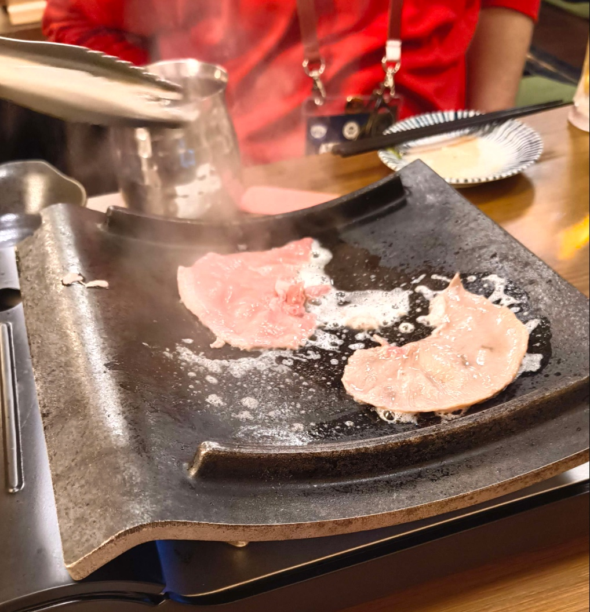

4月16日から4月19日の間に、松山に宿泊して、RubyKaigiに来ている。

ざっと1日を振り返ります！

<h2>道後温泉で朝風呂</h2>

早めに起きたので道後温泉にいった。

<blockquote align="center" class="twitter-tweet" data-dnt="true">
入ってきた♨️ <a href="https://t.co/YBDOsmZcSn">pic.twitter.com/YBDOsmZcSn</a>
— yukyu (@yukyu30) <a href="https://twitter.com/yukyu30/status/1912654995494957414?ref_src=twsrc%5Etfw">April 16, 2025</a></blockquote>

建物の外観や内装に歴史を感じた。湯船は小さいが深かった。

<h2>RubyKaigi Day2</h2>

セッションをいくつか聞きつつ、スタンプラリーでいろんなブースを回った。 
個人的に印象に残ったのは「 Benchmark and profile every single change 」というセッションだった。 
ベンチマークは1タイプごとにとり、それを元にベンチマーク駆動開発を進めていくかがわかるセッションだった。 
より高速に動くようにプログラムのチューニングを行う流れや実例が紹介されていて、普段のコードでここまで意識できてなかったなと感じた。

また、ペパボのブースで 
VRChatのフレンドさんともお会いして、リアルで再会をした。

<h2>giftee Drink Upに参加</h2>

giftee Drink Upに参加した。 
セッションの感想を話したり、おすすめの大街道のお店の話などをした。 

麻婆豆腐を作る話など、お会いした方の人となりがわかるようはお話もできて楽しかった。

<h2>二次会</h2>

同僚と合流して二次会をしていたところ、隣のテーブルがRuby コミッターの方だった。 
しかも、2年前のRubyKaigiで一緒にランチをした方だった。2年越しの再会だった。

<h2>今日の1日を動画で振り返る</h2>

人の顔が映りそうなタイミングでは撮影していないので、観光してるだけみたいな映像になってる

<iframe allow="accelerometer; clipboard-write; encrypted-media; gyroscope; picture-in-picture; web-share;" allowfullscreen="" scrolling="no" src="https://www.youtube.com/embed/9-_fMBjJyoU?rel=0" style="top: 0; left: 0; width: 100%; height: 100%; position: absolute; border: 0;" title="RubyKaigi 2025 Day2"></iframe>

