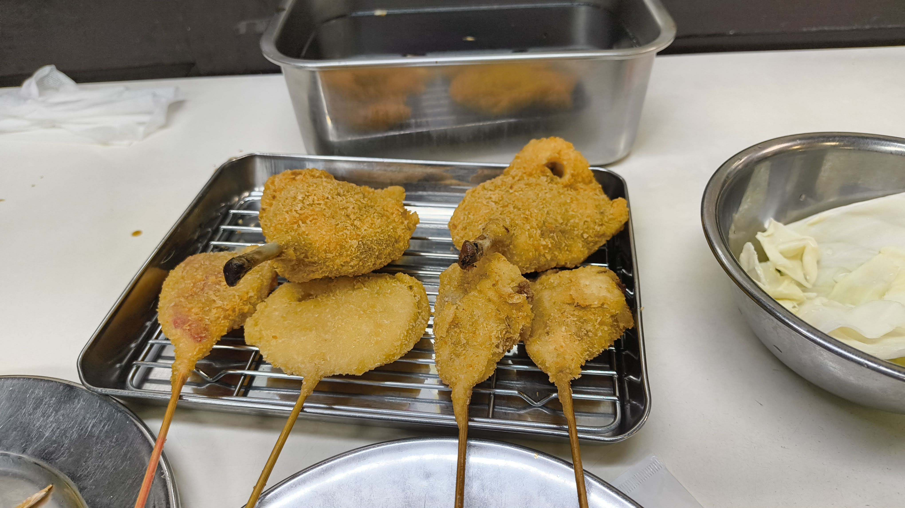
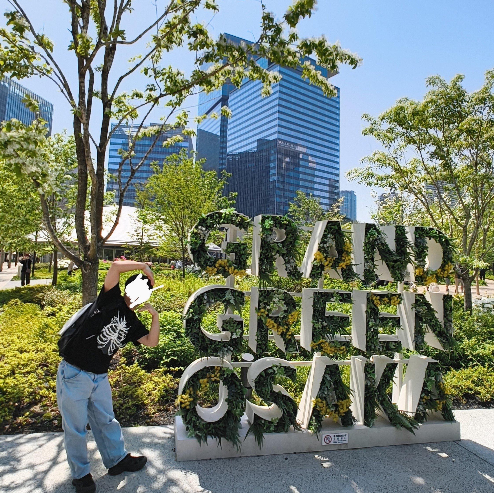
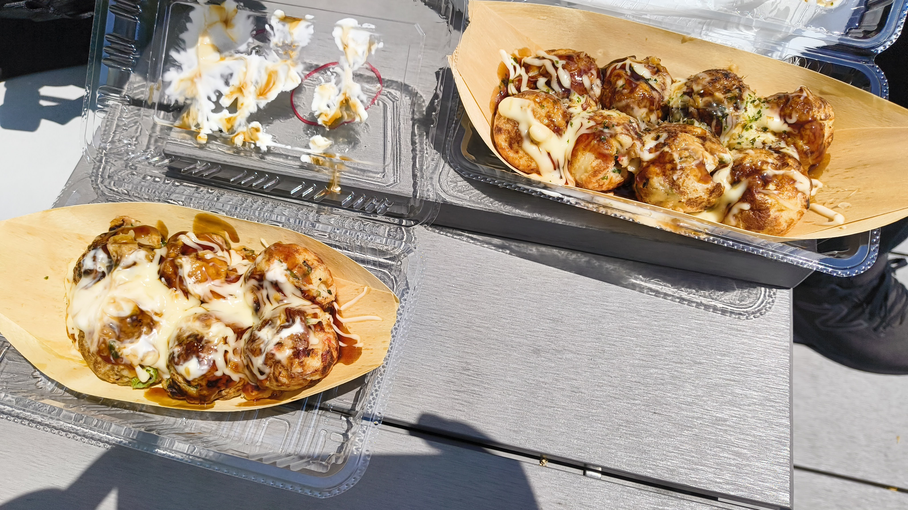
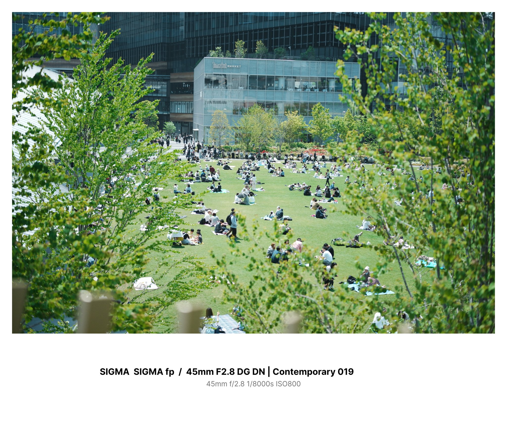
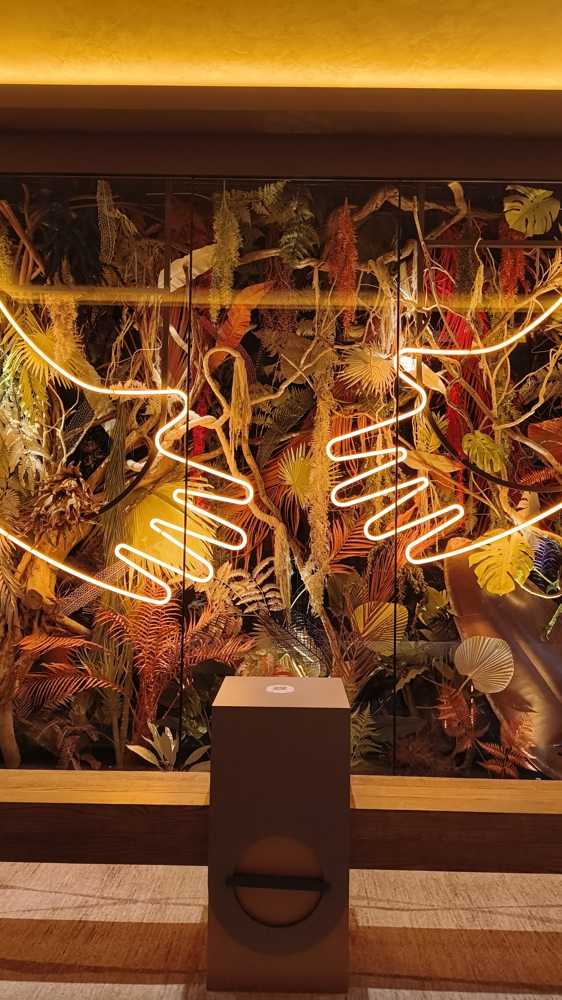
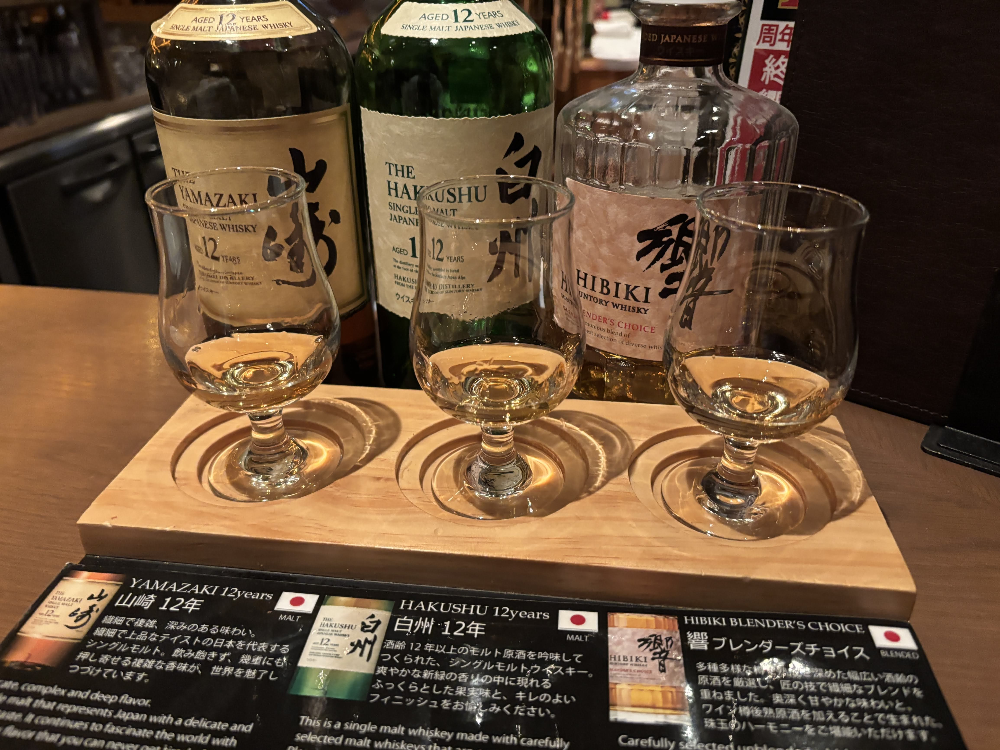
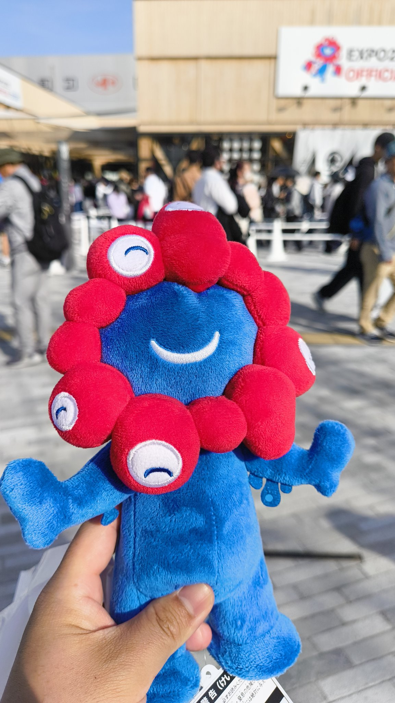
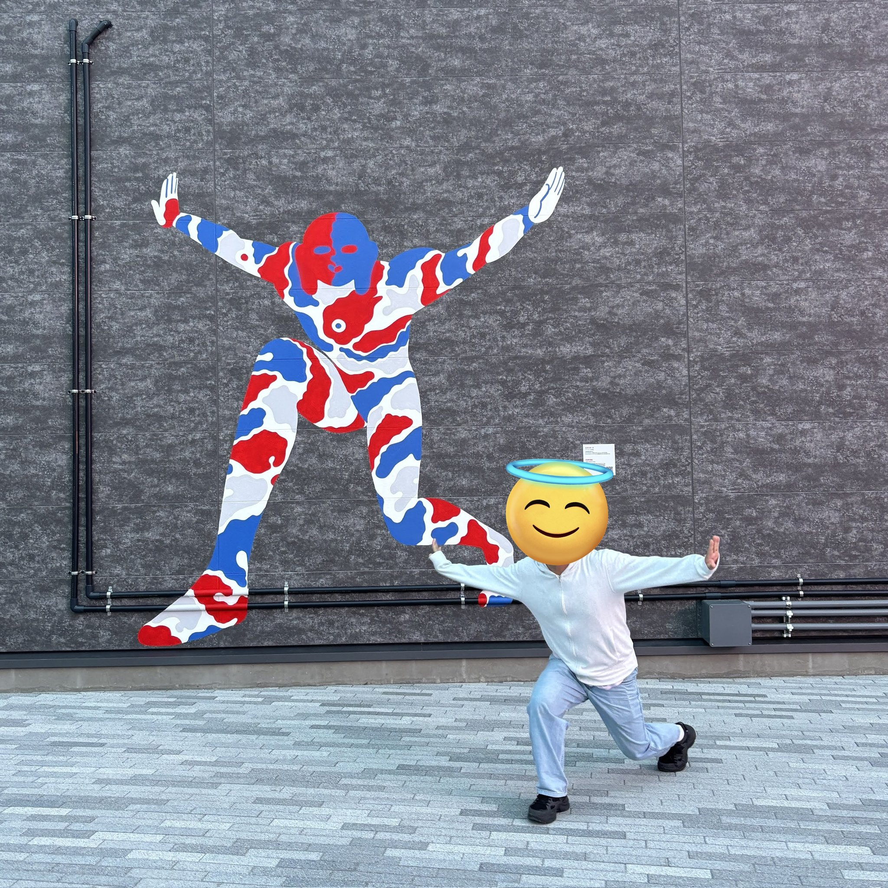

4月26日から一泊二日で大阪旅行をした。

<h2>1日目</h2>

梅田、道頓堀、通天閣近辺を散策しつつ、たこやきや串カツを食べた。 

たこ焼きをテイクアウトして、グラングリーン大阪で食べるのがゆったりと過ごせて楽しかった。!

 
 

大阪は思ったよりも、大きなビルがなく空がよく見えた。だけど、お店はたくさんあり過ごしやすそうで、住みたくなった。

ホテルはcanopy by hiltonに泊まった。 
万博行くつもりもなかったのと、やることとしても食べ歩きくらいの想定だったので、せっかくならホテルにはお金をかけようと思い、選んだ。 

ホテルの近くに、サントリーウィスキーハウスなる施設があるのを知り、その中のバーにいった。 
ジャパニーズウィスキーの飲み比べができてよかった。

<h2>二日目</h2>

二日目は万博へ。 
桜島駅まで電車で行き、予約したシャトルバスで夢洲へ。 
西口ゲートから入場した。 
スムーズに入場できた。

<ol>
<li>中国館</li>
<li>ブラジル館</li>
<li>北欧館</li>
<li>EARTH MART</li>
<li>UAE館</li>
<li>いのちめぐる冒険</li>
<li>コモンズ館</li>
</ol>

の7つのパビリオンを巡った。 
EARTH MARTが特に面白かった。 
食べ物に対する理解を深めるコンテンツと、これからの食べ物の展示があった。

冷凍技術や食用3Dプリンターの展示が興味深かった。 
UAE館では、ドリンク、デザートをテイクアウトした。日本食にはない独特な味がした。

大屋根リングの上で座りながら眺めたり、静けさの森を歩いたり、こみゃくを探したりと、いろんなエリアを散策しても楽しめた。

しっかり、ミャクミャクのぬいぐるみを買った。 
 

<h2>おわりに</h2>

大阪は初めてだったが、たくさん食べれたのと、観光スポットにも行けて、楽しかった。 
お店の看板というか店構えが豪華なので見て回るだけでも楽しかった。

万博も普段見れないようなものや、馴染みのない国について知ることができたので面白かった。

<iframe allow="accelerometer; clipboard-write; encrypted-media; gyroscope; picture-in-picture; web-share;" allowfullscreen="" scrolling="no" src="https://www.youtube.com/embed/XQJDLXp4ojg?rel=0" style="top: 0; left: 0; width: 100%; height: 100%; position: absolute; border: 0;" title="2025/04/26-2025/04/27"></iframe>
