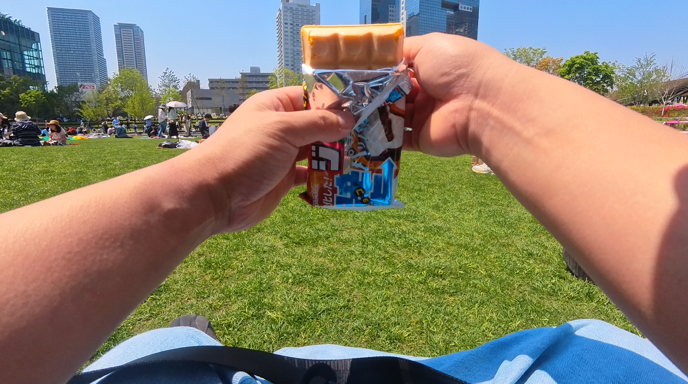

アクションカムのinsta360 go s3を3月にかった。 
3ヵ月くらいつかったので、その使用感を書いていこうと思う。

<h2>出かけることが多いので動画に残したい</h2>
<blockquote align="center" class="twitter-tweet" data-dnt="true">
とどいた！！ <a href="https://t.co/sAUtodWqAu">pic.twitter.com/sAUtodWqAu</a>
— yukyu (@yukyu30) <a href="https://twitter.com/yukyu30/status/1900752687031087245?ref_src=twsrc%5Etfw">March 15, 2025</a></blockquote>

イベントや旅行の思い出を手軽に動画で残したく、3月にInsta360 Go S3を購入した。Osmo Pocket 3とも迷ったが、「両手がふさがっているシーンでも撮影したい」「ものを壊しがちで、ジンバルを壊しそう」という理由から、服にマグネットで装着できるGo S3を選択した。
<h2>実際使ってどうだったか</h2>
<h3>良い感じの画になる</h3>

手にもって撮影するのと違い、マグネットペンダントをつけていると撮影して、見返すと思いかけずいい感じの画になっている。 
ご飯を食べるときや、飲み物を飲むときなどはいい感じになる 

<h3>ポケットには忍ばせて、撮るときに出す</h3>

小さくポケットに入るので持ち運びが楽だった。 
同じポケットに鍵やアクセサリーがあるとレンズを傷つけそうなので、カバーを装着して使っている。

<h3>バッテリーは心もとない</h3>

一日使おうと思ったら1回の充電は必要。 
なので、スマホとinsta360 go s3を充電できるモバイルバッテリーを持ち歩く必要がありそうだった。

<h3>アプリの自動編集がよかった</h3>

動画は撮るのは簡単になった分、編集が大変だなと思っていたら、公式アプリに自動編集機能があるのを知って、使ってみた。これが思ったよりも良かった。 
アプリから撮影した動画を選ぶと、いい感じに動画をカットし、一つの動画としてまとめてくれる。

👇その機能で作った動画

<iframe allow="accelerometer; clipboard-write; encrypted-media; gyroscope; picture-in-picture; web-share;" allowfullscreen="" scrolling="no" src="https://www.youtube.com/embed/9-_fMBjJyoU?rel=0" style="top: 0; left: 0; width: 100%; height: 100%; position: absolute; border: 0;" title="RubyKaigi 2025 Day2"></iframe>

なので、寝る前にこれで毎日動画を編集して、Youtubeに限定公開でアップロードするというのをやっていた。

動画を撮りたいという目的も満たし、それをいい感じにまとめてくれるということもできたのでよかった。

<h2>アプリの自動編集 をうまく使いこなす</h2>

自動編集機能に 
<strong>選んだ動画の合計時間が20分以内</strong>という制限がある。 
そのため、長時間撮影していた動画はアプリの自動編集が使えなくなってしまう。 
なので、自分はスポット、スポットで10秒から2分くらいで撮影をするようにしている。

これをしていると結局は半分くらい手持ちで撮影している。

<h2>まとめると</h2>

コンパクトで荷物にならず、旅先で便利だった。マグネットペンダントを使って撮影はハンズフリーで、思いがけない動画がとれて面白い。

バッテリーは心もとないのと、自動編集を使うために撮影の仕方を工夫しないといけのがいまいちだった。

