大阪・関西万博に通算で4回行った。思い出や感想をまとめて書いておこうと思う。

## 関連する記事
[大阪旅行](./2025-05-02)
[2泊3日の大阪旅行：万博と山崎蒸留所](./2025-06-11)

## 行ったパビリオン
通算４回で17つのパビリオンと、2つのショーを観た。

### 中国館
天井高が高く存在感を感じる外観のパビリオンだった。
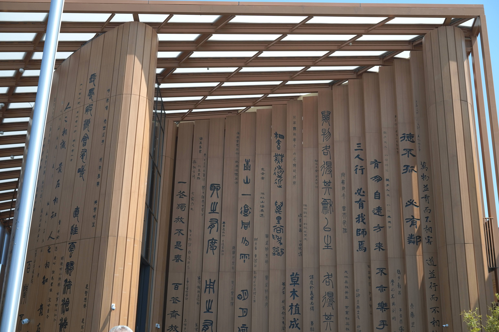
その天井ギリギリに収まるでかい円形ディスプレイも展示されており迫力があった。
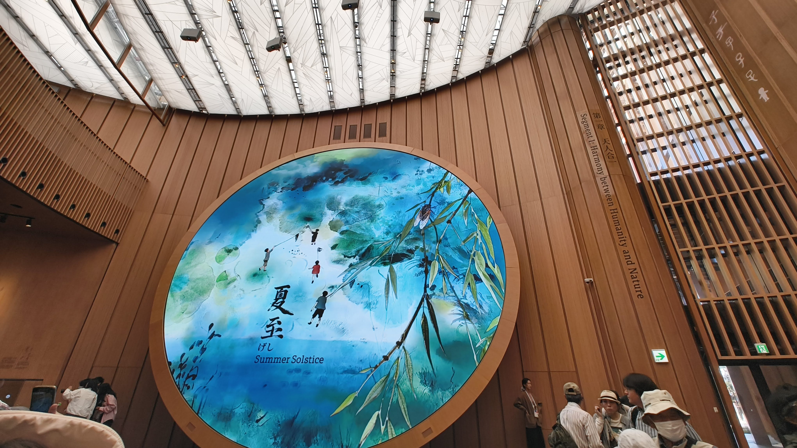
透過ディスプレイが使われており、展示物をみながら解説をすぐ近く見ることができた。
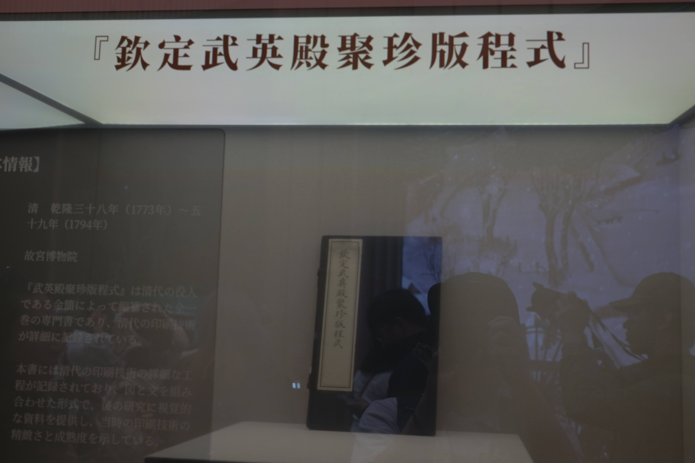

個人的に中国館で印象に残ったのが、ゲームアプリのようなUIで、展示物が紹介されていることだった。パーティ編成画面みたいな画面に、ニワトリとかパンダとかが並んでいた。一周回ってゲーム開発能力を見せる展示なのではと思った。
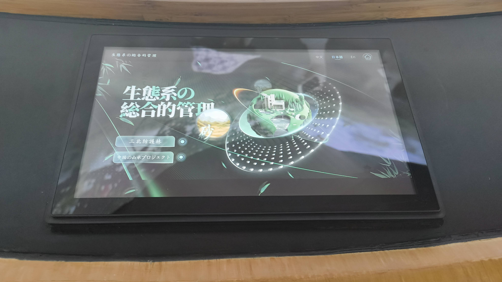
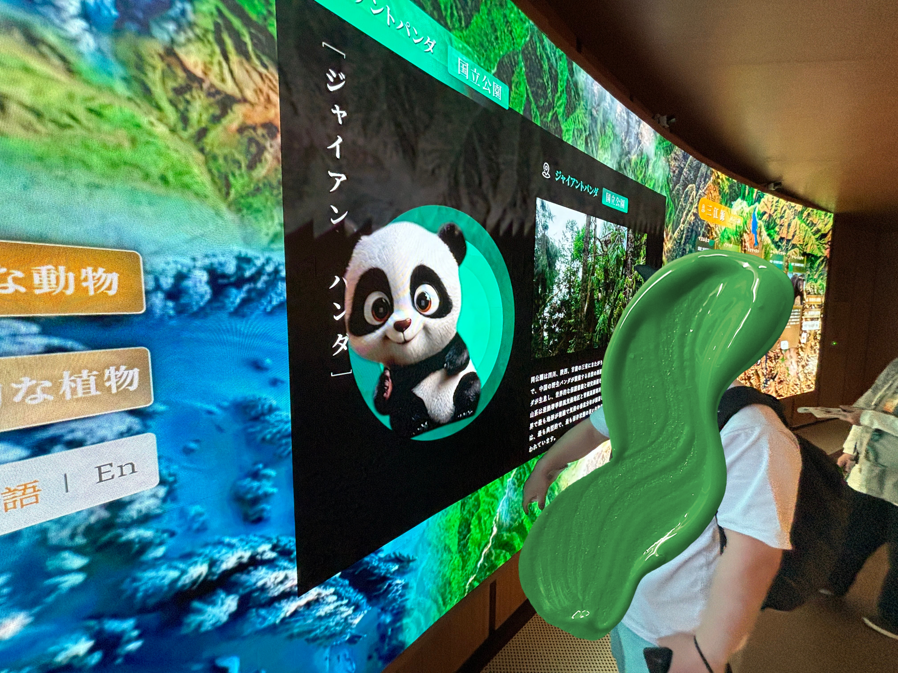
### ブラジル館
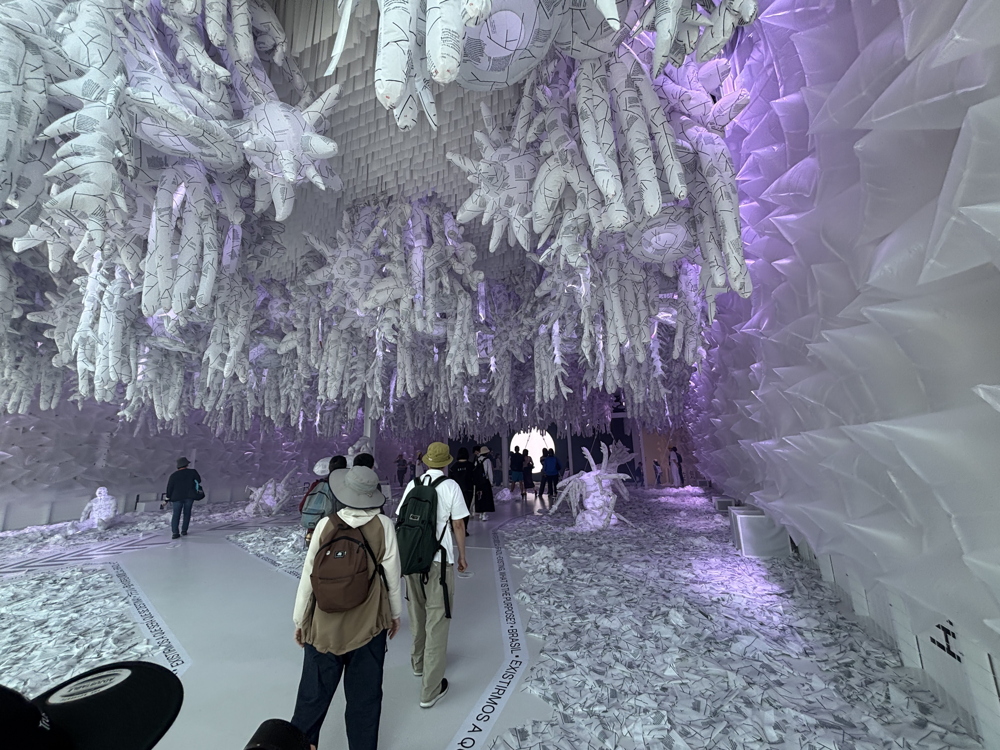
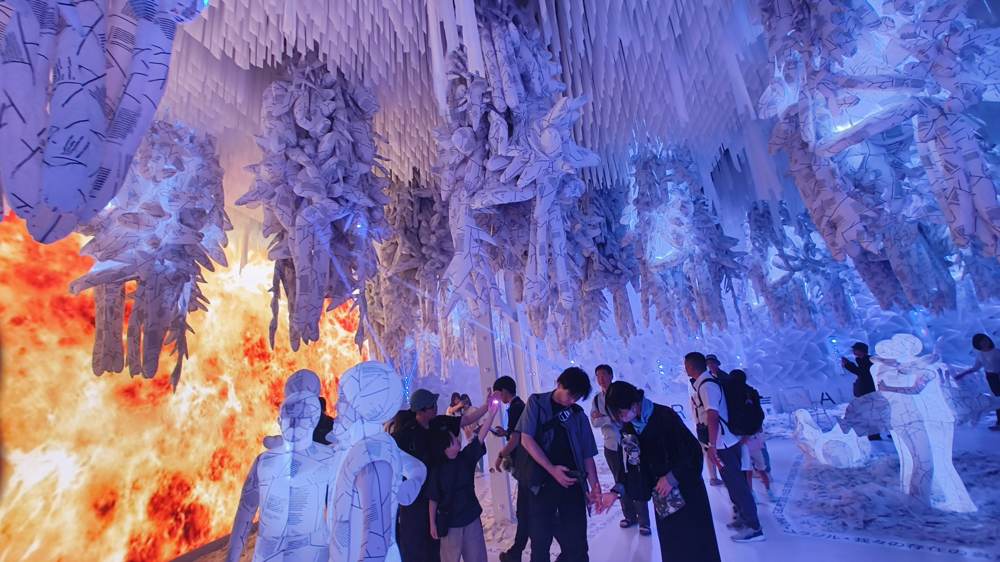
先住民風のフェイスペイントが体験できるブースがあった。手にこみゃくを描いた。
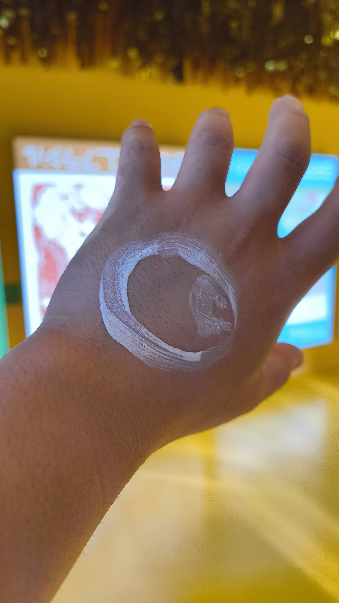
### 北欧館
北欧の暮らしや社会に関する展示がされていた。
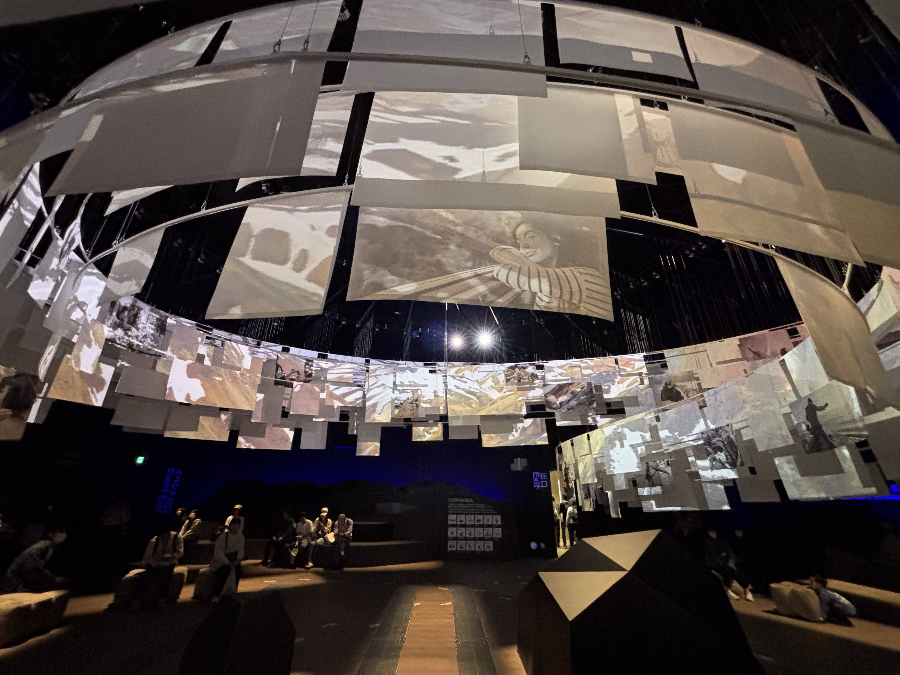
### EARTH MART
たべものに関することが学べる展示がされていた。
いちばん食べられる魚としてイワシがショーケースに陳列されていて、説明を見ると10万匹いた卵から、食卓に並ぶのはそのうち3匹という説明があった。
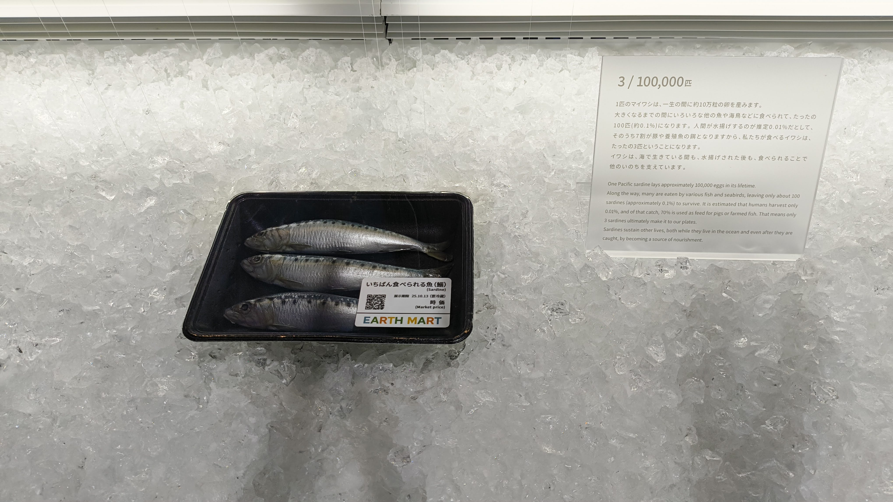
一生で食べる量の卵で作った目玉焼きの模型の展示などもあった。
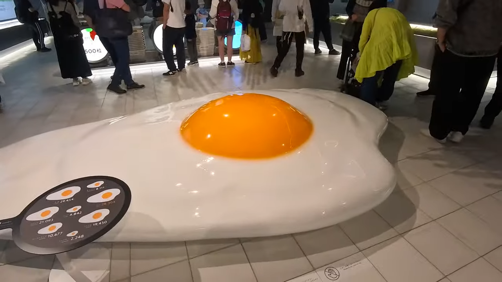

そして、研究が進んでいる新しい食に関する技術も展示されていた。

万博会期中につけた梅干しを十数年後に食べれるチケットをもらった。

### UAE館
アラブ首長国連邦のパビリオン。ナツメヤシの柱が特徴的だった。

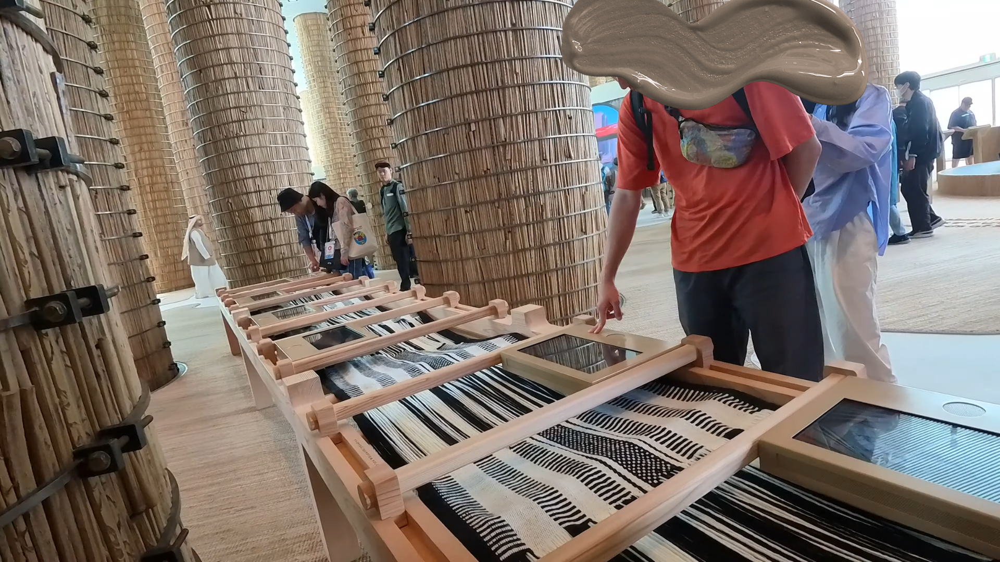
併設されているレストランのご飯をテイクアウトして、大屋根リングの上で食べた。
バーツのコーヒーとタピオカ何かを食べた。
日本では食べることない風味で新鮮な体験ができた。
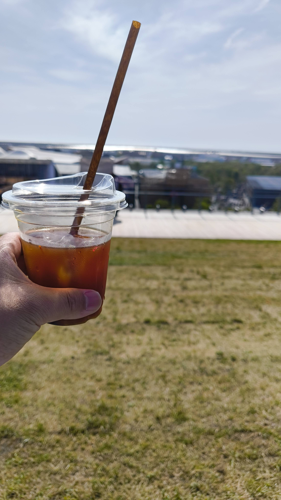
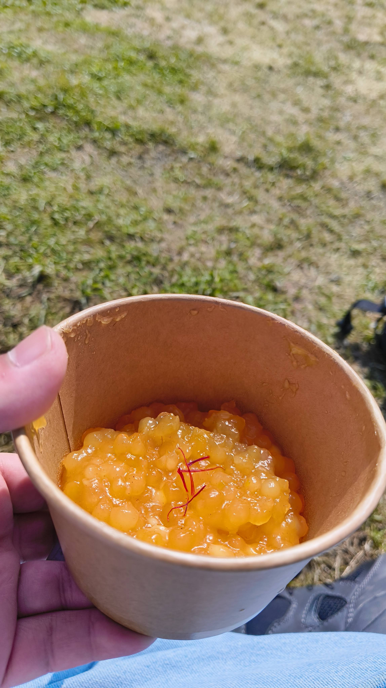
### いのちめぐる冒険

撮影禁止なので写真はない。
円形のソファにみんなで座り、ヘッドセットを身につけ体験するパビリオンだった。

みんなが円形に座っているという前提のもと体験が作られていて、バーチャルだけどオフラインでみんなで集まらないと体験できないようなコンテンツで脱帽した。

以下は後で更新します！

### コモンズ館
### テックワールド
### トルクメニスタン館
### 未来の都市
### マレーシア館
### フランス館
### 動的平衡館
### パキスタン館
### オーストラリア館
### USA館
### ポーランド館
### アオと夜の虹のパレ―ド(噴水ショー)
### One World, One Planet.(ドローンショー)

## マルタ共和国(フードのみ)
## ベルギー(フードのみ)
